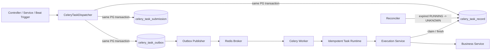

# Celery PostgreSQL 幂等与一致性设计

## 1. 目标与结论

本方案使用 PostgreSQL 作为 Celery 任务登记、发布和执行状态的唯一事实源，解决以下问题：

1. **提交幂等**：同一业务幂等键只创建一个逻辑任务。
2. **发布一致性**：业务数据和任务 outbox 在同一 PostgreSQL 事务内提交，避免数据库与 broker 双写不一致。
3. **执行防重**：Worker 只有在 PostgreSQL 原子 claim 成功后才能进入业务逻辑。
4. **副作用幂等**：数据库唯一约束或下游 idempotency key 防止崩溃窗口造成重复副作用。
5. **快速失败**：校验、claim、业务执行和状态持久化失败都立即结束当前执行，不自动执行 retry。
6. **默认不自动重复执行**：每个逻辑任务默认只允许一次业务执行；Worker 崩溃或结果不确定时不自动接管。

本方案不提供跨 PostgreSQL、Redis broker 和外部系统的 exactly-once。它提供的是：

```text
原子登记 + 可重试消息发布 + 单次业务执行 claim + 业务副作用幂等
```

标注说明：

- **[新增]**：原设计未覆盖、为闭合目标必须补充的内容。
- **[待确认]**：依赖实际 Celery/Redis/PostgreSQL 版本、运行环境或业务策略，实施前需要测试或确认。

### 1.1 术语约束

- **逻辑任务**：`celery_task_record` 中的一条任务记录。
- **publish retry**：outbox 使用同一个 `task_record_id` 和 `task_id` 重新向 broker 发送消息；不创建新逻辑任务，也不增加业务执行次数。
- **execution retry**：业务逻辑已经开始后再次执行业务逻辑；本方案默认禁止。
- **重复消息**：同一 `task_record_id` 或 `task_id` 被 broker 重复交付；允许出现，但不得重复进入业务逻辑。

> **[新增]** “默认不自动重复执行”只禁止 execution retry。为保证 transactional outbox 的可靠交付，publish retry 默认保留。

## 2. 适用范围与前提

- Redis 继续作为 Celery broker 和 result backend；Redis 不再承担业务任务幂等锁。
- 幂等状态表只支持 PostgreSQL，依赖 `ON CONFLICT`、`RETURNING` 和 `FOR UPDATE SKIP LOCKED`。
- 有副作用的任务必须经过本方案的 dispatcher 和 runtime；纯计算、心跳等任务可以显式 opt-out。
- 任务必须有明确的 soft/hard time limit，不允许无限执行。
- 任务参数必须能被 Celery JSON serializer 编码，敏感值和大对象只传资源 ID。

> **[新增]** 启用幂等功能时必须校验 `DB_TYPE=postgresql`，否则启动失败，避免在 MySQL、Oracle 或 SQLite 上得到错误语义。

## 3. 当前项目差距

- `CeleryClient.submit()` 每次生成新的 task ID，相同业务请求不会自动去重。
- 数据库提交和 broker 发布之间存在双写窗口。
- Worker 执行前没有持久化 claim，重复消息可能再次执行业务逻辑。
- `run_in_async()` 只负责异步资源和 trace context，不包含任务状态机。
- `.delay()`、`.apply_async()`、Beat 和 Canvas 可以绕过统一提交入口。
- 当前任务示例存在显式 `self.retry(..., max_retries=3)`，与默认不自动重复执行冲突。
- 当前 Celery ACK、Worker lost 和 redelivery 策略没有形成可验证的项目 contract。
- 当前通用 DDL 使用 MySQL 语法，PostgreSQL 表需要独立方言目录。

## 4. 核心不变量

1. `(scope, task_name, idempotency_key_hash)` 在幂等有效期内唯一。
2. 相同幂等键和相同 `payload_hash` 返回原任务；payload 不同必须返回稳定 conflict。
3. 任务登记时一次性生成稳定 `task_id`，所有 publish retry 都复用它。
4. 业务数据、任务记录、首次 submission 和 outbox 必须在同一 PostgreSQL 事务内写入。
5. Worker 只有在 `attempt_count = 0` 且原子 claim 成功时才能进入业务逻辑。
6. `attempt_count` 固定上限为 1、Celery `max_retries = 0`，runtime 不调用 `task.retry()`。
7. `RUNNING` 任务 lease 过期后进入 `EXECUTION_UNKNOWN`，不得自动回到 `RUNNING`。
8. 任务成功或失败更新必须校验 `lease_owner`；owner 不匹配不能覆盖状态。
9. broker I/O、业务协程和外部 API 不得在数据库事务或行锁范围内执行。
10. PostgreSQL 不可用、header 不完整或 claim 结果不明确时 fail closed，不执行业务逻辑。
11. 原始 idempotency key 不写数据库、消息或日志；数据库只保存 SHA-256。
12. 原子 claim 只能防止重复进入业务逻辑，最终副作用仍必须有业务唯一约束或下游 idempotency key。
13. 批量任务不得在处理前把全量明细预先标记为 `RUNNING`；只能按有界分片 claim，未 claim 的明细必须保持
    `PENDING`。
14. 每条已 claim 的批量明细必须有独立 lease 和 owner/fencing token；明细 lease 过期后必须进入可恢复状态，
    不能无限停留在 `RUNNING`。

## 5. 架构与职责



职责边界：

- `pkg/celery_queue`：构造和发布 Celery 消息，不访问项目数据库或业务 context。
- `internal/infra/celery`：Celery app、连接生命周期和 `run_in_async()`，不实现业务状态机。
- `internal/dao`：任务记录、submission、outbox 的 PostgreSQL 原子 SQL。
- `internal/services`：提交事务、幂等冲突判断、执行状态机和结果持久化。
- `internal/tasks/runtime.py`：验证 Celery request，调用 execution Service，映射 ACK/Ignore/失败行为。
- outbox publisher：轮询 PostgreSQL 并发布消息，不通过 Celery 自身运行。
- reconciler：扫描过期 `RUNNING` 并标记 `EXECUTION_UNKNOWN`，只改状态，不重新发布或执行业务逻辑。

> **[新增]** reconciler 用于关闭 Worker 崩溃后的状态缺口；它不是任务重试器。

## 6. 数据模型

三个表均为系统表，不使用软删除或用户审计字段，不建立物理外键。时间统一使用 PostgreSQL UTC 时间语义。

### 6.1 逻辑任务表

```sql
CREATE TABLE celery_task_record (
    id                          BIGINT PRIMARY KEY,
    task_id                     VARCHAR(255) NOT NULL,
    task_name                   VARCHAR(255) NOT NULL,
    task_tag                    VARCHAR(64) NOT NULL,
    origin_trace_id             VARCHAR(128) NOT NULL,
    scope                       VARCHAR(128) NOT NULL,
    idempotency_key_hash        CHAR(64) NOT NULL,
    payload_hash                CHAR(64) NOT NULL,
    status                      VARCHAR(32) NOT NULL,
    attempt_count               INTEGER NOT NULL DEFAULT 0,
    execution_timeout_seconds   INTEGER NOT NULL,
    lease_owner                 VARCHAR(128),
    lease_expires_at            TIMESTAMPTZ,
    result_payload              JSONB,
    result_ref                  VARCHAR(512),
    error_type                  VARCHAR(128),
    error_message               VARCHAR(2048),
    published_at                TIMESTAMPTZ,
    started_at                  TIMESTAMPTZ,
    finished_at                 TIMESTAMPTZ,
    idempotency_expires_at      TIMESTAMPTZ NOT NULL,
    created_at                  TIMESTAMPTZ NOT NULL DEFAULT CURRENT_TIMESTAMP,
    updated_at                  TIMESTAMPTZ NOT NULL DEFAULT CURRENT_TIMESTAMP,

    CONSTRAINT uq_celery_task_record_task_id
        UNIQUE (task_id),
    CONSTRAINT uq_celery_task_record_idempotency
        UNIQUE (scope, task_name, idempotency_key_hash),
    CONSTRAINT ck_celery_task_record_status
        CHECK (status IN (
            'PENDING_PUBLISH',
            'PUBLISHED',
            'PUBLISH_FAILED',
            'RUNNING',
            'SUCCEEDED',
            'FAILED',
            'EXECUTION_UNKNOWN',
            'CANCELLED'
        )),
    CONSTRAINT ck_celery_task_record_attempt
        CHECK (attempt_count BETWEEN 0 AND 1),
    CONSTRAINT ck_celery_task_record_timeout
        CHECK (execution_timeout_seconds > 0)
);

CREATE INDEX idx_celery_task_record_origin_trace
    ON celery_task_record (origin_trace_id, created_at DESC, id DESC);

CREATE INDEX idx_celery_task_record_status_updated
    ON celery_task_record (status, updated_at, id);

CREATE INDEX idx_celery_task_record_expired_running
    ON celery_task_record (lease_expires_at, id)
    WHERE status = 'RUNNING';

CREATE INDEX idx_celery_task_record_idempotency_expiry
    ON celery_task_record (idempotency_expires_at, id)
    WHERE status IN (
        'PUBLISH_FAILED',
        'SUCCEEDED',
        'FAILED',
        'EXECUTION_UNKNOWN',
        'CANCELLED'
    );
```

说明：

- `id` 使用项目 Snowflake ID，在写数据库前生成。
- `task_id` 格式为 `{task_tag}_{origin_trace_id}_{record_id}`，长度不得超过 255。
- `execution_timeout_seconds` 必须等于任务 hard time limit，用于校验消息和数据库记录一致。
- `result_payload` 只保存小型 JSON 结果；大结果使用 `result_ref`。
- 错误消息必须截断和脱敏，不保存完整 traceback、token 或外部响应正文。

> **[新增]** `PUBLISH_FAILED` 闭合 outbox 进入 `DEAD` 后逻辑任务仍停留在 `PENDING_PUBLISH` 的状态缺口。

> **[新增]** `EXECUTION_UNKNOWN` 表示 Worker 崩溃或 hard timeout 后无法确认副作用是否完成；该状态禁止自动执行。

> **[待确认]** 默认幂等有效期建议 30 天。删除任务记录后，相同 key 可以再次创建；需要永久幂等的业务应在业务表保留永久唯一键，不能依赖任务表无限保留。

### 6.2 Submission trace 表

```sql
CREATE TABLE celery_task_submission (
    id                  BIGINT PRIMARY KEY,
    task_record_id      BIGINT NOT NULL,
    scope               VARCHAR(128) NOT NULL,
    trace_id            VARCHAR(128) NOT NULL,
    created_at          TIMESTAMPTZ NOT NULL DEFAULT CURRENT_TIMESTAMP,

    CONSTRAINT uq_celery_task_submission_trace
        UNIQUE (scope, trace_id, task_record_id)
);

CREATE INDEX idx_celery_task_submission_trace
    ON celery_task_submission (scope, trace_id, created_at DESC, id DESC);

CREATE INDEX idx_celery_task_submission_record
    ON celery_task_submission (task_record_id, id);
```

每次 `submit_once()` 都登记当前 trace，包括命中已有任务的重复提交。按 trace 查询时必须携带 `scope`，避免跨租户读取。

### 6.3 Outbox 表

```sql
CREATE TABLE celery_task_outbox (
    id                  BIGINT PRIMARY KEY,
    task_record_id      BIGINT NOT NULL,
    task_id             VARCHAR(255) NOT NULL,
    task_name           VARCHAR(255) NOT NULL,
    trace_id            VARCHAR(128) NOT NULL,
    queue               VARCHAR(128),
    args_payload        JSONB NOT NULL DEFAULT '[]'::jsonb,
    kwargs_payload      JSONB NOT NULL DEFAULT '{}'::jsonb,
    options_payload     JSONB NOT NULL DEFAULT '{}'::jsonb,
    publish_status      VARCHAR(16) NOT NULL DEFAULT 'PENDING',
    publish_attempts    INTEGER NOT NULL DEFAULT 0,
    available_at        TIMESTAMPTZ NOT NULL DEFAULT CURRENT_TIMESTAMP,
    next_attempt_at     TIMESTAMPTZ NOT NULL DEFAULT CURRENT_TIMESTAMP,
    lease_owner         VARCHAR(128),
    lease_expires_at    TIMESTAMPTZ,
    last_error          VARCHAR(2048),
    published_at        TIMESTAMPTZ,
    created_at          TIMESTAMPTZ NOT NULL DEFAULT CURRENT_TIMESTAMP,
    updated_at          TIMESTAMPTZ NOT NULL DEFAULT CURRENT_TIMESTAMP,

    CONSTRAINT uq_celery_task_outbox_record UNIQUE (task_record_id),
    CONSTRAINT uq_celery_task_outbox_task_id UNIQUE (task_id),
    CONSTRAINT ck_celery_task_outbox_status
        CHECK (publish_status IN ('PENDING', 'CLAIMED', 'PUBLISHED', 'DEAD')),
    CONSTRAINT ck_celery_task_outbox_payload
        CHECK (
            jsonb_typeof(args_payload) = 'array'
            AND jsonb_typeof(kwargs_payload) = 'object'
            AND jsonb_typeof(options_payload) = 'object'
        )
);

CREATE INDEX idx_celery_task_outbox_pending
    ON celery_task_outbox (next_attempt_at, id)
    WHERE publish_status IN ('PENDING', 'CLAIMED');

CREATE INDEX idx_celery_task_outbox_claim_lease
    ON celery_task_outbox (lease_expires_at, id)
    WHERE publish_status = 'CLAIMED';
```

`available_at` 是首次允许发布时间；`next_attempt_at` 是下次 publish retry 时间。`countdown` 必须在登记时转换为绝对时间。

> **[新增]** `options_payload` 只允许白名单字段，例如 `priority`、`expires` 和 serializer 相关选项；禁止持久化或覆盖 `task_id`、幂等 headers、broker connection 参数和 callback/link。

## 7. 状态机

### 7.1 逻辑任务

```text
PENDING_PUBLISH -> PUBLISHED -> RUNNING -> SUCCEEDED
        |                         |  |
        |                         |  +-> FAILED
        |                         +----> EXECUTION_UNKNOWN
        +-> PUBLISH_FAILED

PENDING_PUBLISH -----------------> RUNNING
PENDING_PUBLISH/PUBLISHED -> CANCELLED
```

禁止以下自动转换：

```text
FAILED -> RUNNING
EXECUTION_UNKNOWN -> RUNNING
expired RUNNING -> RUNNING
SUCCEEDED -> RUNNING
```

| 状态 | 含义 |
| --- | --- |
| `PENDING_PUBLISH` | 已提交数据库，等待 publisher |
| `PUBLISHED` | broker publish 已确认，不代表已经执行 |
| `PUBLISH_FAILED` | publish 达到上限，需要人工处理 |
| `RUNNING` | Worker 已获得唯一执行权 |
| `SUCCEEDED` | 业务成功且结果状态已持久化 |
| `FAILED` | 业务明确失败，不自动 retry |
| `EXECUTION_UNKNOWN` | Worker 丢失或状态回写不确定，不自动执行 |
| `CANCELLED` | 执行前被明确取消 |

### 7.2 Outbox

```text
PENDING -> CLAIMED -> PUBLISHED
   ^          |
   |          +-> PENDING
   +-------------- expired claim lease

PENDING/CLAIMED -> DEAD
```

outbox claim lease 只保护 publisher，不是业务 execution lease。

## 8. 提交协议

### 8.1 接口

```python
submission = await celery_task_dispatcher.submit_once(
    session=session,
    task_name="internal.tasks.order.create_order",
    trace_id=context.get_trace_id(),
    scope=f"tenant:{tenant_id}",
    idempotency_key=f"create-order:{request_id}",
    args=(order_id,),
    kwargs={},
    queue="celery_queue",
    execution_timeout_seconds=300,
    idempotency_expires_in=timedelta(days=30),
)
```

```python
@dataclass(frozen=True, slots=True)
class TaskSubmissionDTO:
    record_id: int
    task_id: str
    status: CeleryTaskStatus
    created: bool
```

`created=False` 表示返回已有逻辑任务，不代表失败，也不会创建新 outbox。

### 8.2 幂等键与 payload hash

- 幂等键由业务调用方提供，不能从 `args/kwargs` 自动推断。
- `idempotency_key_hash = sha256(idempotency_key.encode()).hexdigest()`。
- `payload_hash` 使用规范化 JSON，至少包含 `task_name`、`args`、`kwargs`、queue 和影响业务执行的白名单 options。
- JSON object key 固定排序，数组保留顺序；排除 trace、publish attempt 和 lease 字段。
- 相同唯一键、相同 payload：返回原任务。
- 相同唯一键、不同 payload：抛出稳定 `IDEMPOTENCY_CONFLICT`。
- 原始 idempotency key 不进入日志、headers 或持久化字段。

### 8.3 原子登记

业务写入和任务登记复用同一个 `AsyncSession` 和事务：

```text
BEGIN
  写业务数据
  INSERT task_record ... ON CONFLICT DO NOTHING RETURNING ...
  若冲突，读取主库记录并校验 payload_hash
  INSERT submission ... ON CONFLICT DO NOTHING
  仅新任务 INSERT outbox
COMMIT
```

冲突后的读取必须使用当前事务或主库 session，不能使用 read replica。DAO 必须接受显式 `AsyncSession` 或提供 statement；不能调用会自行创建事务的 `BaseDao.insert()`。

提交结果语义：

- PostgreSQL commit 成功：返回任务已可靠登记，状态通常为 `PENDING_PUBLISH`。
- PostgreSQL 失败：立即返回失败，不发布消息。
- broker 不可用：不影响已经完成的数据库提交，由 outbox 后续发布。

> **[新增]** “快速失败”不等于同步等待 broker。API 确认的是任务已持久化登记，不是任务已经发布或执行。

## 9. 稳定消息与发布协议

### 9.1 Celery transport API

`pkg/celery_queue` 增加稳定消息发布接口，同时保留现有 `submit()` 给显式 opt-out 的非持久任务使用：

```python
@dataclass(frozen=True, slots=True)
class CeleryMessage:
    task_id: str
    task_name: str
    trace_id: str
    args: tuple[Any, ...]
    kwargs: Mapping[str, Any]
    queue: str | None
    options: Mapping[str, Any]


def publish(self, message: CeleryMessage) -> AsyncResult:
    """发布 ID 已确定的 Celery 消息。"""
```

publisher 只能调用 `publish()`，不得调用会生成新 ID 的 `submit()`。

消息 headers 至少包含：

```json
{
  "trace_id": "...",
  "task_record_id": 123456789,
  "task_schema_version": 1
}
```

Worker 必须验证 request ID、task name、record ID 和数据库记录完全一致。

### 9.2 Outbox publisher

新增独立进程 `entrypoints/celery_outbox.py`。它不能作为 Celery task 运行，否则 broker 故障时无法自恢复。

publisher 通过 `FOR UPDATE SKIP LOCKED` 批量 claim；claim 事务提交后才访问 broker。禁止在数据库事务内执行网络 I/O，也禁止在逐条消息循环中逐条写数据库。

发布结果：

- 成功：outbox 更新为 `PUBLISHED`；任务记录仅在仍为 `PENDING_PUBLISH` 时更新为 `PUBLISHED`。
- 可重试失败：outbox 回到 `PENDING`，使用带 jitter 的指数退避。
- 达到 publish 上限：outbox 更新为 `DEAD`；任务记录条件更新为 `PUBLISH_FAILED` 并告警。
- send 成功但状态更新前 publisher 崩溃：lease 到期后复用同一 task ID 重发；Worker claim 负责忽略重复消息。

建议初始配置：

```text
CELERY_OUTBOX_BATCH_SIZE=100
CELERY_OUTBOX_POLL_INTERVAL_MS=500
CELERY_OUTBOX_LEASE_SECONDS=30
CELERY_OUTBOX_MAX_ATTEMPTS=20
```

> **[待确认]** `batch_size`、poll interval、publish lease、最大次数和 backoff 需要根据实际吞吐、broker 超时和告警响应时间压测后确定。

## 10. Worker 执行协议

### 10.1 Runtime wrapper

所有有副作用任务通过统一 wrapper：

```python
def run_idempotent_task[T](
    task: Task,
    coro_func: Callable[[], Coroutine[None, None, T]],
) -> T:
    """执行一次经过持久化 claim 的业务任务。"""
```

wrapper 必须完成：

1. 校验 message headers 和数据库记录。
2. 通过 `run_in_async()` 初始化异步资源和 trace context。
3. 原子 claim；失败则 ACK/Ignore，不能执行业务逻辑。
4. 执行业务协程。
5. owner 条件更新成功或失败状态。
6. 任何异常都不调用 `task.retry()`。

任务声明默认：

```python
@celery_client.app.task(
    bind=True,
    name="internal.tasks.order.create_order",
    max_retries=0,
    soft_time_limit=270,
    time_limit=300,
)
def create_order(self, order_id: int):
    async def _execute():
        return await new_order_service().create(order_id=order_id)

    return run_idempotent_task(self, _execute)
```

### 10.2 原子 claim

```sql
UPDATE celery_task_record
SET status = 'RUNNING',
    lease_owner = :owner,
    lease_expires_at = CURRENT_TIMESTAMP + make_interval(secs => :lease_seconds),
    attempt_count = 1,
    started_at = CURRENT_TIMESTAMP,
    published_at = COALESCE(published_at, CURRENT_TIMESTAMP),
    updated_at = CURRENT_TIMESTAMP
WHERE id = :record_id
  AND task_id = :task_id
  AND task_name = :task_name
  AND attempt_count = 0
  AND status IN ('PENDING_PUBLISH', 'PUBLISHED')
RETURNING *;
```

`lease_seconds = hard_time_limit + grace`，且数据库中的 `execution_timeout_seconds` 必须与 task hard time limit 一致。lease 只用于识别失联任务，不允许自动接管。

claim 未返回行时读取主库记录：

| 当前情况 | Worker 行为 |
| --- | --- |
| `RUNNING` | ACK/Ignore，不执行 |
| `SUCCEEDED`、`FAILED`、`PUBLISH_FAILED`、`EXECUTION_UNKNOWN`、`CANCELLED` | ACK/Ignore，不执行 |
| attempt 已为 1 | ACK/Ignore，不执行 |
| 记录不存在或 ID/name 不匹配 | fail closed、告警、不执行 |
| PostgreSQL 不可用或结果不明确 | fail closed、不执行 |

### 10.3 完成与失败

成功更新：

```sql
UPDATE celery_task_record
SET status = 'SUCCEEDED',
    result_payload = :result_payload,
    result_ref = :result_ref,
    lease_owner = NULL,
    lease_expires_at = NULL,
    finished_at = CURRENT_TIMESTAMP,
    updated_at = CURRENT_TIMESTAMP
WHERE id = :record_id
  AND status = 'RUNNING'
  AND lease_owner = :owner
RETURNING id;
```

业务异常使用相同 owner 条件更新为 `FAILED`，保存脱敏摘要后重新抛出原异常。状态更新没有返回行时不能报告成功，必须记录高优先级告警。

> **[新增]** 如果业务副作用已经成功但 `SUCCEEDED` 更新失败，任务保持 `RUNNING`，之后由 reconciler 标记 `EXECUTION_UNKNOWN`；禁止自动再执行。

### 10.4 Worker lost 与超时

- soft timeout：业务清理后按明确异常路径写 `FAILED`；不 retry。
- hard timeout、进程崩溃或机器丢失：记录可能保持 `RUNNING`。
- reconciler 只把 lease 已过期的 `RUNNING` 条件更新为 `EXECUTION_UNKNOWN` 并告警。
- `EXECUTION_UNKNOWN` 必须通过业务数据或下游查询进行 reconciliation，不能直接重跑。

> **[新增]** reconciliation 必须使用数据库时间和条件更新，避免覆盖已经完成的任务：

```sql
WITH candidates AS (
    SELECT id
    FROM celery_task_record
    WHERE status = 'RUNNING'
      AND lease_expires_at < CURRENT_TIMESTAMP
    ORDER BY lease_expires_at, id
    FOR UPDATE SKIP LOCKED
    LIMIT :batch_size
)
UPDATE celery_task_record AS r
SET status = 'EXECUTION_UNKNOWN',
    lease_owner = NULL,
    lease_expires_at = NULL,
    error_type = 'WORKER_LOST_OR_TIMEOUT',
    finished_at = CURRENT_TIMESTAMP,
    updated_at = CURRENT_TIMESTAMP
FROM candidates AS c
WHERE r.id = c.id
  AND r.status = 'RUNNING'
  AND r.lease_expires_at < CURRENT_TIMESTAMP
RETURNING r.id;
```

> **[新增]** 如果未来需要人工恢复，应设计独立、鉴权、审计的 recovery command；不复用普通提交接口，本阶段不实现。

### 10.5 批量任务的明细状态与 Worker 中止恢复

任务级 lease 只管理 `celery_task_record`，不会自动修复业务表或批次明细表中的状态。若一个任务在开始时将全量
明细更新为 `RUNNING`，Worker 被 kill、hard timeout 或机器丢失后，即使父任务被 reconciler 更新为
`EXECUTION_UNKNOWN`，尚未处理的明细也会永久停留在 `RUNNING`。因此批量任务必须额外遵守以下 contract。

#### 10.5.1 推荐拆分方式

优先将大批量作业拆成“批次协调任务 + 有界分片任务”：

1. 协调任务只固化待处理明细和游标，不直接长时间处理全量数据。
2. 每个分片任务都有独立的 `celery_task_record`、幂等键和 hard time limit。
3. 分片登记和 outbox 写入使用同一 PostgreSQL 事务；协调任务中止后，已登记分片仍可发布。
4. 分片幂等键至少包含批次 ID 和稳定分片边界，不能使用本次进程生成的随机值。

无法拆成子任务时，单任务循环也必须按固定上限 claim 明细。禁止先执行类似
`UPDATE ... SET status = 'RUNNING' WHERE batch_id = :batch_id` 的全量状态更新。每轮只能在短事务内通过
`FOR UPDATE SKIP LOCKED` claim `:batch_size` 条；事务提交后再执行外部 I/O，并在一个批量 SQL 中持久化该分片的
结果，不得逐条查询或逐条提交。

#### 10.5.2 明细最小持久化字段

字段可以放在业务明细表，也可以放在业务专用的 batch item 表；不强制所有业务共用一张通用表。至少需要：

```text
batch_id                 # 所属业务批次
status                   # PENDING/RUNNING/SUCCEEDED/FAILED/PROCESSING_UNKNOWN
lease_owner              # 当前 Worker/分片 owner
lease_token              # 每次 claim 生成的新 fencing token
lease_expires_at         # 使用数据库时间计算
started_at/finished_at
last_error               # 截断、脱敏后的错误摘要
```

应为实际领取查询建立索引，例如 `(batch_id, status, id)` 以及仅覆盖过期 `RUNNING` 的 partial index。是否增加
`attempt_count` 由业务恢复策略决定；它不能替代业务副作用幂等。

示例分片 claim：

```sql
WITH candidates AS (
    SELECT id
    FROM business_batch_item
    WHERE batch_id = :batch_id
      AND status = 'PENDING'
    ORDER BY id
    FOR UPDATE SKIP LOCKED
    LIMIT :batch_size
)
UPDATE business_batch_item AS i
SET status = 'RUNNING',
    lease_owner = :owner,
    lease_token = :lease_token,
    lease_expires_at = CURRENT_TIMESTAMP + make_interval(secs => :item_lease_seconds),
    started_at = COALESCE(i.started_at, CURRENT_TIMESTAMP),
    updated_at = CURRENT_TIMESTAMP
FROM candidates AS c
WHERE i.id = c.id
RETURNING i.id;
```

完成或失败更新必须同时校验 `status = 'RUNNING'`、`lease_owner` 和 `lease_token`。旧 Worker 在 lease 过期后恢复时，
不得覆盖新 owner 的结果。分片处理时间可能超过 lease 时必须续租；续租也要校验 owner/token，并设置最大执行时长，
不能形成无限 lease。

#### 10.5.3 lease 过期后的分类恢复

reconciler 扫描过期明细时，必须根据副作用是否可判定选择状态，不能统一重置为 `PENDING`：

| 明细类型 | lease 过期后的状态 | 后续行为 |
| --- | --- | --- |
| 从未被 claim 的明细 | 保持 `PENDING` | 可由新的、显式登记的恢复任务继续处理 |
| 业务变更与明细完成状态在同一 PostgreSQL 事务内提交，事务失败会整体回滚 | `PENDING` | 允许重新 claim |
| 外部副作用有稳定 idempotency key，且可安全重放 | `PENDING` | 新恢复任务可使用同一 key 重放 |
| 外部副作用是否成功无法确认，或状态回写失败 | `PROCESSING_UNKNOWN` | 先查询业务数据/下游系统并 reconciliation，禁止直接重放 |

通用实现应采用保守默认值：过期 `RUNNING -> PROCESSING_UNKNOWN`。只有业务处理器显式声明并通过测试证明
`safe_to_requeue` 时，才允许条件更新回 `PENDING`。reconciler 必须等待明细 lease 过期，不能仅因为父任务进入
`EXECUTION_UNKNOWN` 就抢占可能仍在运行的明细。

保守回收必须使用数据库时间、`SKIP LOCKED` 和二次条件判断，例如：

```sql
WITH candidates AS (
    SELECT id
    FROM business_batch_item
    WHERE status = 'RUNNING'
      AND lease_expires_at < CURRENT_TIMESTAMP
    ORDER BY lease_expires_at, id
    FOR UPDATE SKIP LOCKED
    LIMIT :batch_size
)
UPDATE business_batch_item AS i
SET status = 'PROCESSING_UNKNOWN',
    lease_owner = NULL,
    lease_token = NULL,
    lease_expires_at = NULL,
    last_error = 'WORKER_LOST_OR_TIMEOUT',
    finished_at = CURRENT_TIMESTAMP,
    updated_at = CURRENT_TIMESTAMP
FROM candidates AS c
WHERE i.id = c.id
  AND i.status = 'RUNNING'
  AND i.lease_expires_at < CURRENT_TIMESTAMP
RETURNING i.id;
```

业务专用 reconciler 在满足 `safe_to_requeue` contract 时可以使用相同的候选查询将状态更新为 `PENDING`，但必须
同时清空旧 owner/token/lease，且不得保留 `finished_at`。是否安全由代码中的固定处理器策略决定，不能由请求参数或
单条数据自行开启。

父任务的恢复规则如下：

- 父任务被 kill 后，任务级 reconciler 仍按第 10.4 节将其更新为 `EXECUTION_UNKNOWN`。
- 明细 reconciler 独立清理已过期的 `RUNNING`，保证不存在永久 `RUNNING`。
- 未处理且未 claim 的明细保持 `PENDING`；由于本方案禁止 execution retry，它们不会由原父任务自动继续。
- 继续处理必须创建新的、可审计的 recovery task，幂等键使用
  `batch-recovery:{batch_id}:{recovery_generation}`；同一恢复代次必须稳定复用该 key。该任务只能 claim
  `PENDING`，不能直接 claim `PROCESSING_UNKNOWN`。
- 只有所有明细都处于 `SUCCEEDED` 或业务允许的 `FAILED` 终态，且不存在 `PENDING`、`RUNNING`、
  `PROCESSING_UNKNOWN` 时，批次才可标记为成功。

> **[新增]** Celery revoke 默认只阻止尚未执行的消息；带 terminate 的 revoke、进程信号、hard timeout 和机器失联
> 都按 Worker lost 处理。不能依赖 `finally` 将明细复位，因为进程可能没有执行清理代码。

## 11. ACK、Redelivery 与快速失败

目标不是阻止 broker 重复交付，而是确保重复交付无法再次进入业务逻辑。

建议行为：

- 消息在 claim 前发生 Worker lost：允许 broker redelivery，由新的 Worker 完成第一次 claim。
- 消息在 claim 后发生 Worker lost：redelivery 看到 `RUNNING` 或 `attempt_count=1` 后 ACK/Ignore，不重复执行业务逻辑。
- 业务异常：写 `FAILED` 并 ACK，不 requeue。
- 重复消息：ACK/Ignore。
- header 非法或记录不存在：fail closed 并告警，不执行业务逻辑。
- PostgreSQL 不可用：快速结束并 fail closed；不得因为无法确认 claim 就执行业务逻辑。

建议显式评估并锁定以下 Celery 配置，而不是依赖框架默认值：

```text
task_acks_late
task_acks_on_failure_or_timeout
task_reject_on_worker_lost
broker_transport_options.visibility_timeout
```

> **[待确认]** 上述配置与 `celery.exceptions.Ignore`、prefork hard timeout、Redis redelivery 的组合行为，必须在项目锁定的 Celery 版本上通过集成测试确认后再写入生产默认值。文档不预设未经验证的 ACK 结果。

> **[新增]** “快速失败”的边界：业务异常、校验失败和 claim 失败不做 execution retry；broker publish 失败仍由 outbox 异步恢复。

## 12. 业务副作用幂等

数据库 claim 无法消除“副作用成功、任务状态回写前崩溃”的窗口。每个有副作用任务至少满足一种保障：

- 数据库写入：业务请求 ID、事件 ID 或业务单号唯一约束。
- 状态变更：使用带前置状态或版本号的条件更新。
- 支付/外部 API：透传稳定 idempotency key。
- 邮件/通知：发送记录使用 `(template_id, recipient, business_event_id)` 唯一键。
- 第三方同步：保存目标版本或事件 ID，防止旧任务覆盖新状态。

不具备业务幂等保障的副作用任务不得接入自动化执行链路。

## 13. Beat 与 Canvas

### 13.1 Beat

周期任务的幂等键必须包含计划时间槽：

```text
beat:{schedule_name}:{scheduled_at_utc}
```

Beat 只触发无副作用 dispatcher；真实业务任务由 outbox 发布。重复触发同一时间槽只能创建一条任务记录。

### 13.2 Chain、Group、Chord

- 纯计算 Canvas 可以显式 opt-out。
- 有副作用的每个 Canvas 节点都必须有独立任务记录、稳定 task ID 和幂等键。
- Chord callback 使用独立幂等键，不能复用 header 节点的 key。
- 完成 Canvas 集成测试前，不宣称通用幂等机制覆盖 Canvas。

> **[待确认]** `Ignore`、重复节点和 chord unlock/callback 的交互依赖 Celery 运行时行为，需要独立集成测试。

## 14. 安全、保留与可观测性

### 14.1 安全

- outbox payload 上限建议 256 KiB，超限拒绝提交。
- 不在 payload 中放密码、token、连接串或文件正文。
- 日志只记录 record ID、task ID、task name、trace ID、状态、publish attempt、execution attempt 和耗时。
- idempotency key 日志最多记录 hash 前缀，不能记录原文。
- Celery result backend 只作为运行时辅助；业务查询以 PostgreSQL 任务表为准。

### 14.2 数据保留

- `PENDING_PUBLISH`、`PUBLISHED`、`RUNNING` 不自动清理。
- `EXECUTION_UNKNOWN` 在 reconciliation 完成前不自动清理。
- 其他终态默认保留 30 天；审计敏感业务按业务要求延长。
- 已发布 outbox 默认保留 7 天。
- 清理顺序为 submission、outbox、task record，使用有上限的批量删除，不逐行删除。

### 14.3 指标和告警

至少提供：

- outbox pending 数量、最老 pending 年龄和 dead 数量；
- publish attempt、延迟和失败原因；
- execution claim success、duplicate、invalid message 数量；
- `RUNNING` 超时和 `EXECUTION_UNKNOWN` 数量；
- 各业务批次 `PENDING`、过期 `RUNNING` 和 `PROCESSING_UNKNOWN` 明细数量、最老年龄；
- batch item reclaim、safe requeue、unknown reconciliation 数量；
- `PUBLISH_FAILED`、`FAILED` 数量；
- idempotency conflict 数量；
- task 执行耗时和 soft/hard timeout 数量。

## 15. 配置

```text
CELERY_IDEMPOTENCY_ENABLED=true
CELERY_IDEMPOTENCY_STRICT_HEADERS=true
CELERY_EXECUTION_LEASE_GRACE_SECONDS=30
CELERY_OUTBOX_BATCH_SIZE=100
CELERY_OUTBOX_POLL_INTERVAL_MS=500
CELERY_OUTBOX_LEASE_SECONDS=30
CELERY_OUTBOX_MAX_ATTEMPTS=20
CELERY_TASK_IDEMPOTENCY_DAYS=30
CELERY_OUTBOX_RETENTION_DAYS=7
CELERY_TASK_MAX_PAYLOAD_BYTES=262144
CELERY_TASK_MAX_RESULT_BYTES=262144
```

必须使用 Pydantic 正数和范围校验，并验证：

- 幂等功能启用时数据库类型为 PostgreSQL；
- execution lease grace 有合理上限；
- outbox lease 大于单次 broker publish timeout；
- payload/result 上限不能被配置为无界；
- strict headers 在旧消息排空前只能作为临时 rollout 例外关闭。

> **[待确认]** grace、保留期和大小上限是初始建议值，需要结合真实任务时长、审计要求和数据库容量确定。

## 16. 计划修改文件

| 文件 | 变更 |
| --- | --- |
| `ddl/postgresql/1.1.0_celery_idempotency.sql` | 三张表、约束和索引 |
| `internal/models/celery_task.py` | PostgreSQL 系统表 ORM 映射 |
| `internal/dao/celery_task.py` | reserve、claim、finish、outbox claim、reconcile 原子 SQL |
| `internal/services/celery_task_dispatcher.py` | 幂等提交和同事务 outbox |
| `internal/services/celery_task_execution.py` | 单次执行状态机和结果持久化 |
| `internal/schemas/celery_task.py` | 状态 `StrEnum`、DTO 和 context |
| `internal/tasks/runtime.py` | request 校验、claim、ACK/Ignore/失败映射 |
| `entrypoints/celery_outbox.py` | 独立 publisher 和状态 reconciler |
| `pkg/celery_queue/client.py` | 稳定 task ID 的 `publish()`；保留兼容 `submit()` |
| `internal/tasks/celery.py` | 有副作用任务接入 runtime，删除默认 retry |
| `internal/tasks/scheduler.py` | Beat 改为 schedule-slot trigger |
| `internal/config.py`、`configs/.env.*` | 配置及校验 |
| `tests/` | 单元、PostgreSQL 并发和 Celery 故障窗口测试 |

批量任务还需要在对应业务 model/DAO/service 中实现 batch item 状态、分片 claim、owner/token 条件更新和明细
reconciler；这些字段属于业务恢复 contract，不放入通用 `celery_task_record`。具体文件在接入首个批量任务时确定。

## 17. 上线与回滚

### 17.1 上线顺序

1. 部署新增表和索引；空表无需 backfill。
2. 部署能够识别新 headers 的 Worker，暂不切业务流量。
3. 部署 outbox publisher 和 reconciler。
4. 选择一个具备业务唯一约束的任务试点 dispatcher/runtime。
5. 验证提交并发、publish 故障、重复消息、Worker lost 和状态回写失败。
6. 迁移所有有副作用任务、Beat 和 Canvas 节点。
7. 排空旧消息后启用 strict headers；未登记的副作用任务 fail closed。

rollout 期间 legacy 消息只能短期兼容，并必须有明确截止时间；legacy 模式不具备本方案的幂等保证。

### 17.2 回滚

- 先停止新的 dispatcher 提交。
- 保持 publisher 运行，处理已登记 outbox；不能直接停止并遗留 pending。
- pending 清零或完成显式转移后，再回滚 Worker/runtime。
- 表和数据不在同一版本删除，保留用于恢复和审计。

## 18. 测试矩阵

### 18.1 单元测试

- task ID、trace、scope、header、payload 大小和 options 白名单校验。
- canonical payload hash 对 object key 顺序稳定，对数组顺序敏感。
- 相同 key/相同 payload 返回原任务；不同 payload 返回 conflict。
- `attempt_count` 不能超过 1，所有异常路径都不调用 `task.retry()`。
- 所有允许和禁止的状态转换。
- error/result 截断和脱敏。
- outbox backoff、最大次数和 `PUBLISH_FAILED`。
- reconciler 只执行 `RUNNING -> EXECUTION_UNKNOWN`。
- batch item 只有显式 `safe_to_requeue` 才允许过期 `RUNNING -> PENDING`，否则进入 `PROCESSING_UNKNOWN`。
- 批次存在 `PENDING`、`RUNNING` 或 `PROCESSING_UNKNOWN` 明细时不能标记成功。

### 18.2 PostgreSQL 集成测试

以下行为不能用 SQLite 代替，必须连接真实 PostgreSQL 并标记 `integration`：

- 100 个并发提交只创建一条 task record 和一条 outbox。
- 相同 key、不同 payload 并发时稳定 conflict。
- 业务数据、任务、submission 和 outbox 同时 commit/rollback。
- 多 publisher 不会同时 claim 同一 outbox。
- 多 Worker 只有一个 execution claim 成功。
- 重复 claim、owner 不匹配和 attempt 已为 1 都不能进入业务逻辑。
- lease 过期只转 `EXECUTION_UNKNOWN`，不能再次 claim。
- 批量 claim 只领取 `batch_size` 条，未领取明细保持 `PENDING`。
- Worker 在分片 claim 后被 kill，过期明细最终离开 `RUNNING`；安全明细回到 `PENDING`，不确定副作用进入
  `PROCESSING_UNKNOWN`。
- 旧 Worker 使用过期 owner/token 不能更新或覆盖已被恢复任务处理的明细。
- 两个恢复任务并发时，同一 `PENDING` 明细最多被一个任务 claim。
- outbox `DEAD` 条件更新 `PUBLISH_FAILED`，不能覆盖已 `RUNNING/SUCCEEDED` 的任务。
- 批量清理只删除符合终态、保留期和 reconciliation 条件的记录。

### 18.3 Celery 集成测试

- 相同 task ID 重复投递只调用一次业务 Service。
- publisher 在 send 后、mark 前崩溃，重发后不重复执行。
- Worker 在 claim 前丢失时，消息仍能完成第一次 claim。
- Worker 在 claim 后丢失时，消息不会第二次进入业务逻辑，记录最终进入 `EXECUTION_UNKNOWN`。
- 业务异常写 `FAILED`，无 execution retry。
- soft/hard timeout 不触发第二次业务执行。
- `Ignore`、ACK、redelivery、Worker lost 和 Redis visibility timeout 行为符合第 11 节 contract。
- legacy 与 strict header 模式符合上线阶段约束。
- Beat 同一时间槽只登记一个任务。
- 有副作用 Canvas 节点和 callback 分别防重。

## 19. 验收标准

满足以下条件后才能用于生产副作用任务：

1. 同一幂等键 100 并发提交只产生一个逻辑任务和一个 outbox。
2. 同一消息并发或重复消费时，业务 Service 最多进入一次。
3. 业务异常立即进入 `FAILED`，没有 `task.retry()`、autoretry 或自动重新提交。
4. Worker lost 或 hard timeout 后不自动接管，状态可观测地进入 `EXECUTION_UNKNOWN`。
5. PostgreSQL 不可用或 claim 不明确时 fail closed。
6. publish retry 始终复用相同 task ID，不创建新逻辑任务或 execution attempt。
7. outbox backlog、dead、publish failure、expired running 和 unknown 状态均有指标与告警。
8. 所有外部副作用都有业务唯一约束或下游 idempotency key。
9. Beat、Canvas、旧消息兼容、回滚和数据清理流程完成演练。
10. ACK/redelivery contract 已在锁定的 Celery、Redis 和 Worker pool 组合上通过集成测试。
11. 批量任务不会全量预标记 `RUNNING`；Worker 被 kill 后，过期明细可观测地转为 `PENDING` 或
    `PROCESSING_UNKNOWN`，不存在永久 `RUNNING`。

## 20. 实施顺序

1. DDL、ORM、DAO 原子 SQL 和 PostgreSQL 并发测试。
2. dispatcher、canonical hash、原子登记和提交幂等测试。
3. `CeleryMessage.publish()`、outbox publisher 和 broker 故障测试。
4. execution Service、单次 claim、`EXECUTION_UNKNOWN` 和 reconciler。
5. runtime wrapper、ACK/redelivery 集成测试和单任务试点。
6. Beat、Canvas、strict headers、指标、告警和清理流程。
