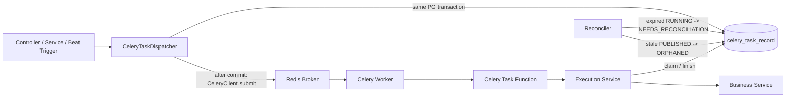

# Celery PostgreSQL 幂等与一致性设计

## 1. 目标与结论

结论：**适合采用当前 fast-fail 版本**。本阶段不引入独立发布缓冲表，也不提供自动重试、自动恢复或可靠发布语义；
API 在任务记录提交后直接调用 `CeleryClient.submit()`，发布异常或发布确认超时都快速进入
`PUBLISH_FAILED`。本方案的首要目标是让每个逻辑任务最终落到一个可解释、可审计、不会无限悬挂的状态，
不是保证任务最终投递或最终执行。

本方案使用 PostgreSQL 作为 Celery 任务登记、发布和执行状态的唯一事实源，解决以下问题：

1. **提交幂等**：同一业务幂等键只创建一个逻辑任务。
2. **请求内同名任务约束**：同一请求内同一个 `task_name` 只能提交一次；该约束由调用方 contract 保证，系统强幂等边界不依赖它。
3. **发布可观测**：数据库登记和 broker 发布不是原子操作；发布失败或长时间未确认发布会进入可观测的
   `PUBLISH_FAILED`。
4. **执行防重**：Worker 只有在当前首次投递消息通过 PostgreSQL 原子准入 claim 后才能进入业务逻辑。
5. **副作用幂等**：数据库唯一约束或下游 idempotency key 防止崩溃窗口造成重复副作用。
6. **快速失败**：校验、claim、业务执行和状态持久化失败都立即结束当前执行，不自动执行 retry。
7. **默认不自动重复执行**：每个逻辑任务默认只允许一次业务执行；Worker 崩溃或结果不确定时不自动接管。

本方案不提供跨 PostgreSQL、Redis broker 和外部系统的 exactly-once。它提供的是：

```text
原子登记 + 直接单次提交 broker + 单次首次投递准入 claim + 业务副作用幂等
```

需要保留的风险说明：

- 当前方案仍然存在 DB/broker 双写窗口。
- Beat/Reconciler 只能把异常状态按 deadline 显性化为 `PUBLISH_FAILED`、`ORPHANED` 或
  `NEEDS_RECONCILIATION`，不能保证任务最终投递、最终执行或自动恢复。

### 1.1 术语约束

- **逻辑任务**：`celery_task_record` 中的一条任务记录。
- **请求**：由 `(scope, trace_id)` 标识的一次提交上下文。调用方必须保证每个请求使用稳定且不与其他请求复用的
  `trace_id`；同一请求内同一个 `task_name` 只能提交一次。系统不使用该约束作为幂等唯一边界。
- **publish attempt**：API 对一个逻辑任务执行的一次 broker 发布尝试；本方案默认不做自动 publish retry。
- **execution retry**：业务逻辑已经开始后再次执行业务逻辑；本方案默认禁止。
- **准入 claim**：Worker 当前收到的首次投递消息在进入业务逻辑前执行的一次 PostgreSQL 条件更新；它是防重门禁，
  不是后台自动接管。
- **自动 claim**：redelivery、晚到消息、孤儿任务、`NEEDS_RECONCILIATION` 任务或恢复流程在没有显式人工命令时
  再次尝试获得执行权；本方案禁止。
- **重复消息**：同一 `task_record_id` 或 `task_id` 被 broker 重复交付；允许出现，但必须快速失败，不得进入业务逻辑。
- **状态归类 deadline**：Beat/Reconciler 判断任务是否长时间停留在中间状态的数据库时间阈值；它只用于状态归类、
  指标和告警，不是投递 SLA，也不触发自动重投、自动 claim 或业务恢复。

“默认不自动重复执行”同时禁止 execution retry、redelivery 自动 claim 和自动 publish retry。所有失败或结果不明确的
路径都快速失败并进入可观测状态。

## 2. 适用范围与前提

- Redis 继续作为 Celery broker 和 result backend；Redis 不再承担业务任务幂等锁。
- 幂等状态表只支持 PostgreSQL，依赖 `ON CONFLICT`、`RETURNING` 和 `FOR UPDATE SKIP LOCKED`。
- 有副作用的任务必须经过本方案的 dispatcher 和 runtime；纯计算、心跳等任务可以显式 opt-out。
- 任务必须有明确的 soft/hard time limit，不允许无限执行。
- 任务参数必须能被 Celery JSON serializer 编码，敏感值和大对象只传资源 ID。

启用幂等功能时必须校验 `DB_TYPE=postgresql`，否则启动失败，避免在 MySQL、Oracle 或 SQLite 上得到错误语义。

## 3. 当前剩余差距

已落地的基础能力不再列为差距；本节只保留当前代码尚未覆盖或仍需确认的内容。

- 当前 `CeleryTaskService.submit_once()` 只覆盖“登记任务后直接 submit”的基础链路，还没有提供让业务写入和任务登记复用同一
  PostgreSQL 事务的通用入口或回调模式；接入真实业务写副作用前需要补齐。
- 只有 `internal.tasks.celery_idempotency_demo.sum_numbers` 作为示例任务接入了 claim wrapper；旧任务、任意
  `.delay()` / `.apply_async()`、Beat 业务任务和 Canvas 仍可绕过统一提交入口。
- Worker runtime 还未完整实现严格消息协议：未写入 `task_schema_version` header，未校验 Celery `request.id` 是否等于
  `task_{record_id}`，未显式识别 redelivery、晚到消息和 claim 失败原因，也缺少对应告警。
- 显式 `CANCELLED`、`NEEDS_RECONCILIATION` 关闭、`ORPHANED` 人工处理、recovery command 和审计记录尚未实现。
- 任务清理、保留期批量删除、指标和告警尚未实现。
- 批量任务的业务明细状态、分片 claim、owner/token fencing、明细 reconciler 和 recovery 流程尚未接入具体业务。
- ACK、redelivery、Worker lost、hard timeout、Redis visibility timeout、Canvas/chord 行为仍缺少真实 Celery/Redis
  集成测试确认。
- 当前只有单元测试覆盖基础 dispatcher、demo wrapper 和 reconciler 编排；尚未覆盖真实 PostgreSQL 并发、Celery
  故障窗口和上线/回滚演练。

## 4. 核心不变量

1. `(scope, task_name, idempotency_key_hash)` 在任务记录保留期间唯一，这是系统唯一强幂等边界；幂等有效期只决定
   记录何时允许清理，不改变唯一约束语义。
2. `(scope, trace_id, task_name)` 只作为请求上下文和观测维度；同一请求内重复提交同名任务由调用方避免，系统不为此维护独立
   请求级登记表或数据库唯一约束。
3. 任意请求使用相同幂等键和相同 `payload_hash` 返回同一个逻辑任务；payload 不同必须返回稳定
   `IDEMPOTENCY_CONFLICT`。
4. 任务登记时一次性生成稳定 `id`，Celery `task_id` 由 `id` 派生为 `task_{record_id}`；自动 publish retry 禁止。
5. 新逻辑任务创建路径中，业务数据和任务记录必须在同一 PostgreSQL 事务内写入；broker 发布在事务提交后直接
   `submit()`，不具备跨 DB/broker 原子性。
6. Worker 只有在消息是当前首次投递、记录状态为 `PUBLISHED` 且原子准入 claim 成功时才能进入业务逻辑。
7. Celery `max_retries = 0`，runtime 不调用 `task.retry()`。
8. redelivery、重复消息、晚到消息、`PENDING_PUBLISH` 早到消息、`ORPHANED` 和 `NEEDS_RECONCILIATION` 都不得自动 claim；
   runtime 必须快速失败并告警。
9. `RUNNING` 任务 lease 过期后进入 `NEEDS_RECONCILIATION`，不得自动回到 `RUNNING`。
10. `PUBLISHED` 任务超过最大未 claim 状态归类 deadline 仍未被 claim 时进入 `ORPHANED`；`ORPHANED`
   只表示消息投递或消费缺口，不表示业务已经开始执行。
11. `ORPHANED` 任务不得自动重新投递，也不得被 runtime 自动 claim；本阶段只能取消或通过独立、鉴权、审计的
    recovery task 重新建模。
12. 任务成功或失败更新必须校验 `lease_owner`；owner 不匹配不能覆盖状态。
13. broker I/O、业务协程和外部 API 不得在数据库事务或行锁范围内执行。
14. PostgreSQL 不可用、header 不完整或 claim 结果不明确时 fail closed，不执行业务逻辑。
15. 原始 idempotency key 不写数据库、消息或日志；数据库只保存 SHA-256。
16. 原子 claim 只能防止重复进入业务逻辑，最终副作用仍必须有业务唯一约束或下游 idempotency key。
17. 批量任务不得在处理前把全量明细预先标记为 `RUNNING`；只能按有界分片 claim，未 claim 的明细必须保持
    `PENDING`。
18. 每条已 claim 的批量明细必须有独立 lease 和 owner/fencing token；明细 lease 过期后必须进入可恢复状态，
    不能无限停留在 `RUNNING`。

## 5. 架构与职责



职责边界：

- `pkg/celery_queue`：构造和发布 Celery 消息，不访问项目数据库或业务 context。
- `internal/infra/celery`：Celery app、连接生命周期和 `run_in_async()`，不实现业务状态机。
- `internal/dao`：任务记录的 PostgreSQL 原子 SQL。
- `internal/services`：提交事务、幂等冲突判断、执行状态机和结果持久化。
- `internal/tasks/*`：任务函数通过 `run_in_async()` 调用 execution Service，映射 ACK/Ignore/失败行为。
- reconciler：默认由 Celery Beat 调度，扫描过期 `RUNNING` 并标记 `NEEDS_RECONCILIATION`；扫描长期未 claim 的
  `PUBLISHED` 并标记 `ORPHANED`；扫描超时 `PENDING_PUBLISH` 并标记 `PUBLISH_FAILED`；不重新投递任务，也不执行业务逻辑。

reconciler 用于关闭 Worker 崩溃后的状态缺口；它不是任务重试器。`ORPHANED` 不是 execution retry，它只表示 broker
已确认发布但没有任何 Worker 成功 claim；业务逻辑尚未按数据库事实源开始执行。

## 6. 数据模型

`celery_task_record` 为系统表，不使用软删除或用户审计字段，不建立物理外键。时间统一使用 PostgreSQL UTC 时间语义。

### 6.1 逻辑任务表

```sql
CREATE TABLE celery_task_record (
    id                          BIGINT PRIMARY KEY,
    task_name                   VARCHAR(255) NOT NULL,
    trace_id                    VARCHAR(128) NOT NULL,
    scope                       VARCHAR(128) NOT NULL,
    idempotency_key_hash        CHAR(64) NOT NULL,
    payload_hash                CHAR(64) NOT NULL,
    status                      VARCHAR(32) NOT NULL,
    execution_timeout_seconds   INTEGER NOT NULL,
    lease_owner                 VARCHAR(128),
    lease_expires_at            TIMESTAMPTZ,
    error_type                  VARCHAR(128),
    error_message               VARCHAR(2048),
    idempotency_expires_at      TIMESTAMPTZ NOT NULL,
    created_at                  TIMESTAMPTZ NOT NULL DEFAULT CURRENT_TIMESTAMP,
    updated_at                  TIMESTAMPTZ NOT NULL DEFAULT CURRENT_TIMESTAMP,

    CONSTRAINT uq_celery_task_record_idempotency
        UNIQUE (scope, task_name, idempotency_key_hash),
    CONSTRAINT ck_celery_task_record_status
        CHECK (status IN (
            'PENDING_PUBLISH',
            'PUBLISHED',
            'PUBLISH_FAILED',
            'ORPHANED',
            'RUNNING',
            'SUCCEEDED',
            'FAILED',
            'NEEDS_RECONCILIATION',
            'CANCELLED'
        )),
    CONSTRAINT ck_celery_task_record_timeout
        CHECK (execution_timeout_seconds > 0)
);

CREATE INDEX idx_celery_task_record_trace
    ON celery_task_record (trace_id, created_at DESC, id DESC);

CREATE INDEX idx_celery_task_record_status_updated
    ON celery_task_record (status, updated_at, id);

CREATE INDEX idx_celery_task_record_expired_running
    ON celery_task_record (lease_expires_at, id)
    WHERE status = 'RUNNING';

CREATE INDEX idx_celery_task_record_stale_published
    ON celery_task_record (updated_at, id)
    WHERE status = 'PUBLISHED';

CREATE INDEX idx_celery_task_record_idempotency_expiry
    ON celery_task_record (idempotency_expires_at, id)
    WHERE status IN (
        'PUBLISH_FAILED',
        'SUCCEEDED',
        'FAILED',
        'NEEDS_RECONCILIATION',
        'CANCELLED'
    );
```

说明：

- `id` 使用项目 Snowflake ID，在写数据库前生成。
- Celery `task_id` 不落库，统一由 `id` 派生为 `task_{record_id}`；`trace_id` 和 `task_name` 通过数据库字段与
  broker headers 传递，不作为 Celery `task_id` 的唯一性组成。
- `task_name` 同时是 Celery task name 和幂等命名空间；它是持久化 contract，重命名必须按兼容性迁移处理。
- `execution_timeout_seconds` 必须等于任务 hard time limit，用于校验消息和数据库记录一致。
- `error_type` 在 `NEEDS_RECONCILIATION` 中作为 reason code 使用，例如 `WORKER_LOST_OR_TIMEOUT`、
  `RESULT_WRITE_FAILED`、`OWNER_MISMATCH_ON_FINISH`、`UNCLASSIFIED_RUNTIME_TERMINATION`。
- `updated_at` 作为状态更新时间使用：进入 `PUBLISHED` 时用于 orphan detector，进入 `ORPHANED`、`SUCCEEDED`、
  `FAILED`、`NEEDS_RECONCILIATION` 或 `CANCELLED` 时用于排查、指标和清理。
- 业务结果不写入核心任务表；结果查询应回到业务表、对象存储或 Celery result backend。reconciliation 审计也不写入核心表；
  需要强审计的业务应使用独立审计表。
- 错误消息必须截断和脱敏，不保存完整 traceback、token 或外部响应正文。

- `PUBLISH_FAILED` 用于闭合直接 publish 失败或发布确认超时后仍停留在 `PENDING_PUBLISH` 的状态缺口。
- `ORPHANED` 表示 broker 已确认发布，但在投递孤儿阈值内没有任何 Worker 成功 claim；它与
  `NEEDS_RECONCILIATION` 的区别是它从未进入 `RUNNING`。
- `NEEDS_RECONCILIATION` 表示 Worker 已成功 claim 但未可靠写入终态；副作用是否完成需要通过业务数据或下游系统显式
  reconciliation，系统不自动 claim、retry 或 requeue。
- 默认幂等有效期建议 30 天。由于数据库唯一约束作用于保留中的记录，只有清理旧记录后相同 key 才能再次创建；需要永久
  幂等的业务应在业务表保留永久唯一键，不能依赖任务表无限保留。
- 本方案不维护 `celery_task_submission`。`trace_id + task_name` 是调用方 contract 和观测入口，不是系统强幂等边界。
  若同一请求使用不同幂等键重复提交同名任务，系统可能创建多个逻辑任务；调用方必须通过批量任务或明确的业务幂等键避免。
- 去掉请求级登记表后，`trace_id` 只记录首次创建逻辑任务时的 trace。后续请求命中同一幂等任务时，新 `trace_id`
  不写入任务表；需要审计每次幂等命中的业务，应单独设计访问日志或审计表。

## 7. 状态机

### 7.1 逻辑任务

```text
PENDING_PUBLISH -> PUBLISHED -> RUNNING -> SUCCEEDED
        |             |           |  |
        |             |           |  +-> FAILED
        |             |           +----> NEEDS_RECONCILIATION
        |             +-> ORPHANED
        +-> PUBLISH_FAILED

NEEDS_RECONCILIATION -> SUCCEEDED/FAILED/CANCELLED  # 仅限显式 reconciliation command
PENDING_PUBLISH/PUBLISHED/ORPHANED -> CANCELLED
```

禁止以下自动转换：

```text
FAILED -> RUNNING
NEEDS_RECONCILIATION -> PENDING_PUBLISH/PUBLISHED/RUNNING
expired RUNNING -> RUNNING
SUCCEEDED -> RUNNING
PENDING_PUBLISH -> RUNNING
ORPHANED -> PENDING_PUBLISH
ORPHANED -> RUNNING
ORPHANED -> SUCCEEDED/FAILED/NEEDS_RECONCILIATION
```

| 状态 | 含义 |
| --- | --- |
| `PENDING_PUBLISH` | 已提交数据库，API 正在直接 submit 或尚未确认发布 |
| `PUBLISHED` | `CeleryClient.submit()` 已返回成功且该事实已持久化；不保证消息仍在 Redis 队列、未被预取或一定会被 Worker claim |
| `PUBLISH_FAILED` | 系统没有形成可审计的发布成功事实：direct submit 失败，或 `PENDING_PUBLISH` 超过发布确认 deadline |
| `ORPHANED` | 系统形成过发布成功事实，但没有形成业务开始执行事实：已 `PUBLISHED` 且超过最大未 claim deadline 仍无 Worker 成功准入 claim |
| `RUNNING` | Worker 已获得唯一执行权 |
| `SUCCEEDED` | 业务成功且结果状态已持久化 |
| `FAILED` | 业务明确失败，不自动 retry |
| `NEEDS_RECONCILIATION` | Worker 已成功 claim 但未可靠写入终态；需要显式 reconciliation 判断副作用结果，不自动执行 |
| `CANCELLED` | 执行前被明确取消 |

三个异常停靠状态的审计口径固定为：`PUBLISH_FAILED` 表示没有确认发布成功，`ORPHANED` 表示确认发布过但没有确认业务开始，
`NEEDS_RECONCILIATION` 表示确认业务开始过但没有确认业务结果。

`ORPHANED` 是自动状态机的停靠状态。runtime 不得从 `ORPHANED` claim；晚到的原始消息或重复消息也只能
ACK/Ignore 并告警，不能进入业务逻辑。若未来需要恢复，必须设计独立、鉴权、审计的 recovery command，本方案不提供
自动重新投递。

`PENDING_PUBLISH` 的早到消息同样不能 claim。只有任务记录已成功更新为 `PUBLISHED` 后，当前首次投递的 Worker 才能
执行准入 claim；否则快速失败并等待 publish reconciler 收敛为 `PUBLISH_FAILED`。

`NEEDS_RECONCILIATION` 可以由显式 reconciliation command 根据业务证据关闭到 `SUCCEEDED`、`FAILED` 或
`CANCELLED`，但不得自动转换，也不得回到 `PUBLISHED`、`PENDING_PUBLISH` 或 `RUNNING`。

## 8. 提交协议

### 8.1 接口

```python
dispatch_result = await celery_task_dispatcher.submit_once(
    session=session,
    task_name="internal.tasks.order.create_order",
    trace_id=context.get_trace_id(),
    scope=f"tenant:{tenant_id}",
    idempotency_key=f"create-order:{request_id}",
    args=(order_id,),
    kwargs={},
    queue="celery_queue",
    execution_timeout_seconds=300,
    idempotency_expires_in=timedelta(days=30),
)
```

```python
@dataclass(frozen=True, slots=True)
class TaskDispatchDTO:
    record_id: int
    task_id: str
    status: CeleryTaskStatus
    created: bool
```

`created=False` 表示命中了相同 `(scope, task_name, idempotency_key_hash)` 已登记的逻辑任务；不代表失败，也不会再次
提交 broker。系统不记录请求级登记表，也不区分命中来自当前请求还是其他请求。

`TaskDispatchDTO.task_id` 为派生字段，固定等于 `task_{record_id}`，不需要在数据库中单独存储。

### 8.2 幂等键与 payload hash

- 幂等键由业务调用方提供，不能从 `args/kwargs` 自动推断。
- `idempotency_key_hash = sha256(idempotency_key.encode()).hexdigest()`。
- 系统幂等唯一键为 `(scope, task_name, idempotency_key_hash)`。
- `payload_hash` 使用规范化 JSON，至少包含 `task_name`、`args`、`kwargs`、queue 和影响业务执行的白名单 options。
- JSON object key 固定排序，数组保留顺序；排除 trace、publish attempt 和 lease 字段。
- 任意请求使用相同幂等唯一键、相同 payload：返回原任务。
- 任意请求使用相同幂等唯一键、不同 payload：抛出稳定 `IDEMPOTENCY_CONFLICT`。
- 同一请求再次提交同一 `task_name` 由调用方避免；若使用不同幂等键提交，系统会按不同逻辑任务处理，不提供
  专门的请求级重复任务错误码。
- 原始 idempotency key 不进入日志、headers 或持久化字段。

### 8.3 原子登记

业务写入和任务登记复用同一个 `AsyncSession` 和事务：

```text
BEGIN
  生成 candidate task_record_id
  INSERT task_record ... ON CONFLICT (scope, task_name, idempotency_key_hash) DO NOTHING RETURNING ...
  若冲突，读取主库记录并校验 payload_hash；payload 一致则不执行业务写入，返回已有任务
  若创建新 task_record，写业务数据
COMMIT
提交后直接 CeleryClient.submit(task_id=task_{record_id}, ...)
submit 成功后条件更新 task_record 为 PUBLISHED
submit 失败后条件更新 task_record 为 PUBLISH_FAILED
```

冲突后的读取必须使用当前事务或主库 session，不能使用 read replica。DAO 必须接受显式 `AsyncSession` 或提供 statement；不能调用会自行创建事务的 `BaseDao.insert()`。

任务幂等唯一性必须由 PostgreSQL unique constraint 兜底，Service 层预检查只能用于改善错误信息，不能作为并发正确性
保障。DAO 应使用带明确 conflict target 的 `ON CONFLICT DO NOTHING RETURNING` 判断幂等键是否已占用，不应捕获宽泛
`IntegrityError`；不能把连接失败、超时或其他完整性错误误报为幂等冲突。异常日志只记录 `scope`、`trace_id`、
`task_name` 和幂等 key hash 前缀。调用方不得捕获幂等冲突后在同一请求中改用随机幂等键重试。

命中已有逻辑任务时，当前提交路径不得继续执行业务写入或再次提交 broker。若某个业务必须先写业务数据才能计算
`payload_hash` 或幂等键，该业务写入本身必须有数据库唯一约束兜底，并在任务幂等命中时回滚当前事务。

提交结果语义：

- PostgreSQL commit 成功：任务已登记为 `PENDING_PUBLISH`，随后 API 直接尝试 `CeleryClient.submit()`。
- direct submit 成功：任务记录条件更新为 `PUBLISHED` 并返回。
- direct submit 抛出异常：任务记录条件更新为 `PUBLISH_FAILED` 并返回发布失败错误。
- commit 后、submit 前进程崩溃，或 submit 后、状态回写前进程崩溃：Beat 只能把超时 `PENDING_PUBLISH` 收敛为
  `PUBLISH_FAILED`；如果 broker 实际已收到消息但记录未进入 `PUBLISHED`，Worker 仍必须快速失败。
- 幂等键冲突但 payload 一致：返回已存在的逻辑任务，不提交新的业务写入，也不再次提交 broker。
- 幂等键冲突且 payload 不一致：抛出稳定 `IDEMPOTENCY_CONFLICT`，当前事务内的业务写入和 task record 全部回滚。
- PostgreSQL 失败：立即返回失败，不发布消息。
- broker 不可用：不影响已经完成的数据库提交；direct submit 失败后快速进入 `PUBLISH_FAILED` 并告警，不自动 retry。

“快速失败”不等于可靠投递。API 只能确认当前同步 publish attempt 的结果；无法消除 DB/broker 双写窗口。

## 9. 稳定消息与发布协议

### 9.1 Celery transport API

`pkg/celery_queue.CeleryClient.submit()` 支持传入稳定 `task_id`。幂等任务必须通过 dispatcher 调用 `submit()`，
不得由 Controller、业务 Service 或 task 内部直接 `.delay()` / `.apply_async()` 绕过任务记录。

消息 headers 至少包含：

```json
{
  "trace_id": "...",
  "task_schema_version": 1
}
```

当前实现将 `record_id` 和 `scope` 放在 task args 的前两个参数，Celery `request.id` 固定为 `task_{record_id}`。
Worker 必须验证 task name、scope、record ID 和数据库记录一致。`trace_id` 用于日志与链路观测，不参与 Worker
claim 条件。

### 9.2 Direct submit fast-fail

发布流程：

1. DB transaction 创建 `PENDING_PUBLISH` 任务记录并提交。
2. API 在事务外调用 `CeleryClient.submit(task_id=f"task_{record_id}", retry=False, countdown=delivery_grace)`。
3. submit 成功后，DAO 条件更新 `PENDING_PUBLISH -> PUBLISHED`。
4. submit 抛异常后，DAO 条件更新 `PENDING_PUBLISH -> PUBLISH_FAILED`，记录 `BROKER_PUBLISH_FAILED`。
5. Beat 定时扫描 stale `PENDING_PUBLISH`，只标记 `PUBLISH_FAILED`，不再次 submit。

stale `PENDING_PUBLISH` 的保守收敛 SQL：

```sql
WITH candidates AS (
    SELECT id
    FROM celery_task_record
    WHERE status = 'PENDING_PUBLISH'
      AND updated_at < CURRENT_TIMESTAMP - make_interval(secs => :stale_seconds)
    ORDER BY updated_at, id
    FOR UPDATE SKIP LOCKED
    LIMIT :batch_size
)
UPDATE celery_task_record AS r
SET status = 'PUBLISH_FAILED',
    error_type = 'PUBLISH_CONFIRMATION_TIMEOUT',
    error_message = 'pending publish was not confirmed before timeout',
    updated_at = CURRENT_TIMESTAMP
FROM candidates AS c
WHERE r.id = c.id
  AND r.status = 'PENDING_PUBLISH'
RETURNING r.id;
```

建议初始配置：

```text
CELERY_TASK_DELIVERY_GRACE_SECONDS=2
CELERY_PUBLISH_CONFIRM_TIMEOUT_SECONDS=30
CELERY_PUBLISH_RECONCILER_INTERVAL_SECONDS=10
CELERY_PUBLISHED_ORPHAN_SECONDS=900
```

delivery grace 必须小于 publish confirmation timeout，避免 Worker 在 API 正常确认发布前过早 claim。
publish confirmation timeout 必须大于 publish reconciler interval，避免扫描周期本身大于或等于确认窗口而导致告警口径不清。
`CELERY_PUBLISHED_ORPHAN_SECONDS` 必须大于正常排队延迟和 Worker 冷启动时间，并小于业务可接受的任务投递延迟；
该值需要按队列和业务任务类型压测后确定，不能直接套用全局默认值。

## 10. Worker 执行协议

### 10.1 Task function wrapper

所有有副作用任务必须在任务函数内通过 `run_in_async()` 执行 async 业务链路：

```python
@celery_client.app.task(
    bind=True,
    name="internal.tasks.order.create_order",
    max_retries=0,
    soft_time_limit=270,
    time_limit=300,
)
def create_order(self, record_id: int, scope: str, order_id: int):
    async def _execute():
        owner = f"worker_{uuid4().hex}"
        service = new_celery_task_execution_service()
        claimed = await service.claim(
            record_id=record_id,
            task_name="internal.tasks.order.create_order",
            scope=scope,
            owner=owner,
            execution_timeout_seconds=300,
            lease_grace_seconds=settings.CELERY_EXECUTION_LEASE_GRACE_SECONDS,
        )
        if not claimed:
            raise Ignore()
        return await new_order_service().create(order_id=order_id)

    return run_in_async(_execute, trace_id=_resolve_trace_id(self))
```

任务函数必须完成：

1. 校验 message headers 和数据库记录。
2. 校验当前消息不是 broker redelivery、重复消息或晚到消息；不能可靠判定时 fail closed。
3. 通过 `run_in_async()` 初始化异步资源和 trace context。
4. 仅对 `PUBLISHED` 的当前首次投递执行一次准入 claim；失败则 ACK/Ignore，不能执行业务逻辑。
5. 执行业务协程。
6. owner 条件更新成功或失败状态。
7. 任何异常都不调用 `task.retry()`，也不 requeue。

### 10.2 原子 claim

```sql
UPDATE celery_task_record
SET status = 'RUNNING',
    lease_owner = :owner,
    lease_expires_at = CURRENT_TIMESTAMP + make_interval(secs => :lease_seconds),
    error_type = NULL,
    error_message = NULL,
    updated_at = CURRENT_TIMESTAMP
WHERE id = :record_id
  AND task_name = :task_name
  AND scope = :scope
  AND status = 'PUBLISHED'
RETURNING *;
```

该 SQL 只能在 runtime 已确认当前消息不是 broker redelivery 或晚到消息后执行。`lease_seconds = hard_time_limit + grace`，
且数据库中的 `execution_timeout_seconds` 必须与 task hard time limit 一致。lease 只用于识别失联任务，不允许自动接管。

claim 未返回行时读取主库记录：

| 当前情况 | Worker 行为 |
| --- | --- |
| `PENDING_PUBLISH` | ACK/Ignore，记录早到消息告警，不执行 |
| `RUNNING` | ACK/Ignore，不执行 |
| `ORPHANED` | ACK/Ignore，记录晚到消息告警，不执行 |
| `SUCCEEDED`、`FAILED`、`PUBLISH_FAILED`、`NEEDS_RECONCILIATION`、`CANCELLED` | ACK/Ignore，不执行 |
| 记录不存在或 ID/name 不匹配 | fail closed、告警、不执行 |
| PostgreSQL 不可用或结果不明确 | fail closed、不执行 |

`ORPHANED` 任务即使从未进入 `RUNNING` 也不能由 runtime 自动 claim。这个规则会牺牲“晚到消息自动补执行”，换取更清晰的
人工恢复边界，避免任务已被标记为孤儿后又在后台突然产生副作用。

`PENDING_PUBLISH` 任务即使已经有 broker 消息到达，也不能由 runtime 自动 claim。该消息属于 publish 状态回写前的
早到窗口，必须快速失败；后续由 publish reconciler 标记为 `PUBLISH_FAILED`。

### 10.3 完成与失败

成功更新：

```sql
UPDATE celery_task_record
SET status = 'SUCCEEDED',
    lease_owner = NULL,
    lease_expires_at = NULL,
    updated_at = CURRENT_TIMESTAMP
WHERE id = :record_id
  AND status = 'RUNNING'
  AND lease_owner = :owner
RETURNING id;
```

业务异常使用相同 owner 条件更新为 `FAILED`，保存脱敏摘要后重新抛出原异常。状态更新没有返回行时不能报告成功，必须记录高优先级告警。
业务结果不写入核心任务表；需要返回结果的业务应通过业务表、对象存储或 result backend 查询。

> 如果业务副作用已经成功但 `SUCCEEDED` 更新失败，任务保持 `RUNNING`，之后由 reconciler 标记 `NEEDS_RECONCILIATION`；禁止自动再执行。

### 10.4 Worker lost 与超时

- soft timeout：业务清理后按明确异常路径写 `FAILED`；不 retry。
- hard timeout、进程崩溃或机器丢失：记录可能保持 `RUNNING`。
- execution reconciler 只把 lease 已过期的 `RUNNING` 条件更新为 `NEEDS_RECONCILIATION` 并告警。
- `NEEDS_RECONCILIATION` 必须通过业务数据或下游查询进行 reconciliation，不能直接重跑；状态原因写入
  `error_type`，不要再拆成多个主状态。

> reconciliation 必须使用数据库时间和条件更新，避免覆盖已经完成的任务：

```sql
WITH candidates AS (
    SELECT id
    FROM celery_task_record
    WHERE status = 'RUNNING'
      AND lease_expires_at < CURRENT_TIMESTAMP
    ORDER BY lease_expires_at, id
    FOR UPDATE SKIP LOCKED
    LIMIT :batch_size
)
UPDATE celery_task_record AS r
SET status = 'NEEDS_RECONCILIATION',
    lease_owner = NULL,
    lease_expires_at = NULL,
    error_type = 'WORKER_LOST_OR_TIMEOUT',
    error_message = 'running task lease expired before terminal status was persisted',
    updated_at = CURRENT_TIMESTAMP
FROM candidates AS c
WHERE r.id = c.id
  AND r.status = 'RUNNING'
  AND r.lease_expires_at < CURRENT_TIMESTAMP
RETURNING r.id;
```

显式 reconciliation command 的边界：

- 必须独立鉴权和审计，不复用普通提交接口。
- 必须先查询业务数据或下游系统，形成可记录的 reconciliation 证据；审计证据写入独立审计表或操作日志，不写入核心任务表。
- 只允许把 `NEEDS_RECONCILIATION` 关闭到 `SUCCEEDED`、`FAILED` 或 `CANCELLED`，并更新 `error_type`、`error_message`
  和 `updated_at`。
- 禁止把 `NEEDS_RECONCILIATION` 改回 `RUNNING`、`PUBLISHED` 或 `PENDING_PUBLISH`。

> 如果未来需要重新执行业务，必须通过显式 recovery command 创建新的、可审计的逻辑任务；不能复用原任务状态回到可执行态。

### 10.5 Published 孤儿任务检测与人工处理边界

`PUBLISHED` 只表示 broker 接受了消息，不保证消息最终被 Worker claim。`CELERY_PUBLISHED_ORPHAN_SECONDS`
是最大未 claim 状态归类 deadline，不是投递 SLA；超过该时间只说明系统没有观察到数据库 claim 成功。
以下场景会产生孤儿任务：

- broker 在确认 publish 后丢失消息、消息过期或 Redis 数据被清理；
- 队列路由错误、没有 Worker 消费对应队列，或 Worker 长时间不可用；
- API 在 broker 侧成功且项目状态已经进入 `PUBLISHED`，后续没有任何 claim；
- legacy/strict header rollout 或任务注册错误导致消息被拒绝但没有业务执行。

孤儿判断只针对仍停留在 `PUBLISHED` 的任务。任务一旦进入 `RUNNING`，即使没有完成也只能按第 10.4 节进入
`NEEDS_RECONCILIATION`，不能按孤儿任务处理。

检测 SQL：

```sql
WITH candidates AS (
    SELECT id
    FROM celery_task_record
    WHERE status = 'PUBLISHED'
      AND updated_at < CURRENT_TIMESTAMP - make_interval(secs => :orphan_seconds)
    ORDER BY updated_at, id
    FOR UPDATE SKIP LOCKED
    LIMIT :batch_size
)
UPDATE celery_task_record AS r
SET status = 'ORPHANED',
    error_type = 'DELIVERY_ORPHANED',
    error_message = 'published task was not claimed before orphan deadline',
    updated_at = CURRENT_TIMESTAMP
FROM candidates AS c
WHERE r.id = c.id
  AND r.status = 'PUBLISHED'
  AND r.updated_at < CURRENT_TIMESTAMP - make_interval(secs => :orphan_seconds)
RETURNING r.id;
```

处理规则：

- `ORPHANED` 是人工介入状态，不自动重新投递，也不自动执行业务逻辑。
- 任务记录保持 `ORPHANED`，用于审计“broker 曾确认 publish 但没有成功 claim”；reconciler 不得把它改回
  `PENDING_PUBLISH` 或 `PUBLISHED`。
- 原始消息晚到时，runtime 必须 ACK/Ignore 并记录晚到消息告警，不能从 `ORPHANED` claim 到 `RUNNING`。
- 如果 Celery `expires` 或业务投递截止时间已经过期，任务保持 `ORPHANED` 并告警，不做自动恢复。
- 如果未来需要恢复，必须设计独立、鉴权、审计的 recovery command。恢复命令需要先基于业务数据和下游状态判断是否
  仍应执行，再决定取消、重新建模，或以显式人工操作复用原 `task_id` 投递；该能力不属于本阶段自动流程。

> `ORPHANED` 与 `NEEDS_RECONCILIATION` 的共同点是都不自动重跑；区别是 `ORPHANED` 表示数据库确认没有
> claim，`NEEDS_RECONCILIATION` 表示业务副作用是否发生已经不确定。两者都必须通过显式 reconciliation 决策处理。

### 10.6 批量任务的明细状态与 Worker 中止恢复

任务级 lease 只管理 `celery_task_record`，不会自动修复业务表或批次明细表中的状态。若一个任务在开始时将全量
明细更新为 `RUNNING`，Worker 被 kill、hard timeout 或机器丢失后，即使父任务被 reconciler 更新为
`NEEDS_RECONCILIATION`，尚未处理的明细也会永久停留在 `RUNNING`。因此批量任务必须额外遵守以下 contract。

#### 10.6.1 推荐拆分方式

优先将大批量作业拆成“批次协调任务 + 有界分片任务”：

1. 协调任务只固化待处理明细和游标，不直接长时间处理全量数据。
2. 每个分片任务都有独立的 `celery_task_record`、幂等键和 hard time limit。
3. 原始请求只能登记一个协调任务。协调器登记多个同名分片时，每个分片必须使用由批次 ID 和稳定分片边界派生的
   独立幂等键；不得使用随机幂等键绕过 `(scope, task_name, idempotency_key_hash)` 唯一约束。
4. 分片任务按相同 dispatcher fast-fail 语义登记和直接 submit；协调任务中止后，已登记分片不会自动恢复发布。
5. 分片幂等键至少包含批次 ID 和稳定分片边界，不能使用本次进程生成的随机值。

无法拆成子任务时，单任务循环也必须按固定上限 claim 明细。禁止先执行类似
`UPDATE ... SET status = 'RUNNING' WHERE batch_id = :batch_id` 的全量状态更新。每轮只能在短事务内通过
`FOR UPDATE SKIP LOCKED` claim `:batch_size` 条；事务提交后再执行外部 I/O，并在一个批量 SQL 中持久化该分片的
结果，不得逐条查询或逐条提交。

#### 10.6.2 明细最小持久化字段

字段可以放在业务明细表，也可以放在业务专用的 batch item 表；不强制所有业务共用一张通用表。至少需要：

```text
batch_id                 # 所属业务批次
status                   # PENDING/RUNNING/SUCCEEDED/FAILED/PROCESSING_UNKNOWN
lease_owner              # 当前 Worker/分片 owner
lease_token              # 每次 claim 生成的新 fencing token
lease_expires_at         # 使用数据库时间计算
started_at/finished_at
last_error               # 截断、脱敏后的错误摘要
```

应为实际领取查询建立索引，例如 `(batch_id, status, id)` 以及仅覆盖过期 `RUNNING` 的 partial index。是否增加
`attempt_count` 由业务恢复策略决定；它不能替代业务副作用幂等。

示例分片 claim：

```sql
WITH candidates AS (
    SELECT id
    FROM business_batch_item
    WHERE batch_id = :batch_id
      AND status = 'PENDING'
    ORDER BY id
    FOR UPDATE SKIP LOCKED
    LIMIT :batch_size
)
UPDATE business_batch_item AS i
SET status = 'RUNNING',
    lease_owner = :owner,
    lease_token = :lease_token,
    lease_expires_at = CURRENT_TIMESTAMP + make_interval(secs => :item_lease_seconds),
    started_at = COALESCE(i.started_at, CURRENT_TIMESTAMP),
    updated_at = CURRENT_TIMESTAMP
FROM candidates AS c
WHERE i.id = c.id
RETURNING i.id;
```

完成或失败更新必须同时校验 `status = 'RUNNING'`、`lease_owner` 和 `lease_token`。旧 Worker 在 lease 过期后恢复时，
不得覆盖新 owner 的结果。分片处理时间可能超过 lease 时必须续租；续租也要校验 owner/token，并设置最大执行时长，
不能形成无限 lease。

#### 10.6.3 lease 过期后的分类恢复

reconciler 扫描过期明细时，必须根据副作用是否可判定选择状态，不能统一重置为 `PENDING`：

| 明细类型 | lease 过期后的状态 | 后续行为 |
| --- | --- | --- |
| 从未被 claim 的明细 | 保持 `PENDING` | 不自动 claim；只能由显式登记的恢复任务处理 |
| 业务变更与明细完成状态在同一 PostgreSQL 事务内提交，事务失败会整体回滚 | `PROCESSING_UNKNOWN` | 先由显式恢复流程判定，再决定是否重置为 `PENDING` |
| 外部副作用有稳定 idempotency key，且可安全重放 | `PROCESSING_UNKNOWN` | 先由显式恢复流程判定，再决定是否使用同一 key 重放 |
| 外部副作用是否成功无法确认，或状态回写失败 | `PROCESSING_UNKNOWN` | 先查询业务数据/下游系统并 reconciliation，禁止直接重放 |

通用实现必须采用保守默认值：过期 `RUNNING -> PROCESSING_UNKNOWN`。即使业务处理器理论上可安全重放，reconciler
也不得自动更新回 `PENDING`，避免形成自动 claim 或自动重试。reconciler 必须等待明细 lease 过期，不能仅因为父任务进入
`NEEDS_RECONCILIATION` 就抢占可能仍在运行的明细。

保守回收必须使用数据库时间、`SKIP LOCKED` 和二次条件判断，例如：

```sql
WITH candidates AS (
    SELECT id
    FROM business_batch_item
    WHERE status = 'RUNNING'
      AND lease_expires_at < CURRENT_TIMESTAMP
    ORDER BY lease_expires_at, id
    FOR UPDATE SKIP LOCKED
    LIMIT :batch_size
)
UPDATE business_batch_item AS i
SET status = 'PROCESSING_UNKNOWN',
    lease_owner = NULL,
    lease_token = NULL,
    lease_expires_at = NULL,
    last_error = 'WORKER_LOST_OR_TIMEOUT',
    finished_at = CURRENT_TIMESTAMP,
    updated_at = CURRENT_TIMESTAMP
FROM candidates AS c
WHERE i.id = c.id
  AND i.status = 'RUNNING'
  AND i.lease_expires_at < CURRENT_TIMESTAMP
RETURNING i.id;
```

如果未来需要把 `PROCESSING_UNKNOWN` 明细恢复为 `PENDING`，必须通过独立、鉴权、审计的 recovery command 完成；
不能由后台 reconciler 自动执行。恢复命令必须同时清空旧 owner/token/lease，且不得保留 `finished_at`。

父任务的恢复规则如下：

- 父任务被 kill 后，任务级 reconciler 仍按第 10.4 节将其更新为 `NEEDS_RECONCILIATION`。
- 明细 reconciler 独立清理已过期的 `RUNNING`，保证不存在永久 `RUNNING`。
- 未处理且未 claim 的明细保持 `PENDING`；由于本方案禁止 execution retry，它们不会由原父任务自动继续。
- 继续处理必须由显式人工流程创建新的、可审计的 recovery task，幂等键使用
  `batch-recovery:{batch_id}:{recovery_generation}`；同一恢复代次必须稳定复用该 key。该任务只能 claim
  `PENDING`，不能直接 claim `PROCESSING_UNKNOWN`。
- 只有所有明细都处于 `SUCCEEDED` 或业务允许的 `FAILED` 终态，且不存在 `PENDING`、`RUNNING`、
  `PROCESSING_UNKNOWN` 时，批次才可标记为成功。

> Celery revoke 默认只阻止尚未执行的消息；带 terminate 的 revoke、进程信号、hard timeout 和机器失联
> 都按 Worker lost 处理。不能依赖 `finally` 将明细复位，因为进程可能没有执行清理代码。

## 11. Reconciler

reconciler 是任务状态维护器，只做数据库状态收敛和告警，不执行业务逻辑，不发布 broker 消息，不 claim 任务，
也不做 retry/requeue。

默认实现使用 Celery Beat 调度维护任务：

- `celery_task_publish_reconciler`：定期扫描超时 `PENDING_PUBLISH`，按第 9.2 节条件更新为 `PUBLISH_FAILED`。
- `celery_task_running_reconciler`：定期扫描过期 `RUNNING`，按第 10.4 节条件更新为 `NEEDS_RECONCILIATION`。
- `celery_task_orphan_detector`：定期扫描长期未 claim 的 `PUBLISHED`，按第 10.5 节条件更新为 `ORPHANED`。
- 可选的业务明细 reconciler：只把过期业务明细 `RUNNING` 收敛到 `PROCESSING_UNKNOWN`，不得自动回到
  `PENDING`。

调度与执行约束：

- 默认由 `internal/tasks/scheduler.py` 配置 Celery Beat schedule，投递到维护队列，例如 `celery_maintenance_queue`。
- reconciler task 必须幂等、可重复触发、批量有上限，并使用数据库时间、`FOR UPDATE SKIP LOCKED` 和二次条件判断。
- 单次运行只处理有限批次，不能长事务，不能在数据库事务或行锁范围内做 broker I/O、外部 API 或业务 Service 调用。
- 如果 Celery Beat、broker 或维护 Worker 不可用，reconciler 可能延迟运行；这只影响异常状态归类和告警及时性，
  不允许触发自动 claim、自动重新投递或自动业务执行。
- 多个 reconciler 实例并发运行时，必须依赖数据库条件更新保证同一记录最多被一个实例转换状态。
- reconciler 只允许以下自动转换：

```text
RUNNING -> NEEDS_RECONCILIATION
PENDING_PUBLISH -> PUBLISH_FAILED
PUBLISHED -> ORPHANED
business item RUNNING -> PROCESSING_UNKNOWN
```

禁止以下行为：

- `ORPHANED -> PENDING_PUBLISH/RUNNING`
- `NEEDS_RECONCILIATION -> PENDING_PUBLISH/PUBLISHED/RUNNING`
- `PUBLISH_FAILED -> PENDING_PUBLISH`
- 再次调用 Celery `submit()` / `.apply_async()`、调用 `task.retry()` 或 requeue；
- 根据业务参数决定是否恢复执行。

建议初始调度：

```text
CELERY_RECONCILER_BEAT_ENABLED=true
CELERY_RECONCILER_INTERVAL_SECONDS=60
CELERY_RECONCILER_BATCH_SIZE=100
CELERY_RECONCILER_QUEUE=celery_maintenance_queue
```

## 12. ACK、Redelivery 与快速失败

目标不是阻止 broker 重复交付，而是确保重复交付、redelivery 和晚到消息快速失败，无法自动 claim 或再次进入业务逻辑。

建议行为：

- 消息在 claim 前发生 Worker lost：如果 broker redelivery，runtime 必须识别为 redelivery 后 ACK/Ignore 并告警；
  不允许新的 Worker 自动完成第一次 claim。任务后续进入 `ORPHANED`，等待显式处理。
- 消息已 publish 但长时间没有任何 claim：任务进入 `ORPHANED`，告警并等待人工或显式恢复流程处理。
- 消息在 claim 后发生 Worker lost：redelivery 看到记录已不再是 `PUBLISHED` 后 ACK/Ignore，不重复执行业务逻辑。
- 业务异常：写 `FAILED` 并 ACK，不 requeue。
- 重复消息：ACK/Ignore。
- `PENDING_PUBLISH` 早到消息：ACK/Ignore 并告警，不 claim。
- `ORPHANED` 晚到消息：ACK/Ignore 并告警，不 claim。
- header 非法或记录不存在：fail closed 并告警，不执行业务逻辑。
- PostgreSQL 不可用：快速结束并 fail closed；不得因为无法确认 claim 就执行业务逻辑。

建议显式评估并锁定以下 Celery 配置，而不是依赖框架默认值：

```text
task_acks_late
task_acks_on_failure_or_timeout
task_reject_on_worker_lost
broker_transport_options.visibility_timeout
```

> “快速失败”的边界：业务异常、校验失败、redelivery、早到/晚到消息、claim 失败和 broker publish 失败
> 都不做自动 retry、自动 claim 或 requeue；后续只能通过显式、鉴权、审计的恢复流程处理。

## 13. 业务副作用幂等

数据库 claim 无法消除“副作用成功、任务状态回写前崩溃”的窗口。每个有副作用任务至少满足一种保障：

- 数据库写入：业务请求 ID、事件 ID 或业务单号唯一约束。
- 状态变更：使用带前置状态或版本号的条件更新。
- 支付/外部 API：透传稳定 idempotency key。
- 邮件/通知：发送记录使用 `(template_id, recipient, business_event_id)` 唯一键。
- 第三方同步：保存目标版本或事件 ID，防止旧任务覆盖新状态。

不具备业务幂等保障的副作用任务不得接入自动化执行链路。

## 14. Beat 与 Canvas

### 14.1 Beat

周期任务的幂等键必须包含计划时间槽：

```text
beat:{schedule_name}:{scheduled_at_utc}
```

Beat 只触发无副作用 dispatcher；真实业务任务由 dispatcher 直接 submit。重复触发同一时间槽只能创建一条任务记录。
每个 schedule slot 必须同时派生稳定且唯一的内部 `trace_id`，例如
`sha256("beat:{schedule_name}:{scheduled_at_utc}")`；同一 slot 第二次提交同名任务时，若幂等键和 payload 一致则返回
已有任务，不再次提交 broker。

### 14.2 Canvas

当前 `CeleryClient` 不提供 `chain()`、`group()` 或 `chord()` 封装。Celery Canvas 会绕过 task record 登记、
稳定 task ID 和 claim 状态机；本阶段不通过基础 client 暴露未接入幂等状态机的编排能力。

- 纯计算或无副作用 Canvas 可以直接使用原生 Celery API，但必须显式 opt-out 本幂等状态机。
- 有副作用的编排优先提交一个有状态协调任务，由协调任务按本方案登记后续逻辑任务。
- 如果未来需要支持有副作用 Canvas，每个节点都必须有独立任务记录、稳定 task ID 和幂等键。
- 同一 Canvas 构建请求中不应重复提交相同 `task_name` 的持久化节点；需要并行处理同类数据时使用一个 batch 节点，
  或为每个节点定义稳定、可审计的 `task_name` 和幂等键。
- Chord callback 使用独立幂等键，不能复用 header 节点的 key。
- 完成 Canvas 集成测试前，不宣称通用幂等机制覆盖 Canvas。

## 15. 安全、保留与可观测性

### 15.1 安全

- task payload 上限建议 256 KiB，超限拒绝提交。
- 不在 payload 中放密码、token、连接串或文件正文。
- 日志只记录 record ID、task ID、task name、trace ID、状态、publish attempt、execution attempt 和耗时。
- idempotency key 日志最多记录 hash 前缀，不能记录原文。
- Celery result backend 只作为运行时辅助；业务查询以 PostgreSQL 任务表为准。

### 15.2 数据保留

- `PENDING_PUBLISH`、`PUBLISHED`、`ORPHANED`、`RUNNING` 不自动清理。
- `ORPHANED` 在取消或人工 reconciliation 前不自动清理。
- `NEEDS_RECONCILIATION` 在 reconciliation 完成前不自动清理。
- 其他终态默认保留 30 天；审计敏感业务按业务要求延长。
- 任务记录按终态和保留期清理，使用有上限的批量删除，不逐行删除。

### 15.3 指标和告警

至少提供：

- `PENDING_PUBLISH` 数量、最老 pending 年龄和 fast-fail 数量；
- direct submit attempt、延迟和失败原因；
- `PUBLISHED` 未 claim 数量、最老 published 年龄、`ORPHANED` 数量和最老 orphan 年龄；
- `ORPHANED` 晚到消息忽略数量、人工取消数量、人工 reconciliation 数量；
- reconciler 最近运行时间、运行耗时、批量处理数量、失败次数和 Beat 调度延迟；
- execution claim success、duplicate、invalid message 数量；
- `RUNNING` 超时和 `NEEDS_RECONCILIATION` 数量；
- 各业务批次 `PENDING`、过期 `RUNNING` 和 `PROCESSING_UNKNOWN` 明细数量、最老年龄；
- batch item expired-to-processing-unknown、人工 recovery command、reconciliation close 数量；
- `PUBLISH_FAILED`、`FAILED` 数量；
- idempotency conflict 数量；
- task 执行耗时和 soft/hard timeout 数量。

## 16. 配置

```text
CELERY_IDEMPOTENCY_ENABLED=true
CELERY_EXECUTION_LEASE_GRACE_SECONDS=30
CELERY_TASK_DELIVERY_GRACE_SECONDS=2
CELERY_PUBLISH_CONFIRM_TIMEOUT_SECONDS=30
CELERY_PUBLISH_RECONCILER_INTERVAL_SECONDS=10
CELERY_PUBLISHED_ORPHAN_SECONDS=900
CELERY_RECONCILER_BEAT_ENABLED=true
CELERY_RECONCILER_INTERVAL_SECONDS=60
CELERY_RECONCILER_BATCH_SIZE=100
CELERY_RECONCILER_QUEUE=celery_maintenance_queue
CELERY_TASK_IDEMPOTENCY_DAYS=30
CELERY_TASK_MAX_PAYLOAD_BYTES=262144
```

必须使用 Pydantic 正数和范围校验，并验证：

- 幂等功能启用时数据库类型为 PostgreSQL；
- execution lease grace 有合理上限；
- task delivery grace 小于 publish confirmation timeout；
- published orphan 阈值大于正常排队延迟和 Worker 冷启动时间；
- reconciler interval、batch size 和 queue 必须有显式配置；关闭 Beat reconciler 时必须有替代调度器；
- payload 上限不能被配置为无界。

## 17. 当前未落地实现

以下只列当前仍需实现的内容。已经落地的 DDL、ORM、DAO 原子 SQL、基础 Service、稳定 `task_id`、demo task、
Reconciler task、Beat schedule、配置项和基础单元测试不再作为计划项重复列出。

| 方向 | 当前缺口 | 可能涉及文件 |
| --- | --- | --- |
| 业务事务集成 | 还没有通用入口让业务写入和 task record reserve 复用同一 PostgreSQL 事务；真实业务接入前必须补齐，否则只能覆盖 demo 提交链路。 | `internal/services/celery_task.py`、具体业务 Service |
| 严格消息协议 | 还未写入 `task_schema_version` header，未校验 Celery `request.id == task_{record_id}`，未读取主库记录区分 claim 失败原因。 | `pkg/celery_queue/client.py`、`internal/tasks/*` |
| redelivery/晚到消息识别 | 当前 demo 只依赖 DB claim 失败后 `Ignore`，未显式识别 broker redelivery、早到/晚到消息，也没有告警分类。 | 通用 runtime wrapper 或各任务函数 |
| 旧任务迁移和绕过控制 | `internal/tasks/celery.py` 中仍有旧任务和 `self.retry(...)` 示例；`.delay()` / `.apply_async()`、Beat 业务任务和 Canvas 仍可绕过统一提交入口。 | `internal/tasks/celery.py`、调用方、代码规范或封装 |
| 显式人工流程 | `CANCELLED`、`NEEDS_RECONCILIATION` 关闭、`ORPHANED` 人工处理、recovery command 和审计记录尚未实现。 | DAO / Service / Controller / 审计表 |
| 可观测性 | 指标、告警、reconciler 运行记录、晚到消息忽略计数、人工处理计数尚未实现。 | 监控封装、`internal/tasks/reconciler.py`、runtime |
| 数据保留 | 终态任务按保留期批量清理尚未实现；`ORPHANED` / `NEEDS_RECONCILIATION` 的清理前置条件尚未编码。 | DAO、maintenance task、scheduler |
| 批量任务恢复 contract | 业务明细状态、分片 claim、owner/token fencing、明细 reconciler 和 recovery 流程尚未接入具体业务。 | 首个批量业务的 model / DAO / Service / task |
| Beat 业务任务和 Canvas | 只有 Reconciler 使用 Beat；schedule-slot 幂等、Canvas 节点幂等和 chord callback 行为尚未实现和验证；当前不提供 `CeleryClient` Canvas 封装。 | `internal/tasks/scheduler.py`、业务任务、未来 Canvas runtime |

## 18. 待确认与待补充

- `CELERY_RECONCILER_INTERVAL_SECONDS`、`CELERY_RECONCILER_BATCH_SIZE` 和维护队列容量需要按任务量、数据库压力和告警响应时间压测后确定。
- `CELERY_EXECUTION_LEASE_GRACE_SECONDS`、`CELERY_TASK_IDEMPOTENCY_DAYS`、`CELERY_TASK_MAX_PAYLOAD_BYTES` 仍是初始建议值，需要结合真实任务时长、审计要求和数据库容量确认。
- `task_acks_late`、`task_acks_on_failure_or_timeout`、`task_reject_on_worker_lost`、Redis
  `visibility_timeout` 与 `celery.exceptions.Ignore`、prefork hard timeout 的组合行为，需要在锁定 Celery/Redis/Worker pool
  版本上做集成测试后才能写成生产默认值。
- `Ignore`、重复节点、chord unlock/callback 的交互依赖 Celery 运行时行为，需要独立 Canvas 集成测试后才能声明覆盖。
- strict header rollout、legacy 消息兼容窗口和截止时间需要结合现有队列积压和部署节奏确定。
- 人工 reconciliation / recovery command 的鉴权模型、审计证据格式、操作日志落点需要和实际业务审计要求对齐。
- 指标命名、告警阈值、dashboard 和值班处理流程需要结合现有监控体系补齐。
- PostgreSQL 目标版本、表数据量和并发写入压力下的 query plan、锁等待和索引收益需要压测确认。

## 19. 剩余测试矩阵

当前已有基础单元测试覆盖稳定 `task_id`、canonical payload、幂等命中、payload conflict、publish fast-fail、demo claim
wrapper、Reconciler 编排和 API scope 映射；以下测试仍缺失。

### 19.1 单元测试待补充

- 严格消息协议：`task_schema_version`、Celery `request.id`、record ID、scope、task name 和 hard time limit 不一致时 fail closed。
- claim 失败后的主库记录分类：`PENDING_PUBLISH` 早到、`ORPHANED` 晚到、终态重复消息、记录不存在和 owner mismatch。
- `CANCELLED`、显式 reconciliation、recovery command 和禁止状态转换。
- error/result 截断、脱敏、告警上下文不泄露 secret 或原始 idempotency key。
- 数据保留和批量清理条件。
- 指标/告警发射路径。
- 业务明细分片 claim、owner/token fencing、过期 `RUNNING -> PROCESSING_UNKNOWN` 和 recovery command。
- Beat schedule-slot 幂等与 Canvas/chord 建模约束。

### 19.2 PostgreSQL 集成测试待补充

以下行为不能用 SQLite 代替，必须连接真实 PostgreSQL 并标记 `integration`：

- 相同 `(scope, task_name, idempotency_key_hash)` 和相同 payload 的高并发提交只创建一条 task record。
- 相同幂等键但不同 payload 的并发提交稳定返回 `IDEMPOTENCY_CONFLICT`，且冲突事务不残留业务写入。
- 业务数据和 task record 在同一事务中同时 commit/rollback。
- 多 Worker 并发 claim 只有一个进入 `RUNNING`。
- owner fencing 防止旧 Worker 覆盖终态。
- stale `PENDING_PUBLISH`、expired `RUNNING`、stale `PUBLISHED` 的条件更新不会覆盖已进入其他状态的记录。
- 多个 Reconciler 并发时同一记录最多被一个实例转换状态。
- 终态任务清理只删除满足保留期和 reconciliation 条件的记录。
- 批量明细 claim、过期恢复和 owner/token fencing。

### 19.3 Celery/Redis 集成测试待补充

- 相同 task ID 重复投递只调用一次业务 Service。
- API 在 send 后、mark 前崩溃，不自动重发；未进入 `PUBLISHED` 的早到消息不会进入业务 Service。
- Worker 在 claim 前丢失后发生 redelivery 时，消息快速失败，不会由新的 Worker 自动完成第一次 claim。
- broker publish 成功但消息未被 Worker claim 时，任务进入 `ORPHANED`；后续晚到消息不会进入业务 Service。
- Worker 在 claim 后丢失时，消息不会第二次进入业务逻辑，记录最终进入 `NEEDS_RECONCILIATION`。
- soft/hard timeout 不触发第二次业务执行。
- `Ignore`、ACK、redelivery、Worker lost 和 Redis visibility timeout 行为符合第 12 节 contract。
- Celery Beat 触发 Reconciler 时只做状态收敛；Beat 或维护 Worker 停止后，状态归类只延迟，不触发自动 claim 或重投。
- Beat schedule-slot、strict/legacy header rollout、Canvas/chord callback 行为。

## 20. 生产化剩余验收标准

满足以下剩余条件后，才能把该机制推广到生产副作用任务：

1. 真实业务写入和 task record reserve 已在同一 PostgreSQL 事务中验证 commit/rollback。
2. 至少一个有副作用任务完成试点迁移，旧任务的 `self.retry()`、`.delay()` / `.apply_async()` 绕过路径已处理或明确禁止。
3. 严格消息协议、redelivery、早到/晚到消息和 claim 失败分类已实现并有告警。
4. `CANCELLED`、显式 reconciliation、`ORPHANED` 人工处理和 recovery command 具备鉴权、审计和测试。
5. ACK/redelivery contract 已在锁定的 Celery、Redis 和 Worker pool 组合上通过集成测试。
6. publish failure、stale `PENDING_PUBLISH`、published orphan、expired running、`NEEDS_RECONCILIATION` 和幂等冲突均有指标与告警。
7. 终态清理、保留期和审计保留策略已实现并演练回滚。
8. 批量任务如果接入该机制，必须证明不会全量预标记 `RUNNING`，Worker 被 kill 后明细可观测地进入
   `PROCESSING_UNKNOWN`，不会自动回到 `PENDING`。
9. Beat、Canvas、旧消息兼容、上线和回滚流程完成演练。

## 21. 后续实施顺序

1. 补齐业务事务集成入口，并选择一个有业务唯一约束的副作用任务试点。
2. 抽出或固化严格 runtime wrapper：schema version、request ID 校验、redelivery/晚到消息分类、claim 失败告警。
3. 处理旧任务和绕过路径，明确 `.delay()` / `.apply_async()`、Beat 业务任务和 Canvas 的接入边界。
4. 实现 `CANCELLED`、显式 reconciliation、`ORPHANED` 人工处理、recovery command 和审计记录。
5. 补齐指标、告警、Reconciler 运行记录和终态清理任务。
6. 补 PostgreSQL 并发集成测试与 Celery/Redis 故障窗口测试。
7. 按业务需要实现 batch item contract、Beat schedule-slot 和 Canvas/chord 集成。
8. 完成 strict/legacy rollout、上线和回滚演练后，再推广到更多副作用任务。
