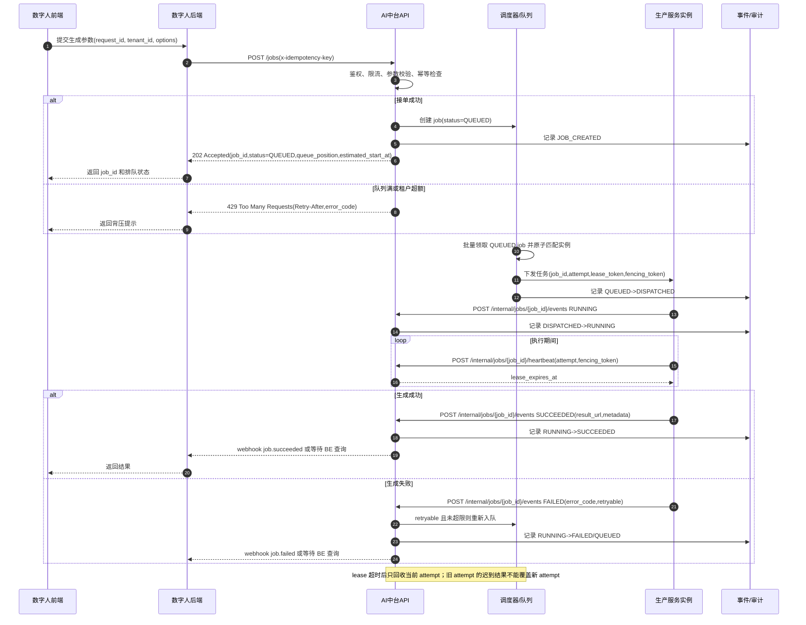
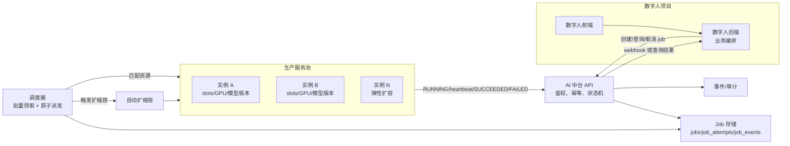
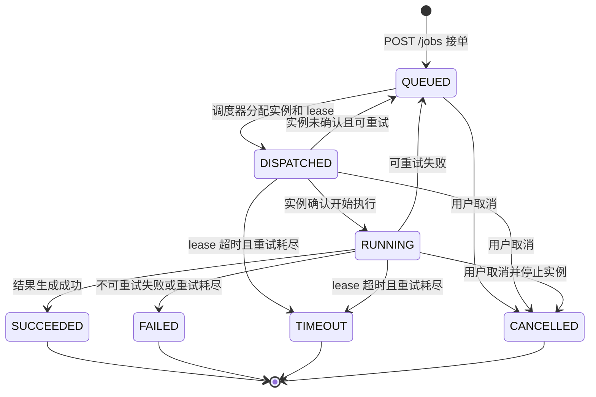

# AI 中台数字人算力动态调度

推荐采用“中台统一接单、调度器原子派发、生产服务实例执行并续约、业务后端查询或接收通知”的架构。

核心原则：

- 数字人后端只负责业务编排，不直接拥有算力实例状态。
- AI 中台拥有 job 状态机、排队、调度、lease、重试和审计。
- 生产服务实例拥有当前 attempt 的执行权，并通过 lease 心跳证明仍在执行。
- `QUEUED` 和 `DISPATCHED` 必须拆开；排队态不能返回服务地址或执行 lease。
- `429` 表示中台拒绝接单，默认不创建 job；已接单但排队返回 `202 Accepted`。

## 架构角色

| 角色 | 职责 |
| --- | --- |
| 数字人前端 | 向数字人后端提交生成请求，展示排队、生成中、成功、失败状态。 |
| 数字人后端 | 校验业务参数、调用 AI 中台创建 job、向前端返回 job 状态、接收中台 webhook 或轮询查询结果。 |
| AI 中台 API | 提供 job API、鉴权、租户限流、幂等、状态查询、取消、callback/webhook。 |
| 调度器/队列 | 原子领取可调度 job，匹配实例和资源，创建 attempt + lease，处理超时和重试。 |
| 生产服务实例 | 执行数字人生成任务，按 lease 续约，上报 RUNNING/SUCCEEDED/FAILED。 |
| 事件/审计 | 记录所有状态迁移和关键调度事件，用于排障、SLA、容量分析和计费对账。 |

## 推荐时序

## 流程图

## Job 状态机

状态迁移要求：

- 终态只能写入一次：`SUCCEEDED`、`FAILED`、`TIMEOUT`、`CANCELLED`。
- 状态更新必须带 `job_id + attempt + fencing_token + state_version`，用条件更新保证乱序事件不能覆盖新状态。
- 所有状态迁移必须写 `job_events`，事件写入和 job 状态更新需要在同一事务或具备等价一致性保证。
- 迟到事件不直接丢弃，应记录为 `LATE_EVENT`，但不能改变 job 终态或新 attempt 状态。

## API 契约

### 创建任务

`POST /jobs`

请求关键字段：

| 字段 | 说明 |
| --- | --- |
| `tenant_id` | 租户标识，参与 quota、限流和审计。 |
| `request_id` | 数字人业务侧请求 ID，和 `tenant_id` 组成业务幂等键。 |
| `options` | 生成参数，例如形象、文本、音频、分辨率、时长等。 |
| `resource_spec` | 资源需求，例如模型版本、GPU 类型、显存、slot 数、预计时长。 |
| `priority` | 调度优先级，默认普通优先级。 |
| `callback_url` | 可选；中台完成后通知数字人后端，必须做租户级白名单校验。 |

响应语义：

| 场景 | HTTP | 说明 |
| --- | --- | --- |
| 新 job 已接单但未执行 | `202` | 返回 `job_id,status=QUEUED,queue_position,estimated_start_at`。 |
| 新 job 已立即派发 | `202` | 返回 `job_id,status=DISPATCHED/RUNNING`，不向 BE 暴露实例 lease。 |
| 幂等重复请求 | `200` 或 `202` | 返回原 job 当前状态，不能创建新 job。 |
| 队列满、租户超额、系统背压 | `429` | 返回稳定 `error_code` 和 `Retry-After`，默认不创建 job。 |
| 参数错误 | `400/422` | 返回稳定 `error_code` 和字段错误。 |
| 鉴权失败 | `401/403` | 默认拒绝。 |

幂等约束：

- `tenant_id + request_id` 唯一。
- `x-idempotency-key` 用于同一业务请求的 HTTP 重试去重。
- 幂等命中时返回已有 job，不重新排队、不重复计费、不重复占用资源。

### 查询任务

`GET /jobs/{job_id}`

返回字段至少包括：

- `job_id`
- `tenant_id`
- `request_id`
- `status`
- `queue_position`
- `estimated_start_at`
- `attempt`
- `result_url`
- `error_code`
- `created_at`
- `updated_at`

查询接口必须做租户隔离，不能通过枚举 `job_id` 读取其他租户任务。

### 取消任务

`POST /jobs/{job_id}/cancel`

要求：

- `QUEUED` 可直接取消。
- `DISPATCHED/RUNNING` 需要向实例发送取消信号，并把当前 attempt 标记为取消中或已取消。
- 取消请求必须幂等，重复取消返回当前状态。
- 已进入终态的 job 不能回退为 `CANCELLED`。

### 实例心跳

`POST /internal/jobs/{job_id}/heartbeat`

由生产服务实例调用，必须使用内部鉴权。请求必须携带：

- `instance_id`
- `attempt`
- `fencing_token`
- `lease_token`
- `progress`
- `resource_usage`

中台只给当前有效 attempt 续约；过期、错误 attempt、错误 fencing token 一律拒绝续约。

### 实例事件

`POST /internal/jobs/{job_id}/events`

由生产服务实例上报：

- `RUNNING`
- `SUCCEEDED`
- `FAILED`
- `CANCELLED`

事件必须幂等，唯一键建议为 `job_id + attempt + event_type + x-idempotency-key`。

## 数据模型建议

最小落地表：

| 表 | 关键字段 |
| --- | --- |
| `jobs` | `job_id`、`tenant_id`、`request_id`、`status`、`priority`、`resource_spec`、`attempt`、`state_version`、`result_url`、`error_code`、`created_at`、`updated_at`。 |
| `job_attempts` | `job_id`、`attempt`、`instance_id`、`status`、`lease_token_hash`、`fencing_token`、`lease_expires_at`、`last_heartbeat_at`、`started_at`、`ended_at`。 |
| `job_events` | `event_id`、`job_id`、`attempt`、`event_type`、`payload_redacted`、`idempotency_key`、`occurred_at`。 |
| `instances` | `instance_id`、`status`、`capacity_slots`、`used_slots`、`gpu_type`、`model_version`、`last_heartbeat_at`、`circuit_until`。 |
| `tenant_quotas` | `tenant_id`、`max_queue_size`、`max_running_slots`、`priority_weight`、`rate_limit`。 |

索引和约束：

- `jobs(tenant_id, request_id)` 唯一。
- `jobs(status, priority, created_at, job_id)` 用于调度领取。
- `job_attempts(job_id, attempt)` 唯一。
- `job_events(job_id, attempt, event_type, idempotency_key)` 唯一。
- `instances(status, gpu_type, model_version)` 用于资源匹配。

## 调度与 lease 规则

调度器必须满足：

- 原子领取 job，避免同一个 job 或实例 slot 被并发调度器重复占用。
- 批量领取、批量更新，避免按 job 循环读写数据库。
- 领取顺序明确：租户公平性、优先级、创建时间、`job_id` 稳定兜底排序。
- 资源匹配基于 `resource_spec`，不能只看实例空闲/忙碌。
- 外部网络调用不能放在长事务内；先原子占位，再异步下发任务。

实现选型：

- 如果以数据库为准，使用条件更新、`SELECT ... FOR UPDATE SKIP LOCKED` 或等价机制领取 job 和实例 slot。
- 如果以 Redis 为准，使用 Lua 脚本完成队列弹出、slot 占用和 lease 创建，数据库异步落审计；需要明确 Redis 恢复策略。
- 不建议只用应用内内存队列；实例重启会丢失排队状态和 lease 状态。

lease 要求：

- lease 所有者是生产服务实例，不是数字人后端。
- lease 绑定 `job_id + attempt + instance_id + fencing_token`。
- lease token 只存 hash，不写明文日志。
- 续约周期建议小于 TTL 的三分之一。
- lease 超时后只能回收当前 attempt；旧 attempt 后续上报的成功结果不能覆盖新 attempt。

## 背压、重试和扩缩容

背压：

- 队列未满时接单并返回 `202`。
- 队列满、租户超额、资源池不可用时返回 `429 + Retry-After`。
- `Retry-After` 应基于当前队列长度、历史执行时长、可用实例数和扩容冷启动时间估算。

重试：

- 只重试幂等的执行 attempt，不重试创建 job。
- 重试必须有上限，例如 `max_attempts`。
- 可重试错误包括实例故障、lease 超时、临时依赖失败；参数错误、素材非法、鉴权失败不可重试。
- 使用退避策略，避免故障实例导致同类任务集中失败。

扩缩容：

- 扩容指标：P95 排队等待、队列深度、按 `resource_spec` 聚合的待处理 slot、GPU 利用率、实例可用率。
- 扩容必须有冷却窗口和最大副本数，避免抖动和成本失控。
- 缩容只能处理空闲实例；`RUNNING` 或 lease 未过期的实例不能缩容。
- 对冷启动慢的模型保留最小预热实例数。

## 安全与观测

安全要求：

- BE 调用 API 使用租户级鉴权，内部实例调用使用 mTLS、HMAC 或等价内部身份。
- `callback_url` 做租户白名单校验，防止 SSRF。
- 短时令牌、lease token、对象存储 URL 不能明文落日志。
- 结果对象 URL 建议短时有效或走中台签发下载链接。

观测指标：

- `job_create_total`
- `job_queue_wait_seconds`
- `job_run_seconds`
- `job_status_transition_total`
- `job_retry_total`
- `lease_renew_total`
- `lease_expired_total`
- `scheduler_dispatch_total`
- `scheduler_dispatch_conflict_total`
- `instance_available_slots`
- `tenant_rejected_total`

日志和事件至少包含：

- `job_id`
- `tenant_id`
- `request_id`
- `attempt`
- `instance_id`
- `status_from/status_to`
- `error_code`

不得记录原始密钥、token、完整对象存储签名 URL、完整用户输入素材内容。

## 兼容模式：BE 直连生产服务

如果现阶段必须保留“中台返回服务地址，BE 调用生产服务”的模式，需要增加以下硬约束：

- 中台只在 `DISPATCHED` 时向 BE 返回单 job、短时、单实例访问令牌。
- BE 必须把 `job_id + attempt + fencing_token` 透传给生产服务。
- 生产服务仍然直接向中台心跳和上报终态，不能只回调 BE。
- BE 调用生产服务失败时，只能上报 `DISPATCH_FAILED`，不能自行把 job 标为 `FAILED`，最终状态仍由中台状态机裁决。
- 该模式下排队态只能返回 `job_id` 和排队信息，不能返回服务地址或 lease。

长期建议收敛到中台调度器直接下发任务或生产服务主动拉取任务，减少 BE 对算力实例拓扑的感知。

## 落地优先级

1. 先实现 job 状态机、幂等创建、查询、取消、事件审计。
2. 再实现调度器原子领取、attempt、lease、心跳续约和超时回收。
3. 再补租户 quota、优先级、公平调度和背压。
4. 最后接入自动扩缩容、容量预测、成本控制和 SLA 报表。
