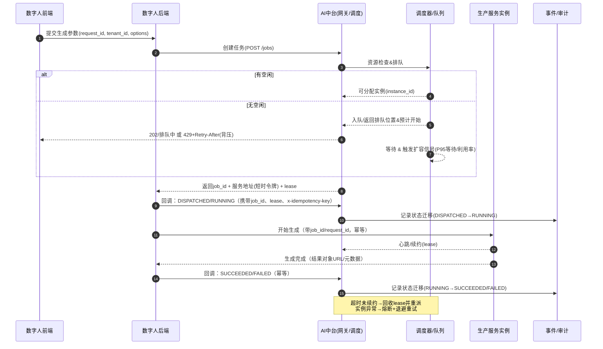
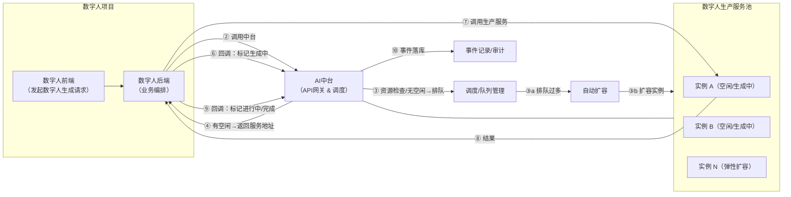

# AI中台数字人算力动态调度

## 时序图

```mermaid
sequenceDiagram
    autonumber
    participant FE as 数字人前端
    participant BE as 数字人后端
    participant API as AI中台(网关/调度)
    participant SCH as 调度器/队列
    participant SVC as 生产服务实例
    participant EVT as 事件/审计

    FE->>BE: 提交生成参数(request_id, tenant_id, options)
    BE->>API: 创建任务(POST /jobs)
    API->>SCH: 资源检查&排队
    alt 有空闲
        SCH-->>API: 可分配实例(instance_id)
    else 无空闲
        SCH-->>API: 入队/返回排队位置&预计开始
        API-->>FE: 202/排队中 或 429+Retry-After(背压)
        SCH-->>SCH: 等待 & 触发扩容信号(P95等待/利用率)
    end

    API-->>BE: 返回job_id + 服务地址(短时令牌) + lease
    BE->>API: 回调：DISPATCHED/RUNNING（携带job_id、lease、x-idempotency-key）
    API->>EVT: 记录状态迁移(DISPATCHED→RUNNING)

    BE->>SVC: 开始生成（带job_id/request_id，幂等）
    SVC-->>API: 心跳/续约(lease)
    SVC-->>BE: 生成完成（结果对象URL/元数据）
    BE->>API: 回调：SUCCEEDED/FAILED（幂等）
    API->>EVT: 记录状态迁移(RUNNING→SUCCEEDED/FAILED)

    note over API,SCH: 超时未续约→回收lease并重派<br/>实例异常→熔断+退避重试
```

## 流程图

```mermaid
flowchart LR
    subgraph Client["数字人项目"]
        FE["数字人前端\n（发起数字人生成请求）"] --> BE["数字人后端\n（业务编排）"]
    end

    BE -->|② 调用中台| API["AI中台\n（API网关 & 调度）"]
    API -->|③ 资源检查/无空闲→排队| Q["调度/队列管理"]
    Q -->|③a 排队过多| AS["自动扩容"]
    AS -->|③b 扩容实例| Pool

    API -->|④ 有空闲→返回服务地址| BE
    BE -->|⑥ 回调：标记生成中| API
    BE -->|⑦ 调用生产服务| SvcA
    SvcA -->|⑧ 结果| BE
    BE -->|⑨ 回调：标记进行中/完成| API
    API -->|⑩ 事件落库| EVT["事件记录/审计"]

    subgraph Pool["数字人生产服务池"]
        SvcA["实例 A（空闲/生成中）"]
        SvcB["实例 B（空闲/生成中）"]
        SvcN["实例 N（弹性扩容）"]
    end

    API --- Pool

```
