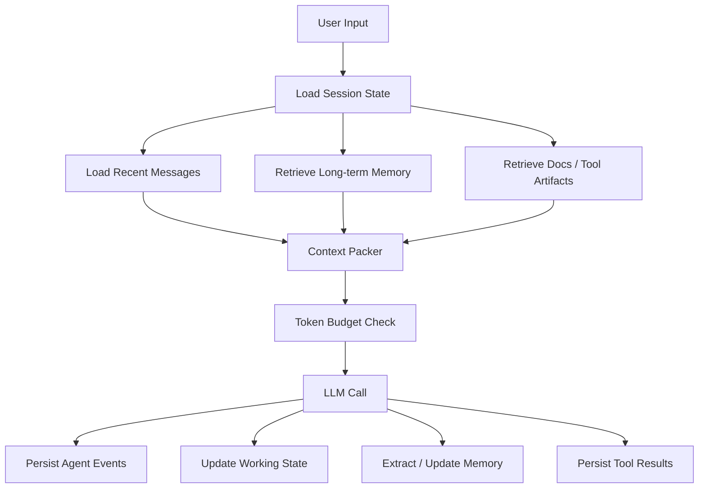

# Agent 记忆与 200k 上下文工程方案

## 概述

本文档用于指导 Agent 后端实现长期记忆、短期记忆与 200k context window 下的上下文编排。

核心结论：

> 完整对话历史应该全量存储，但每次模型调用不应该把全部对话内容塞进 prompt。
> 200k context window 是单次模型调用的输入预算，不是会话历史的存储上限。

工程目标：

- 保留完整会话历史，支持审计、回放、debug 和后续检索。
- 每次模型调用只装配当前任务需要的上下文，控制在模型 context window 内。
- 区分短期记忆、长期记忆、工具结果、知识库片段和最终 prompt。
- 避免旧信息、错误信息、过期信息和大体积工具结果污染模型上下文。
- 支持后续扩展到 RAG、用户偏好、项目事实、工作流状态和多 Agent 协作。

## 1. 术语定义

### 1.1 短期记忆

短期记忆是当前 session 或当前任务内维持连续性的上下文。

典型内容：

- 当前用户请求。
- 最近几轮原始对话。
- 当前任务目标、阶段、待办、已完成事项。
- 本轮或近期工具调用结果摘要。
- 临时推理状态、运行变量、workflow state。

短期记忆可以临时持久化，便于断点恢复，但语义上只服务当前会话或当前任务。

### 1.2 长期记忆

长期记忆是跨 session、跨任务仍然有复用价值的稳定信息。

典型内容：

- 用户偏好：语言、输出风格、默认技术栈。
- 项目事实：模块边界、架构约束、API 约定。
- 业务规则：权限规则、审批规则、数据口径。
- 历史决策：为什么选择某个方案，哪些方案被否决。
- 可长期检索的知识片段：文档 chunk、历史摘要、知识库内容。

长期记忆不是“全量聊天记录”。
它应该是经过筛选、抽取、权限隔离、可更新、可删除的信息。

### 1.3 Prompt 上下文

Prompt 上下文是单次模型调用实际输入给模型的内容。

它由系统指令、当前用户输入、短期状态、最近对话、长期记忆检索结果、RAG 片段和工具结果摘要动态组装。
即使模型支持 200k tokens，也不代表每次都要填满 200k。

## 2. 总体原则

### 2.1 存储上下文不等于输入上下文

正确做法：

```text
完整历史：全量落库
当前状态：结构化保存
旧对话：滚动摘要
长期事实：抽取成 memory
大工具结果：保存引用
本轮 prompt：按预算动态选择
```

错误做法：

```text
每次模型调用 = system prompt + 从第一轮开始的所有 messages
```

### 2.2 200k 是硬预算

200k context window 需要扣除输出预留和安全冗余。
例如：

```text
模型窗口：200000 tokens
输出预留：8000-16000 tokens
安全冗余：8000-12000 tokens
可用输入预算：172000-184000 tokens
```

所有 prompt 组装逻辑必须在调用模型前完成 token 估算和截断。

### 2.3 上下文按优先级装配

推荐优先级：

1. System / developer 指令。
2. 当前用户输入。
3. 当前任务状态。
4. 最近关键对话。
5. 相关长期记忆。
6. 相关文档、代码、工具结果片段。
7. 旧对话摘要。
8. 低相关历史内容。

超预算时，应该按优先级、相关性和时间衰减裁剪，而不是简单从头或从尾截断。

## 3. 推荐架构



分层职责：

| 层 | 职责 | 推荐存储 |
| --- | --- | --- |
| 原始事件 | 保存用户消息、assistant 输出、工具调用、工具结果引用 | PostgreSQL |
| 会话状态 | 保存当前目标、阶段、摘要、工作状态 | PostgreSQL + Redis |
| 长期记忆 | 保存偏好、事实、规则、决策、长期摘要 | PostgreSQL |
| 向量索引 | 保存可检索 chunk 和 embedding | Milvus / pgvector / zvec |
| 大对象 | 保存长日志、文件、完整工具响应 | Object Storage / PostgreSQL 大字段按需 |
| Prompt 快照 | 可选保存本轮最终 prompt 摘要或 hash，用于审计 | PostgreSQL |

结合本项目技术栈，建议：

- PostgreSQL：保存 `agent_sessions`、`agent_events`、`agent_memories`、`agent_tool_artifacts`。
- Redis：缓存活跃 session 的 working state、锁、幂等键、短期工具结果。
- `pkg/vectors`：承载 memory/document chunk 的检索和 context assembly。
- Celery：异步执行摘要生成、embedding、长期记忆抽取、过期清理。

## 4. 数据模型建议

以下是概念模型，不是直接可执行迁移。
真正落地时需要结合现有 ORM、DAO、DDL、索引、租户隔离和迁移计划。

### 4.1 会话表

```text
agent_sessions
- id
- user_id
- project_id
- status
- current_goal
- working_state_json
- rolling_summary
- recent_token_count
- total_event_count
- created_at
- updated_at
```

设计要点：

- `working_state_json` 存当前任务状态，不存无边界全文。
- `rolling_summary` 存旧对话压缩后的摘要。
- 查询活跃会话时使用 `session_id` 或 `(user_id, project_id, status)` 索引。

### 4.2 事件表

```text
agent_events
- id
- session_id
- parent_event_id
- role: user / assistant / tool / system
- content
- content_summary
- token_count
- tool_name
- tool_call_id
- tool_artifact_id
- metadata_json
- created_at
```

设计要点：

- 原始交互全量保存，便于审计和回放。
- 工具大结果不要直接塞满 `content`，优先放 `tool_artifact_id`。
- 常用读取路径需要分页，不做无边界全量查询。
- 最近消息查询使用 `(session_id, created_at, id)` 做稳定排序和分页。

### 4.3 长期记忆表

```text
agent_memories
- id
- owner_type: user / project / workspace
- owner_id
- memory_type: preference / fact / rule / decision / summary
- content
- source_event_ids
- confidence
- status: active / superseded / deleted
- expires_at
- created_at
- updated_at
```

设计要点：

- 记忆必须有作用域，避免跨用户、跨项目串数据。
- 记忆需要支持更新、覆盖、失效和删除。
- 对时效性强的事实设置 `expires_at` 或版本号。
- 保存 `source_event_ids` 便于解释和审计。

### 4.4 Chunk / Embedding 表

```text
agent_memory_chunks
- id
- memory_id
- owner_type
- owner_id
- chunk_text
- token_count
- embedding_ref
- metadata_json
- created_at
```

设计要点：

- 用于语义检索，不替代结构化记忆表。
- 检索时必须带 owner scope、权限条件和业务过滤条件。
- chunk 需要控制大小，常见范围是 300-1200 tokens，按文档类型调整。

### 4.5 工具结果表

```text
agent_tool_artifacts
- id
- session_id
- tool_name
- input_json
- output_summary
- output_ref
- output_token_count
- status
- error_code
- created_at
```

设计要点：

- Prompt 中默认放 `output_summary` 和关键片段，不放完整大结果。
- 完整结果通过 `output_ref` 按需读取。
- 失败结果要保存错误摘要和必要上下文，但不能泄露 secret、token、连接串。

## 5. 200k Prompt Budget 方案

### 5.1 默认预算模板

以下是 200k context window 的参考配置：

| 内容 | 建议预算 |
| --- | ---: |
| System / developer 指令 | 5000-15000 |
| 当前用户输入 | 2000-8000 |
| 当前任务状态 | 3000-8000 |
| 最近原始对话 | 20000-40000 |
| 旧对话滚动摘要 | 3000-8000 |
| 长期记忆检索结果 | 10000-30000 |
| RAG 文档 / 代码 / 知识库片段 | 60000-100000 |
| 工具结果摘要和关键片段 | 10000-30000 |
| 输出预留 | 8000-16000 |
| 安全冗余 | 8000-12000 |

预算不是固定比例。
不同任务应该使用不同 profile：

- 问答型任务：增加 RAG 文档预算。
- 编码型任务：增加代码文件和最近工具结果预算。
- 长流程 Agent：增加 working state 和最近步骤预算。
- 审计/复盘任务：增加历史事件和摘要预算。

### 5.2 Context Packing 流程

```text
1. 读取模型 context window 配置。
2. 扣除 max_output_tokens 和 safety_margin。
3. 固定加入 system / developer 指令和当前用户输入。
4. 加入 working_state 和 rolling_summary。
5. 加入最近消息窗口。
6. 按当前 query 检索长期记忆、文档、工具结果。
7. 对候选片段计算 token_count、priority、relevance、recency。
8. 按预算装配 prompt。
9. 超预算时按规则裁剪、摘要或降级为引用。
10. 调用模型前再次校验总 token 数。
```

伪代码：

```python
MAX_CONTEXT = 200_000
MAX_OUTPUT = 12_000
SAFETY_MARGIN = 10_000
INPUT_BUDGET = MAX_CONTEXT - MAX_OUTPUT - SAFETY_MARGIN

parts = [
    ContextPart("system", system_prompt, priority=100, budget=10_000),
    ContextPart("current_user_input", user_input, priority=100, budget=8_000),
    ContextPart("working_state", working_state, priority=90, budget=8_000),
    ContextPart("recent_messages", recent_messages, priority=80, budget=35_000),
    ContextPart("rolling_summary", rolling_summary, priority=70, budget=6_000),
    ContextPart("long_term_memory", memories, priority=70, budget=25_000),
    ContextPart("rag_context", docs, priority=60, budget=80_000),
    ContextPart("tool_results", tool_summaries, priority=60, budget=25_000),
]

prompt = pack_by_priority(parts, max_tokens=INPUT_BUDGET)
assert estimate_tokens(prompt) <= INPUT_BUDGET
```

`pack_by_priority()` 至少需要支持：

- 必选内容不可丢弃，例如 system 指令、当前用户输入。
- 每类内容有独立 budget。
- 同类内容按 relevance、recency、source priority 排序。
- 超预算时低优先级内容降级为摘要或引用。
- 输出被截断时保留可追踪的 source id。

### 5.3 最近消息窗口

推荐策略：

```text
最近 10-30 轮原始消息：优先保留
超过 20k-40k tokens：开始滚动摘要
重要工具结果：只保留摘要和引用
很早但强相关内容：通过检索补回
```

不要简单按消息条数控制。
不同消息 token 差异很大，应该按 token 数和任务相关性控制。

## 6. 滚动摘要策略

### 6.1 触发条件

可以在以下条件触发摘要：

- session 原始消息超过 40k-60k tokens。
- 最近消息窗口超过配置上限。
- 工具结果过大，无法直接进入 prompt。
- 用户显式切换任务阶段。
- 会话即将进入空闲或关闭状态。

### 6.2 摘要格式

摘要建议结构化，而不是只做自然语言压缩：

```json
{
  "goal": "实现 Agent 记忆和上下文编排方案",
  "current_state": "已确认不需要把全部对话塞进 prompt",
  "completed": [
    "区分长期记忆和短期记忆",
    "确认 200k 是模型调用预算，不是历史存储上限"
  ],
  "decisions": [
    "完整历史全量落库",
    "本轮 prompt 动态选择相关上下文",
    "大工具结果用摘要和引用进入 prompt"
  ],
  "pending": [
    "落地数据模型",
    "实现 context packer"
  ],
  "open_questions": []
}
```

### 6.3 摘要质量要求

摘要必须保留：

- 用户明确要求。
- 关键决策和否决原因。
- 尚未完成的任务。
- 依赖关系和约束。
- 需要后续引用的实体、ID、文件路径、接口名。

摘要不应该保留：

- 寒暄。
- 重复内容。
- 已确认无效的错误假设，除非对后续排错重要。
- 大量原始日志、表格、搜索结果。

## 7. 长期记忆写入策略

### 7.1 可以写入长期记忆的信息

满足以下条件之一时，可以考虑写入：

- 用户显式表达稳定偏好。
- 项目级规则或架构约束被确认。
- 某个业务事实会在未来任务反复使用。
- 用户明确要求“记住”。
- 多轮对话形成了可复用的决策结论。

示例：

```text
用户偏好：回答优先中文，保留必要英文术语。
项目规则：Controller 不直接操作数据库，写操作通过 Service/DAO。
历史决策：Agent prompt 不全量塞历史消息，而是通过 context packer 动态装配。
```

### 7.2 不应写入长期记忆的信息

以下内容默认不写入长期记忆：

- 一次性任务细节。
- 未确认的猜测。
- 临时调试日志。
- 敏感凭据、token、cookie、私钥。
- 只在当前 session 有效的信息。
- 明显过期或无来源的信息。

### 7.3 更新与失效

长期记忆必须支持：

- 覆盖：用户偏好变化时更新旧值。
- 失效：项目规则变化时旧事实不再参与检索。
- 删除：用户要求删除或合规要求清理。
- 来源追踪：能定位记忆来自哪些 event。

## 8. 工具结果处理

工具结果是最容易撑爆上下文的来源。

推荐策略：

```text
完整工具结果：落库或对象存储
模型可见内容：摘要 + 关键片段 + artifact_id
后续需要细节：按 artifact_id 再读取
```

示例：

```text
Tool result summary:
- 查询到 152 条日志
- 17 条包含 DB timeout
- 3 条包含 retry exhausted
- 关键 request_id: req_1, req_2, req_3
- 完整结果 artifact_id: tool_artifact_123
```

不要把 152 条完整日志默认放入 prompt。

对工具结果的硬要求：

- 控制最大 token 数。
- 对敏感字段做脱敏。
- 保存工具名称、输入摘要、输出摘要、状态和错误码。
- 大结果保留引用，支持按需二次读取。
- 对失败工具调用保留足够诊断信息，但不能吞掉错误。

## 9. 检索策略

### 9.1 检索来源

一次模型调用可以检索：

- 当前 session 事件。
- 当前用户长期记忆。
- 当前项目长期记忆。
- 相关文档 chunk。
- 相关工具 artifact 摘要。
- 代码库片段或 API 文档。

### 9.2 检索约束

检索必须带上：

- `user_id`
- `project_id` 或 workspace scope
- memory type
- status
- 时间范围或版本
- 权限过滤条件

禁止跨用户、跨项目无约束召回。

### 9.3 排序特征

候选上下文排序建议综合：

- 语义相关性。
- 时间新鲜度。
- 来源可信度。
- 记忆类型优先级。
- 当前任务类型。
- 用户显式引用，例如“刚才”“上次”“那个接口”。

## 10. 安全与数据治理

### 10.1 权限隔离

所有长期记忆和历史检索都必须按 owner scope 隔离。
默认不能跨用户、跨项目、跨租户检索。

### 10.2 敏感信息

以下内容不得进入长期记忆，除非有明确的加密、权限和合规方案：

- 密码、token、cookie、私钥。
- 数据库连接串。
- 生产密钥。
- 未脱敏的身份证、手机号、邮箱等 PII。
- 受权限保护的完整请求/响应。

### 10.3 审计与可解释性

建议记录：

- 本轮 prompt 使用了哪些 context source id。
- 哪些长期记忆被召回。
- 哪些工具结果被引用。
- 哪些内容因超预算被裁剪。
- 记忆写入、更新、删除的来源 event。

不要默认保存完整 prompt 明文。
如果需要保存 prompt 快照，应设置保留周期、脱敏策略和访问控制。

## 11. 运行时观测指标

建议采集：

| 指标 | 说明 |
| --- | --- |
| `prompt_input_tokens` | 本轮输入 tokens |
| `prompt_output_tokens_reserved` | 输出预留 tokens |
| `context_truncated_count` | 被裁剪的上下文片段数 |
| `memory_retrieval_count` | 召回长期记忆数量 |
| `memory_retrieval_latency_ms` | 长期记忆检索耗时 |
| `summary_generation_latency_ms` | 摘要生成耗时 |
| `tool_artifact_bytes` | 工具结果原始大小 |
| `prompt_budget_utilization` | 输入预算使用率 |

关键告警：

- prompt 接近模型上限。
- 检索延迟过高。
- 大工具结果频繁进入 prompt。
- 长期记忆召回为空或过多。
- 同一用户记忆数量异常增长。

## 12. 落地阶段

### 阶段 1：基础会话存储

- 新增 session/event 存储。
- 保存完整 user/assistant/tool 事件。
- 保存 token_count 和 created_at。
- 最近消息按 session 分页读取。

### 阶段 2：Context Packer

- 实现统一 prompt builder。
- 支持模型窗口、输出预留、安全冗余。
- 支持每类上下文 budget。
- 支持 source id 和裁剪记录。

### 阶段 3：滚动摘要

- 为超长 session 生成结构化 summary。
- 保留最近原文窗口。
- 旧内容通过 summary + 检索补回。
- 摘要生成可用 Celery 异步执行。

### 阶段 4：长期记忆

- 实现 `agent_memories`。
- 支持 preference、fact、rule、decision、summary。
- 支持 owner scope、status、expires_at、source_event_ids。
- 支持记忆更新、失效和删除。

### 阶段 5：向量检索和工具 artifact

- 对长期记忆、历史摘要、文档 chunk 建 embedding。
- 通过 `pkg/vectors` 检索相关 chunk。
- 工具大结果改为 artifact 引用。
- Prompt 中默认放摘要和关键片段。

### 阶段 6：审计与治理

- 记录 context source id、裁剪原因和记忆召回情况。
- 增加敏感字段脱敏。
- 增加 retention 和清理任务。
- 增加指标和告警。

## 13. 推荐默认配置

```yaml
agent_context:
  model_context_window: 200000
  max_output_tokens: 12000
  safety_margin_tokens: 10000
  recent_messages_budget_tokens: 35000
  rolling_summary_budget_tokens: 6000
  working_state_budget_tokens: 8000
  long_term_memory_budget_tokens: 25000
  rag_context_budget_tokens: 80000
  tool_result_budget_tokens: 25000
  summarize_threshold_tokens: 60000
  keep_recent_tokens: 30000
  max_tool_result_prompt_tokens: 4000
```

配置原则：

- 所有 budget 都应可按模型、任务类型、Agent 类型覆盖。
- token 估算必须在模型调用前执行。
- 召回数量和单片段大小必须有上限。
- 默认宁可少放，也不要把低相关历史塞满 200k。

## 14. 实现检查清单

- [ ] 完整会话事件是否已持久化。
- [ ] 本轮 prompt 是否通过统一 context packer 生成。
- [ ] 是否为输出 tokens 和安全冗余预留预算。
- [ ] 是否避免把全部对话历史默认塞进 prompt。
- [ ] 最近消息是否按 token budget 控制。
- [ ] 旧对话是否有 rolling summary。
- [ ] 长期记忆是否有 owner scope 和 source event。
- [ ] 长期记忆是否支持更新、失效和删除。
- [ ] 检索是否有权限过滤。
- [ ] 工具大结果是否以摘要和引用进入 prompt。
- [ ] 是否记录 context source id 和裁剪原因。
- [ ] 是否有敏感信息脱敏和保留周期策略。

## 15. 一句话方案

Agent 需要完整保存历史，但模型只读取本轮需要的上下文。
200k window 的控制靠 token budget、优先级、摘要和检索；
上下文存储靠事件日志、结构化 session state、长期 memory、向量索引和工具 artifact 分层管理。
