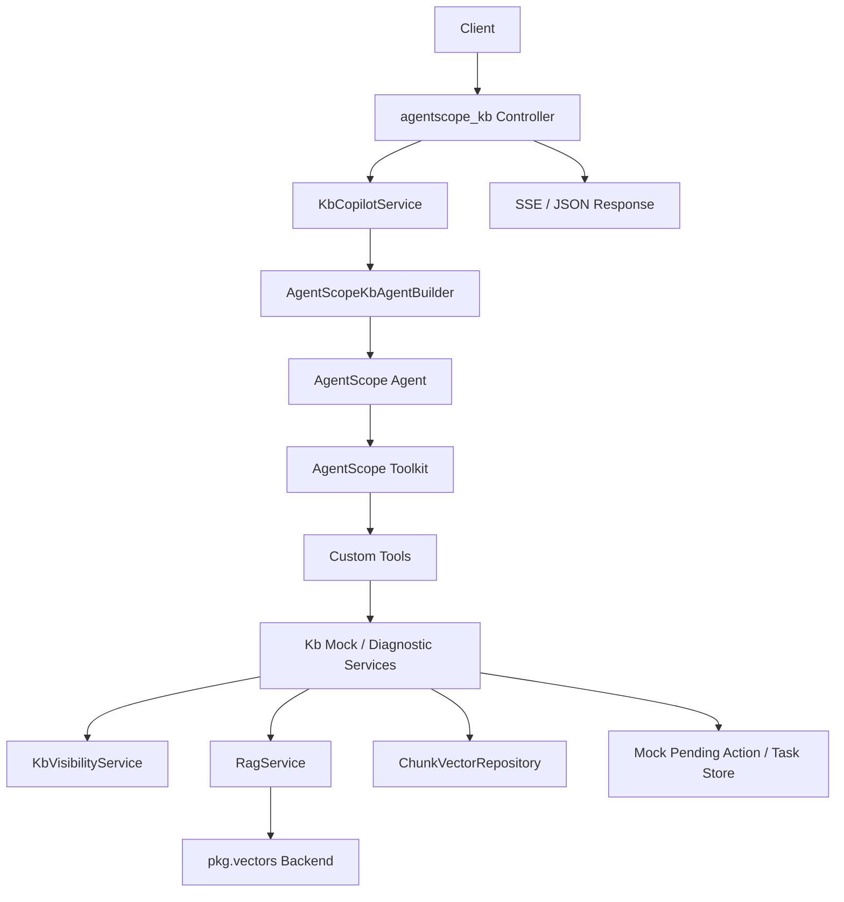

# AgentScope 2.0 知识库运维 Copilot 技术方案

## 概述

本文档定义一个基于 AgentScope 2.0 的知识库运维 Copilot demo。它用于展示
AgentScope 2.0 如何接入 AGENT-BACKEND 既有后端基建，而不是另起一套绕过项目
分层的独立应用。

核心定位：

```text
AgentScope 2.0 = internal/agents/agentscope_kb/ 下的框架化 Agent runtime 示例
AGENT-BACKEND = 继续提供 Controller / Service / DTO / DAO / Cache / RAG / Vector 基建
```

因此，本 demo 的目标不是替代现有 `pkg.agents.ReActAgent`，而是展示成熟 Agent
framework 如何以项目风格落地到一个 FastAPI 后端脚手架中。

## 1. 目标与非目标

### 1.1 目标

- 使用 AgentScope 2.0 实现单 Agent 的知识库运维 Copilot。
- 复用项目已有认证、响应、Service、DTO、RAG、向量仓库、Redis、日志和错误码体系。
- 展示 AgentScope 的 `Agent.reply_stream`、Tool / Toolkit、Permission / HITL、
  state/session 和 event streaming 如何接入本项目。
- 通过 mock KB / Document / Chunk registry 快速落地可运行的 Copilot demo。
- 为后续扩展到完整 KB ORM 管理后台、文档解析任务、索引重建任务和多 Agent 协作预留结构。

### 1.2 非目标

- 不接入 AgentScope 自带 Agent Service 作为主 HTTP 应用入口。
- 不让 AgentScope tool 直接访问 ORM、Redis、Milvus 或 Celery。
- 不在本 Copilot demo 中完整实现 KB / Document / Chunk ORM 管理后台；相关实现拆到单独技术方案。
- 不在首版承诺真实文件上传、文档解析、embedding refresh、Milvus upsert 或完整生产级 RBAC。
- 不把 AgentScope permission/HITL 当作云服务安全边界。
- 不删除现有 `pkg.agents.ReActAgent` 示例。

## 2. 当前项目现状

### 2.1 已有能力

当前项目已经具备以下可复用基础设施：

- FastAPI Controller 分层、`BaseResponse[T]` 响应信封和 SSE 工具。
- Token 认证、请求上下文、trace id 和统一错误码。
- `RagService`：负责受控 RAG 检索、scope 求交、证据 DTO、答案生成和引用校验。
- `internal/rag/repositories/chunk_vector.py`：
  - `ChunkVectorRepository`
  - `ChunkVectorDocument`
  - Milvus chunk collection spec
  - `doc_id` / `kb_id` / `domain` / `chunk_index` scalar fields
  - `search_chunks()`
  - `search_similar()`
  - `delete_chunks()`
- `RagMetadataDao`：当前是 metadata access boundary，默认返回空映射，后续可替换为真实
  KB/document/chunk registry 查询。
- `pkg/vectors/`：vector backend、post-retrieval、context assembly 等通用能力。

### 2.2 首版 mock 边界

当前还没有完整的 KB/document 业务 Service 和 ORM 模型。为了避免首版过重，本
Copilot demo 先使用 mock registry 和已有 RAG/vector 能力完成闭环：

- `MockKbCatalog`：内存或配置驱动的 KB / document / chunk 示例数据。
- `RagService`：执行真实受控检索、scope 求交、证据构造和引用校验。
- `ChunkVectorRepository`：作为已有 vector repository 复用边界，不由 AgentScope tool 直接访问。
- `MockIndexTaskStore`：保存 demo 级 pending action / queued task 状态，可用 Redis cache 或内存 fake。
- `KbVisibilityService`：显式解析当前用户可见 KB scope，不通过一次 RAG 检索反推出可见范围。

mock 实现必须在代码注释和 README 中明确标注：

- mock 数据只用于 AgentScope 2.0 demo，不代表真实后台能力。
- mock 权限只能演示调用链，不能替代 Service 权限校验。
- mock task 只返回 demo `queued` / `succeeded` 状态，不触发真实 Celery 或 Milvus 写入。

完整 KB / Document / Chunk ORM 管理后台另见 `docs/rag/kb_orm_admin_design.md`。

## 3. 总体架构



关键约束：

- Controller 只负责 HTTP contract、认证上下文读取和响应组装。
- `KbCopilotService` 是业务用例入口，负责创建/恢复 AgentScope state、映射事件、审计和错误转换。
- `internal/agents/agentscope_kb/` 只负责 AgentScope 的 prompt、builder、model adapter、
  tools、permissions 和 event adapter。
- Tool 只调用项目 Service，不直接访问 DAO、Redis、Milvus、Celery 或 mock 常量。
- 真实安全边界在 Service，AgentScope permission/HITL 只作为 Agent 行为闸门。
- 首版选择项目原生 pending action 模式；AgentScope-native `ASK` 暂停/恢复流程不进入主路径。

## 4. 推荐目录

```text
internal/agents/agentscope_kb/
  __init__.py
  builder.py
  model.py
  permissions.py
  prompt.py
  stream.py
  tools.py
  README.md

internal/services/agentscope_kb/
  __init__.py
  copilot.py

internal/services/kb/
  __init__.py
  catalog.py
  diagnostics.py
  index_ops.py
  mocks.py
  visibility.py

internal/services/dto/agentscope_kb.py
internal/schemas/agentscope_kb.py
internal/controllers/api/agentscope_kb.py
internal/cache/agentscope_kb_action.py
tests/api/test_agentscope_kb.py
tests/services/test_agentscope_kb.py
tests/agents/test_agentscope_kb_tools.py
```

说明：

- `internal/services/kb/mocks.py` 保存 demo mock 数据和注释，便于后续替换为真实 ORM Service。
- `internal/services/agentscope_kb/` 是 Agent 用例编排入口。
- AgentScope 目录只保存框架 runtime glue，不保存 mock 数据、ORM、DAO、DDL 或业务后台 API。

## 5. Mock Service 边界设计

### 5.1 `KbMockRegistry`

`KbMockRegistry` 是首版 Copilot 的 demo 数据源，用于替代尚未实现的完整 KB ORM
管理后台。它可以放在 `internal/services/kb/mocks.py`。

职责：

- 提供少量固定 KB、document、chunk 和 task 示例数据。
- 用注释明确 mock 字段与未来 ORM 字段的对应关系。
- 支持测试注入，避免测试依赖真实数据库、Redis、Celery 或 Milvus。

示例数据结构：

```text
MockKnowledgeBase
- kb_id
- name
- domain
- owner_id
- status
- description

MockKnowledgeDocument
- doc_id
- kb_id
- title
- source_uri
- parse_status
- index_status
- chunk_count
- error_message

MockKnowledgeChunkSummary
- chunk_id
- doc_id
- kb_id
- chunk_index
- text_hash
- token_count
- vector_status
```

实现要求：

- mock 数据只用于展示 Copilot 运行链路，文件头部必须写明“后续由
  `docs/rag/kb_orm_admin_design.md` 中的 ORM/DAO/Service 替换”。
- mock 查询仍然必须通过 Service 方法，不允许 AgentScope tool 直接读取模块级常量。
- mock 权限只做演示；Service 方法仍需要接收 `user_id` 并模拟 owner/scope 判断。

### 5.2 `KbCatalogService`

职责：

- 解析用户可见 KB scope。
- 从 `KbMockRegistry` 返回 demo KB 概览。
- 聚合 mock document、chunk 和 index task 状态。

首版数据来源：

- `KbMockRegistry`。
- `KbVisibilityService.resolve_visible_scope()`。
- `SettingsRagScopeResolver` 可作为 demo allowed scope 的底层实现。

首版不做：

- 不直接扫 Milvus 全量 collection。
- 不在 Service 外拼接权限过滤。
- 不暴露 mock 内部常量给 Controller 或 AgentScope tool。
- 不调用 `RagService.retrieve()` 只为获取可见 scope；检索只属于 `run_retrieval_probe`。

建议方法：

```text
list_visible_kbs(user_id) -> KbListDTO
get_kb_overview(user_id, kb_id) -> KbOverviewDTO
```

### 5.3 `KbVisibilityService`

职责：

- 显式解析当前用户可见 KB 和 domain scope。
- 作为 `KbCatalogService`、`KbDiagnosticService`、`KbIndexOpsService` 的共同依赖。
- 首版复用 `RagScopeResolver` / `SettingsRagScopeResolver`，后续可切换到真实 KB ACL。

建议方法：

```text
resolve_visible_scope(user_id) -> KbVisibleScopeDTO
ensure_kb_visible(user_id, kb_id) -> KbVisibilityDTO
```

设计原因：

- `RagService.retrieve()` 会进入 query preparation、repository 初始化和 vector 检索路径，
  不适合作为列表/概览接口的权限来源。
- Milvus、embedding provider 或 vector backend 不可用时，不应拖垮只读 mock catalog。
- 后续接入真实 KB ORM 管理后台时，只需要替换 visibility 实现，不改 AgentScope tool。

### 5.4 `KbDiagnosticService`

职责：

- 封装知识库质量诊断。
- 调用 `RagService` 执行检索探针。
- 通过项目 Service 管理 top_k、final_k、domain、kb_id 等 scope 参数。

首版诊断能力：

- `run_retrieval_probe`：用用户问题或探针 query 对指定 KB 做检索，返回 evidence、score、
  errors。
- `diagnose_empty_retrieval`：当检索无结果时，给出可能原因，例如 scope 为空、kb_id 不可见、
  chunk metadata 缺失、embedding/vector backend 不可用。
- `summarize_evidence_quality`：基于 `RagRetrievalDTO.evidence` 的数量、score、title/source
  缺失情况输出质量摘要。
- `summarize_registry_quality`：基于 mock document / chunk 统计解析失败、
  重复 chunk、空文本 chunk、未索引 chunk 等后台质量指标。

建议方法：

```text
run_retrieval_probe(user_id, kb_id, query, top_k, final_k) -> KbRetrievalProbeDTO
diagnose_kb_quality(user_id, kb_id, probe_queries) -> KbDiagnosticDTO
```

### 5.5 `KbIndexOpsService`

职责：

- 封装有副作用的索引操作。
- 管理 pending action、确认、幂等和任务提交。
- 首版只写入 mock task store，不接入真实 Celery workflow。

首版采用项目原生 pending action 模式：`prepare_rebuild_index` tool 正常执行，
由 Service 生成服务端可信 pending action；确认路径绕过 LLM 和 AgentScope runtime。
这与现有订单开票确认链路保持一致。

首版可以先实现 demo 级 pending action 和 mock task 记录，不真实重建索引：

```text
prepare_rebuild_index(user_id, kb_id, reason, mode) -> KbPendingActionDTO
confirm_rebuild_index(user_id, pending_action_id, idempotency_key) -> KbIndexTaskDTO
get_index_task_status(user_id, task_id) -> KbIndexTaskDTO
```

流程：

```text
AgentScope tool: prepare_rebuild_index
-> KbIndexOpsService.prepare_rebuild_index()
-> 保存 pending action
-> tool result 返回 pending_action_id / summary / expires_in_seconds
-> API/SSE 返回 pending_action
-> 用户确认
-> confirm API 调用 KbIndexOpsService.confirm_rebuild_index()
-> 校验归属、过期、幂等
-> 创建 mock task 或后续真实 index task
```

确认路径不得：

- 恢复 AgentScope paused reply。
- 让 LLM 再决定是否执行。
- 接受由客户端或 LLM 构造的执行参数。
- 跳过 Service 的资源归属和幂等校验。

即使首版只返回 demo `queued`，确认前仍必须重新校验：

- 用户身份。
- KB 可见范围。
- pending action 是否属于当前用户。
- pending action 是否过期。
- idempotency key 是否重复或被错误复用。
- 操作是否允许在当前环境执行。

后续如果要改用 AgentScope-native HITL，必须另行设计 `reply_id`、`tool_call_id`、
`UserConfirmResultEvent`、AgentState 恢复和 pending action 映射；该路径不属于首版。
后续接入真实任务时，按 `docs/rag/kb_orm_admin_design.md` 的任务表和 Celery workflow 实现。

## 6. AgentScope 目录职责

### 6.1 `builder.py`

负责组装 AgentScope `Agent`：

- 读取项目 LLM settings 并创建 AgentScope model adapter。
- 注册自定义 tools。
- 配置 `AgentState`、permission context、context config 和 react config。
- 注入 `user_id`、session id、service dependencies。

不负责：

- 不读取请求上下文。
- 不访问数据库、Redis、Milvus。
- 不创建全局 service 单例。

### 6.2 `model.py`

负责把项目已有 OpenAI-compatible LLM 配置适配到 AgentScope model。

要求：

- 复用 `LLM_DEFAULT_PROVIDER`、`LLM_*_BASE_URL`、`LLM_*_MODEL`、`LLM_*_API_KEY`。
- 不新增一套完全独立的 AgentScope LLM 配置。
- 保留 provider-specific 参数能力，例如 `thinking=False`。
- 如果使用自定义 AgentScope `ChatModelBase`，要把调用纳入项目审计或 OpenTelemetry trace。

### 6.3 `tools.py`

负责把项目 Service 方法包装为 AgentScope custom tools。

首版工具建议：

| Tool | 类型 | 说明 |
| --- | --- | --- |
| `list_visible_kbs` | 只读 | 通过 `KbCatalogService` 返回当前用户可见 KB |
| `get_kb_overview` | 只读 | 返回 mock KB / document / chunk / task 概览 |
| `run_retrieval_probe` | 只读 | 调用 `KbDiagnosticService` / `RagService` 执行检索探针 |
| `diagnose_kb_quality` | 只读 | 综合 mock registry 指标与检索探针输出质量诊断 |
| `prepare_rebuild_index` | 写前准备 | 正常执行并生成项目 pending action，不提交真实任务 |
| `get_index_task_status` | 只读 | 查询索引任务状态 |

不建议首版开放：

- `delete_knowledge_base`
- `purge_vector_collection`
- `delete_orphan_chunks`
- `switch_embedding_model`
- `rebuild_all_kbs`

### 6.4 `permissions.py`

AgentScope permission/HITL 在云服务里不是最终安全边界。首版不使用 AgentScope
`ASK` 作为 `prepare_rebuild_index` 的确认机制，避免出现 tool 未执行、pending action
未生成、confirm API 又无法恢复 paused reply 的冲突。

首版用途是：

- 阻止 LLM 在用户只想诊断时擅自触发高成本或有副作用操作。
- 让 `prepare_rebuild_index` 正常执行，由项目 Service 生成用户可确认的 pending action。
- 在无人值守模式下拒绝需要确认的操作。

建议策略：

| 操作 | AgentScope permission | Service 再校验 |
| --- | --- | --- |
| list / get / probe / diagnose | allow | 是 |
| prepare rebuild | allow，tool 内生成 pending action | 是 |
| confirm rebuild | 不暴露给 Agent tool，由 API 确认接口调用 | 是 |
| delete / purge / cross-tenant | deny | 是 |

如果实现 AgentScope custom tool 的 `check_permissions()`：

- 只读工具可返回 allow / passthrough。
- `prepare_rebuild_index` 首版返回 allow；它只创建 pending action，不执行真实重建。
- 高危操作直接 deny。
- `bypass_immune=True` 只用于错误执行会造成明显破坏的场景；云服务仍必须由 Service 兜底。
- 如果未来启用 AgentScope-native `ASK`，必须同时实现 `RequireUserConfirmEvent`、
  `UserConfirmResultEvent` 和 AgentState 恢复，不能继续使用当前 confirm API 直调 Service 的路径。

### 6.5 `stream.py`

负责把 AgentScope event 映射为本项目 SSE event。

建议事件：

| 项目 SSE event | 来源 |
| --- | --- |
| `run_started` | AgentScope reply start |
| `message_delta` | text block delta |
| `tool_call_started` | tool call start |
| `tool_call_delta` | tool call input delta，可选 |
| `tool_call_completed` | tool result end |
| `pending_action_created` | `prepare_rebuild_index` tool result |
| `external_execution_required` | `RequireExternalExecutionEvent`，首版可不启用 |
| `run_completed` | reply end / final msg |
| `error` | AppException 或 AgentScope runtime error |

映射原则：

- API response 不暴露 AgentScope 内部对象。
- 对外只返回项目 DTO / JSON object。
- tool input 需要按项目审计规则脱敏。
- AgentScope event type 变化时，只改 adapter，不影响 Controller contract。

## 7. API 设计

建议新增独立路由：

```text
POST /v1/agentscope/kb-copilot/chat
POST /v1/agentscope/kb-copilot/chat/stream
POST /v1/agentscope/kb-copilot/actions/{pending_action_id}/confirm
GET  /v1/agentscope/kb-copilot/tasks/{task_id}
```

### 7.1 Chat 请求

```json
{
  "session_id": "optional-session-id",
  "question": "帮我检查 KB 3 为什么召回差",
  "kb_id": 3,
  "mode": "diagnose",
  "max_steps": 6
}
```

字段说明：

- `session_id`：可选，多轮运维会话标识。为空时服务端生成。
- `question`：用户问题。
- `kb_id`：用户期望诊断的 KB。最终范围由 Service allowed scope 求交决定。
- `mode`：`diagnose` / `plan` / `operate`，首版默认 `diagnose`。
- `max_steps`：AgentScope ReAct 最大迭代次数。

### 7.2 Chat 响应

```json
{
  "session_id": "kb_session_xxx",
  "run_id": "kb_copilot_run_xxx",
  "status": "completed",
  "answer": "KB 3 的检索探针返回证据较少，建议先检查 chunk 覆盖和 kb_id scope。",
  "steps": [],
  "pending_action": null
}
```

### 7.3 Stream 响应

SSE event 示例：

```text
event: run_started
data: {"run_id":"kb_copilot_run_xxx","session_id":"kb_session_xxx"}

event: tool_call_started
data: {"tool":"run_retrieval_probe","args":{"kb_id":3,"query":"召回质量检查"}}

event: tool_call_completed
data: {"tool":"run_retrieval_probe","result":{"evidence_count":2,"errors":[]}}

event: pending_action_created
data: {"pending_action_id":"act_xxx","tool":"prepare_rebuild_index","summary":"重建 KB 3 索引"}

event: run_completed
data: {"result":{...}}
```

### 7.4 确认接口

用于项目原生 pending action 确认：

```json
{
  "idempotency_key": "rebuild-kb-3-20260609",
  "confirmed": true
}
```

确认接口由 Controller 调用 `KbIndexOpsService.confirm_rebuild_index()`。不要让 LLM 或
AgentScope tool 自行调用 confirm。该接口不恢复 AgentScope paused reply，也不接收
`reply_id` / `tool_call_id`。

## 8. 状态与会话

AgentScope `AgentState` 可以序列化为 JSON 并存储。首版建议：

- 使用项目 Redis provider 或 AgentScope `RedisStorage` 的 adapter，但配置来源仍由项目
  `internal/config.py` 管理。
- key 维度至少包含 `user_id`、`agent_id=agentscope_kb_copilot`、`session_id`。
- 首轮会话必须先 `upsert_session`，后续轮次再 `update_session_state`。
- 在 `ReplyStartEvent`、tool call 完成、pending action 创建、final 和 error 时都保存 state。
- pending action 与 agent session state 分开存储，避免确认动作依赖 LLM 上下文。
- confirm API 只读取 pending action / idempotency result，不依赖 AgentScope paused state。
- 同一 `user_id + agent_id + session_id` 同时只能有一个 active stream；用短锁或版本号防止并发覆盖 state。

如果未来启用 AgentScope-native HITL / external execution：

- 收到 `RequireUserConfirmEvent` 或 `RequireExternalExecutionEvent` 时必须立即保存 AgentState。
- 同时保存 `reply_id`、`tool_call_id`、tool input 摘要和 permission rules。
- confirm/resume 请求必须用 `UserConfirmResultEvent` 或 `ExternalExecutionResultEvent`
  恢复 agent，而不是直接调用业务 Service。
- 恢复后仍需要在 final/error 时再次持久化 state。

状态中可以保存：

- 对话上下文。
- 最近诊断过的 `kb_id`。
- 最近查看的 `doc_id`。
- 最近一次 retrieval probe 摘要。
- 最近一次 registry quality 摘要。
- AgentScope permission rules。

状态中不应保存：

- 完整敏感配置。
- 完整 API token。
- 大量 chunk 原文。
- 可直接执行的确认结果。

## 9. RAG 与 Vector 复用方式

### 9.1 优先复用 `RagService`

AgentScope tool 不应该直接调用 `ChunkVectorRepository.retrieve_by_text()` 来绕过
`RagService`。默认链路应是：

```text
AgentScope Tool
-> KbDiagnosticService
-> RagService.retrieve()
-> ChunkVectorRepository
-> pkg.vectors backend
```

这样可以复用：

- requested scope 与 allowed scope 求交。
- `domain` / `kb_id` 过滤。
- mock KB / document / chunk registry 中的元信息和状态统计。
- post-retrieval document collapse。
- evidence DTO。
- trace id。
- 低置信度 / no evidence 错误语义。

### 9.2 何时直接使用 `ChunkVectorRepository`

只有在 `KbDiagnosticService` 内部需要 vector 级诊断时，才允许直接使用
`ChunkVectorRepository`，例如：

- 验证 collection 是否存在。
- 验证 `kb_id` / `domain` scalar filter 是否可用。
- 按 `doc_id` 或 `kb_id` 执行受控查询。
- 执行 demo 级 chunk 删除准备检查。

即便如此，也必须由 Service 注入 repository，不允许 AgentScope tool 直接 new repository。

### 9.3 当前 repository 限制

`ChunkVectorRepository` 当前只保证 chunk vector 层能力：

- `kb_id` 是 vector metadata filter；首版 demo 权限边界来自 `KbMockRegistry` 与 Service 校验。
- collection 中不保存完整 document status、parse status、owner、tenant 等字段。
- `search_similar()` 只支持 `doc_id`、`kb_id`、`domain` 过滤。
- `delete_chunks()` 要求调用方已完成业务校验。

因此，首版 Copilot 从 mock registry 获取文档数量、失败文档数、解析状态和任务状态；
vector repository 只回答向量检索层问题。完整 ORM registry 接入方式见
`docs/rag/kb_orm_admin_design.md`。

## 10. 审计与观测

项目审计仍是业务侧事实来源。AgentScope observability 可作为补充。

首版建议记录：

- user_id
- session_id
- run_id
- question
- requested kb_id
- effective kb_id / domain
- tool calls
- pending_action_created / denied
- pending_action_id
- final answer
- errors

脱敏规则：

- tool args 中的 token、secret、email、phone、idempotency_key 走项目现有脱敏逻辑。
- AgentScope raw event 不直接入库；先映射为项目审计 payload。

如果接入 AgentScope OpenTelemetry：

- 由应用启动时统一初始化。
- trace_id 与项目 `pkg.toolkit.context.get_trace_id()` 关联。
- 不替代项目审计表。

## 11. 错误处理

Service 层继续使用 `internal.core.AppException` 和 `internal.core.errors`。

建议错误语义：

| 场景 | 错误 |
| --- | --- |
| 用户无权访问 requested kb | `errors.Forbidden` 或返回空 effective scope 的诊断结果 |
| AgentScope runtime 不可用 | `errors.ServiceUnavailable` |
| LLM provider 未配置 | `errors.ServiceUnavailable` |
| pending action 不存在或过期 | `errors.BadRequest` |
| idempotency key 被错误复用 | `errors.BadRequest` |
| Agent 生成待确认动作 | SSE `pending_action_created` 或非流式响应 `pending_action` |

流式接口中业务错误映射为 `error` SSE event；非流式接口按现有异常处理器返回统一错误响应。

## 12. 测试策略

### 12.1 AgentScope adapter 测试

- AgentScope event -> 项目 SSE event 映射。
- `prepare_rebuild_index` tool result -> `pending_action_created`。
- tool call result -> `tool_call_completed`。
- AgentScope 异常 -> `error`。
- 首轮 session 使用 upsert，后续 session 使用 update。
- 同一 session 并发 stream 会被锁或版本检查拒绝。

### 12.2 Service 测试

- `KbMockRegistry` 返回稳定 mock KB / document / chunk 数据。
- `KbCatalogService` 返回 allowed scope，并隐藏非当前用户可见 KB。
- `KbDiagnosticService` 调用 `RagService.retrieve()`，并正确传递 `user_id`、`kb_id`、`top_k`。
- `KbIndexOpsService` 生成 pending action，不直接提交任务。
- 确认接口校验 pending action 归属和 idempotency key。

### 12.3 API 测试

- `/v1/agentscope/kb-copilot/chat` 返回 `BaseResponse[KbCopilotRunRespSchema]`。
- `/stream` 返回稳定 SSE event。
- 无 token 请求仍走 `/v1` 默认认证。
- 无权 KB 不会进入 repository 直接查询。

### 12.4 RAG / Vector 回归

- 不改变现有 `RagService` contract。
- 不改变 `ChunkVectorRepository` filter 白名单。
- 不改变 `pkg/vectors/` 通用 contract。
- mock registry 不改变 `RagMetadataDao` 行为；完整 ORM registry 接入时再切换为批量查询。

## 13. 分阶段落地计划

### Phase 1：轻量 Mock Copilot

- 新增 `KbMockRegistry`，提供带注释的 KB / document / chunk / task mock 数据。
- 新增 AgentScope 依赖和最小 model adapter。
- 新增 `internal/agents/agentscope_kb/`。
- 新增 `KbCatalogService`、`KbDiagnosticService`。
- 工具只开放 `list_visible_kbs`、`run_retrieval_probe`、`diagnose_kb_quality`。
- 提供 JSON 与 SSE 接口。
- 不实现 pending action。

### Phase 2：HITL 与 pending action

- 新增 `prepare_rebuild_index` tool。
- AgentScope permission 对 `prepare_rebuild_index` 返回 allow，由 tool 内 Service 创建 pending action。
- SSE 输出 `pending_action_created`。
- 新增 confirm API。
- `KbIndexOpsService` 使用 Redis/cache 保存 pending action 和 idempotency result。
- `confirm_rebuild_index()` 创建 mock task，返回 demo `queued`，不真实操作 Milvus。

### Phase 3：完整 KB ORM 管理后台

按 `docs/rag/kb_orm_admin_design.md` 分阶段实现：

- KB / Document / Chunk / IndexTask ORM model 和 DAO。
- KB 管理后台 API。
- `RagMetadataDao` 批量查询真实 metadata。
- `KbCatalogService` 从 mock registry 切换到真实 registry。

### Phase 4：真实索引任务与高级运维能力

- 新增 Celery task：文档重解析、embedding refresh、index rebuild。
- `KbIndexOpsService.confirm_rebuild_index()` 提交真实任务。
- `get_index_task_status()` 返回真实任务进度。
- 文档解析 pipeline 与文件上传。
- KB ACL / share / tenant group。
- 质量评估任务和召回回归集。
- 多 Agent 协作：诊断 Agent、修复计划 Agent、Reviewer Agent。

## 14. 文档与代码同步点

实现时需要同步检查：

- `README.md`：说明 AgentScope demo 能力。
- `docs/README.md`：加入本文档索引。
- `docs/rag/kb_orm_admin_design.md`：完整 ORM 管理后台方案与本文 mock 边界保持一致。
- `internal/agents/agentscope_kb/AGENTS.md`：必须声明该子目录使用 AgentScope
  `Agent` / `Toolkit` / `ToolBase`，不受父级 `ReActAgent` / `StructuredTool` 约束。
- `internal/controllers/api/`：路由 prefix、docstring、响应 schema。
- `internal/services/dto/`：DTO 命名和 schema 转换。
- `tests/api/`、`tests/services/`、`tests/agents/`：覆盖 API、Service、adapter。
- `pyproject.toml` / `uv.lock`：新增依赖时使用 `agentscope>=2,<3`，如需固定当前验证版本可用
  `agentscope>=2.0.1,<3`，并同步锁文件。

## 15. 关键设计结论

- AgentScope 2.0 应作为框架化 Agent runtime 示例，不替代项目后端基建。
- KB Copilot 首版应使用带清晰注释的 mock registry，先展示 AgentScope 2.0 的运行时接入价值。
- 完整 KB / Document / Chunk ORM 管理后台应拆到独立技术方案并分阶段实现。
- 首版确认链路采用项目原生 pending action，确认路径绕过 LLM，不恢复 AgentScope paused reply。
- `RagService` 是默认检索入口，`ChunkVectorRepository` 只在 Service 内做受控低层诊断。
- Permission/HITL 在云服务中是 Agent 行为闸门，不是最终安全边界。
- 副作用确认必须经项目 Service、pending action、用户归属校验和幂等控制。
- 对外 API 和 SSE 事件必须映射为项目 DTO，不泄露 AgentScope 内部对象。

## 16. 外部参考

- AgentScope 2.0 Agent：`reply`、`reply_stream`、context、HITL、state persistence。
  <https://docs.agentscope.io/v2/building-blocks/agent>
- AgentScope 2.0 Tool：Tool / Toolkit / FunctionTool / external execution。
  <https://docs.agentscope.io/v2/building-blocks/tool>
- AgentScope 2.0 Message & Event：tool call、tool result、HITL event、event replay。
  <https://docs.agentscope.io/v2/building-blocks/message-and-event>
- AgentScope 2.0 Permission System：allow / deny / ask、custom tool permission。
  <https://docs.agentscope.io/v2/building-blocks/permission-system>
- AgentScope 2.0 Agent Service：可作为参考，但本项目首版不直接接管主 FastAPI 应用。
  <https://docs.agentscope.io/v2/deploy/agent-service>
