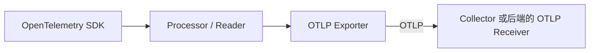

# OpenTelemetry 上下文传播与 OTLP 上报机制

本文说明 OpenTelemetry 如何把跨端调用关联为同一条 Trace，以及 OTLP 在遥测数据上报链路中的职责边界。

## 1. 什么是 OpenTelemetry

OpenTelemetry（简称 OTel）是一套统一采集和传输可观测性数据的解决方案与标准体系，
为 Trace、Metric 和 Log 的生成、关联、采集与导出提供厂商无关的规范、API、SDK、协议和工具。

### 1.1 OpenTelemetry 解决什么痛点

不同语言、框架和可观测性厂商通常提供各自的埋点 SDK、数据模型和上报协议。
一套分布式系统可能因此维护多种 Agent、Exporter 和字段约定，并在切换后端时重新适配甚至重新埋点。

| 痛点 | 典型表现 | OpenTelemetry 的处理方式 |
| --- | --- | --- |
| 厂商绑定 | 应用直接依赖某个 APM 厂商的私有 SDK 和协议，切换后端需要修改代码 | 提供厂商无关的 API、SDK 和 OTLP，允许同一套埋点对接不同后端 |
| 数据语义不一致 | 不同语言对相同 HTTP、数据库或消息操作使用不同属性名 | 通过 Specification 和 Semantic Conventions 统一概念、名称与含义 |
| 跨服务链路断裂 | 不同框架或追踪厂商无法识别彼此的 Trace 上下文 | 使用标准 Propagator 和 W3C Trace Context 传播调用链上下文 |
| 采集管道重复建设 | 每个服务分别实现批处理、重试、过滤、脱敏和多后端转发 | 使用 SDK Processor、Exporter 和 Collector 复用通用采集与转发能力 |

### 1.2 主要遥测信号

三类主要遥测信号分别回答不同问题：

| 信号 | 主要回答的问题 | 典型内容 |
| --- | --- | --- |
| Trace | 一次请求经过了哪些组件，耗时和错误发生在哪里 | Trace、Span、事件和调用关系 |
| Metric | 系统在一段时间内运行得怎么样 | 请求量、延迟、错误率、CPU 和内存 |
| Log | 某个时间点具体发生了什么 | 结构化或非结构化事件记录 |

OpenTelemetry 统一的是这些数据从应用产生到发送给后端之前的标准和工具，
但不要求不同信号存储在同一个后端。

### 1.3 核心组成

| 组成部分 | 职责 |
| --- | --- |
| Specification | 定义跨语言实现需要遵守的行为和数据约定 |
| API | 定义生成和关联遥测数据的编程接口 |
| SDK | 实现采样、处理、聚合和导出等运行时能力 |
| Instrumentation | 使用 API 对应用、框架和依赖进行手动或自动埋点 |
| Semantic Conventions | 统一常见遥测属性的名称和语义 |
| Propagator | 在进程和服务之间注入、提取追踪上下文 |
| OTLP | 定义遥测数据的格式、编码、传输和交付语义 |
| Collector | 接收、处理并转发遥测数据 |

OpenTelemetry 本身不是可观测性后端，通常不负责遥测数据的长期存储、查询、仪表盘、告警和最终展示。
这些能力由 Jaeger、Prometheus、Grafana 生态或商业可观测性平台提供。

### 1.4 当前项目的接入边界

当前项目接入轻量 Trace SDK 和 OTLP/HTTP Exporter，不接入自动 Instrumentation：

- tracing runtime 与 `span_context` 的公共 API 统一位于 `pkg.tracing`。
- 业务埋点统一使用 `async with span_context(...)`，内部根据 `OTEL_TRACING_ENABLED` 决定创建真实 Span
  还是返回 non-recording Span。
- `OTEL_TRACING_ENABLED`、`OTEL_SERVICE_NAME`、`OTEL_EXPORTER_OTLP_TRACES_ENDPOINT`
  和 `OTEL_EXPORTER_OTLP_TIMEOUT_SECONDS` 的实际值维护在 `configs/.env.{APP_ENV}`。
- 浏览器暂不接入 OpenTelemetry，只传递 UUIDv7 hex 格式的 `X-Trace-ID`。
- FastAPI recorder middleware 校验 `X-Trace-ID` 并写入 request context；没有合法值时由服务端生成。
- 没有远程父上下文时，FastAPI SERVER Span 使用 request context 中的 ID 作为 Root Trace ID。
- 当前不解析 `traceparent` / `tracestate`；未来扩展优先级为
  `traceparent > X-Trace-ID > OpenTelemetry SDK 生成`。
- 配置 `OTEL_EXPORTER_OTLP_TRACES_ENDPOINT` 后，进程级 `TracerProvider` 会挂载
  `BatchSpanProcessor + OTLPSpanExporter`，并在 FastAPI / Celery 进程关闭时 flush 和 shutdown。
- `simulate_logger_span` 产生的真实 Span 会异步上报到 Collector；接口只返回 `trace_id`，
  不代表 ClickHouse 已完成持久化。

## 2. 先区分两条数据路径

理解 OpenTelemetry 的关键，是区分“业务请求中的上下文传播”和“遥测数据上报”。
它们可以共享同一个 `trace-id`，但目的、载体和执行组件不同。


| 路径 | 目的 | 常见载体 | 主要执行者 | 标准或协议 |
| --- | --- | --- | --- | --- |
| 上下文传播 | 让下游创建属于同一 Trace 的子 Span | HTTP Header、gRPC metadata、消息属性 | Propagator / Instrumentation | W3C Trace Context 等 |
| 遥测上报 | 把已生成的 Span、Metric、Log 发送给接收端 | 独立的 HTTP 或 gRPC 请求 | Processor / Reader、Exporter、Receiver | OTLP 等 |

> W3C Trace Context 负责把调用链串起来，OTLP 负责把已经采集的遥测数据报上去。

## 3. W3C Trace Context 如何串联多端

当浏览器、App、网关或服务发起下游请求时，Instrumentation 通常通过 Propagator 将当前 Span 的上下文注入载体；
下游从载体中提取上下文，并以它为父级创建新的 Span。
HTTP 通常使用 Header，gRPC 和消息队列则需要使用各自的 metadata 或消息属性。
如果某种客户端、服务端或消息组件没有对应的自动埋点，就需要手动执行注入和提取。

### 3.1 `traceparent` 与 `tracestate`

OpenTelemetry 默认使用 W3C Trace Context 格式。
HTTP 请求至少传播 `traceparent`；存在厂商扩展状态时，还可以传播可选的 `tracestate`：

```http
traceparent: 00-0af7651916cd43dd8448eb211c80319c-b7ad6b7169203331-01
tracestate: vendor_specific_value
```

`traceparent` 的格式为：

```text
<version>-<trace-id>-<parent-id>-<trace-flags>
```

字段含义如下：

| 字段 | 作用 |
| --- | --- |
| `version` | Trace Context 格式版本 |
| `trace-id` | 整条调用链共享的唯一标识 |
| `parent-id` | 当前上游 Span 的标识 |
| `trace-flags` | 固定两个十六进制字符的 8-bit 标志字段 |

这四个字段在 `version=00` 的 `traceparent` 中都不能省略。
`trace-flags` 字段必填，但 sampled 标志不要求必须开启：常见的 `01` 表示 sampled 位为 1，`00` 表示 sampled 位为 0。
它是 bit field，W3C Trace Context Level 2 还定义了值为 `02` 的 random-trace-id 位，因此解析 sampled 状态时应检查最低位，而不是比较整个值是否等于 `01`。
这些标志是上游给出的追踪建议，不能作为可信的安全指令。

同一条 Trace 通常保持相同的 `trace-id`；每个参与追踪的服务创建新的 `span-id`，并将收到的 `parent-id` 作为父级。
后端据此还原 Span 的父子结构。

`tracestate` 不是 `traceparent` 的组成字段，而是独立、可选的 Header，用于传播追踪厂商的扩展状态。
接收方解析失败的 `traceparent` 时，不应继续使用关联的 `tracestate`。

### 3.2 Baggage 完全可选

Baggage 不是实现分布式追踪的必要组件。
不使用 Baggage，仍然可以通过 W3C Trace Context 完整传播 `trace-id` 和父 Span 信息。

它适合传播不属于核心业务契约、缺失时不影响业务正确性的横切上下文，例如：

```http
baggage: experiment.group=checkout-v2,request.source=mobile
```

> 如果接收方缺少这个字段就无法正确完成业务，它应该进入正式接口契约，而不是 Baggage。

业务必需的数据应进入请求体、路径参数、查询参数或明确定义的业务 Header。
Baggage 不会自动成为 Span 属性或通过 OTLP 上报；如需在后端检索，Instrumentation 必须明确将所需值复制为 Span 属性。

来自外部的 Trace Context 和 Baggage 都可能被伪造。
不应使用它们执行认证、授权等安全决策，也不应在 Baggage 中放入密码、Token、API Key 或个人信息。

## 4. OTLP 具体规定什么

OTLP（OpenTelemetry Protocol）是遥测数据的 wire protocol，规定数据如何编码、传输和交付。
它是协议规范，不是可运行程序，因此不会自行执行上报。

### 4.1 数据模型

OTLP 使用 Protocol Buffers 定义 Trace、Metric 和 Log 的请求、响应和数据结构。
以 Trace 导出请求为例：

```text
ExportTraceServiceRequest
└── ResourceSpans[]
    ├── Resource                 # 产生数据的服务、进程或容器
    └── ScopeSpans[]
        ├── InstrumentationScope # 生成数据的 Instrumentation
        └── Spans[]              # trace_id、span_id、时间、属性和状态等
```

`service.name`、`http.request.method` 等属性的标准名称由 Semantic Conventions 定义；
OTLP 负责承载这些属性，不负责定义其业务语义。

### 4.2 编码与传输

OTLP 定义了 gRPC 和 HTTP 两种主要传输方式：

| 方式 | 编码 | 默认端口 | 默认路径 |
| --- | --- | --- | --- |
| OTLP/gRPC | Protobuf 二进制 | `4317` | gRPC `Export` 方法 |
| OTLP/HTTP | Protobuf 二进制或 Protobuf JSON 映射 | `4318` | 按信号区分 |

OTLP/HTTP 默认使用以下路径：

```http
POST /v1/traces
POST /v1/metrics
POST /v1/logs
```

JSON 形式仍然必须遵守 OTLP Protobuf schema，并不是可以任意组织字段的普通 JSON。

### 4.3 谁真正执行上报

实际执行网络上报的是 OTLP Exporter：



> OpenTelemetry SDK 中的 OTLP Exporter 按照 OTLP 规范，将遥测数据发送给 Collector 或可观测性后端。

以 Trace 为例，至少需要正确组装：

```text
TracerProvider
  + SpanProcessor
  + OTLPSpanExporter
  + 可访问的 Collector 或后端地址
```

自动埋点发行版可能会自动组装这些组件，但真正执行网络请求的仍然是 Exporter 实现。

Collector 不是使用 OTLP 的必要条件。
应用可以直接向支持 OTLP 的后端发送数据；引入 Collector 后，可以让它承担额外的批处理、过滤、脱敏、路由、协议转换和多后端转发：

```text
应用 ──OTLP──> 可观测性后端

应用 ──OTLP──> Collector ──OTLP 或其他协议──> 可观测性后端
```

### 4.4 交付语义与边界

OTLP 还定义请求与响应、压缩、完全成功、部分成功和可重试错误等行为。
OTLP/HTTP 的完全成功和部分成功都返回 `200 OK`，部分成功通过响应中的 `partial_success` 表达；客户端不应重试已返回的部分成功请求。

OTLP 只关注相邻客户端和服务端之间的交付，不提供应用到最终存储端的端到端持久化保证。
Exporter、Collector 和后端仍需根据部署方式配置队列、超时、重试和持久化策略。

## 5. 工程落地检查表

- 所有需要串联的入口和下游客户端都已启用 Instrumentation。
- HTTP、gRPC 和消息队列分别在正确载体中注入、提取 Trace Context。
- 浏览器跨域请求已允许所需的 `traceparent`、`tracestate` 和 `baggage` Header。
- 不信任外部传入的 Trace Context，不在 Baggage、Span 属性或日志中记录凭证和敏感个人数据。
- SDK 已配置对应信号的 Processor / Reader、OTLP Exporter 和可访问的接收端。
- OTLP endpoint、传输方式、端口、TLS、认证及信号路径相互匹配。
- 若使用 Collector，OTLP Receiver 和各信号 pipeline 均已配置；若直连后端，后端明确支持所选 OTLP 方式。
- 批处理、超时、队列、重试和进程关闭时的 flush 行为符合可靠性要求。
- 采样策略可解释，并能区分“上下文已传播”和“Span 实际已记录并上报”。
- 使用同一 `trace-id` 验证上下游 Span 是否在后端正确关联。

## 6. 参考资料

- [OpenTelemetry：What is OpenTelemetry?](https://opentelemetry.io/docs/what-is-opentelemetry/)
- [OpenTelemetry：Components](https://opentelemetry.io/docs/concepts/components/)
- [OpenTelemetry：Context propagation](https://opentelemetry.io/docs/concepts/context-propagation/)
- [W3C Trace Context Level 2（Candidate Recommendation Draft）](https://www.w3.org/TR/trace-context-2/)
- [W3C Baggage](https://www.w3.org/TR/baggage/)
- [OpenTelemetry：OTLP Specification](https://opentelemetry.io/docs/specs/otlp/)
- [OpenTelemetry Collector](https://opentelemetry.io/docs/collector/)
- [OpenTelemetry Semantic Conventions](https://opentelemetry.io/docs/specs/semconv/)
