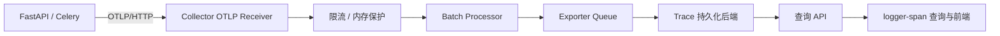

# 当前项目 OpenTelemetry 接入与可观测性数据持久化

本文说明当前项目如何生成、关联和上报 Trace，以及后续如何把 Trace 持久化到可查询的可观测性后端。
OpenTelemetry、W3C Trace Context 和 OTLP 的通用概念见
[OpenTelemetry 上下文传播与 OTLP 上报机制](opentelemetry_context_and_otlp.md)。

本文区分当前实现与目标方案。代码仓库当前只拥有应用侧 Trace 生成和 OTLP/HTTP 上报能力；
Collector pipeline、持久化后端和真实 Trace 查询链路尚未在本仓库落地。

## 1. 当前状态

| 能力 | 当前状态 | 代码或配置依据 |
| --- | --- | --- |
| Trace 生成 | 已实现 | `pkg.tracing` 提供进程级 runtime 和 `span_context` |
| FastAPI Root Span | 已实现 | recorder middleware 创建 `SERVER` Span |
| 业务 Span | 已实现 | 业务代码使用 `async with span_context(...)` 手动埋点 |
| Celery Worker tracing runtime | 已实现 | Worker 启动和关闭 hook 初始化、关闭 runtime |
| OTLP Trace 上报 | 已实现 | `BatchSpanProcessor + OTLPSpanExporter` 使用 OTLP/HTTP 上报 |
| Trace 与日志关联 | 已实现 | 日志处理器从当前 OTel Context 读取 `trace_id` 和 `span_id` |
| W3C Trace Context | 未实现 | 当前不解析或注入 `traceparent` / `tracestate` |
| 自动 Instrumentation | 未实现 | FastAPI、HTTP client 和 Celery 均未接入自动 Instrumentation |
| Metric / Log 的 OTel pipeline | 未实现 | 当前只配置 Trace Exporter |
| Collector 部署与 pipeline | 仓库内未实现 | 仓库没有 Collector receiver、processor、exporter 配置 |
| 可观测性数据持久化 | 仓库内未实现 | 没有存储 schema、写入配置、迁移或保留策略 |
| 真实 Trace 查询 | 未实现 | logger-span 查询接口仍使用确定性 mock 数据 |

因此，当前可以确认的是：启用 tracing 并配置 endpoint 后，应用会把 Span 交给 Exporter；仅凭接口返回的
`trace_id`，不能确认 Collector 已接收、存储后端已写入，或查询索引已经可见。

## 2. 当前项目如何接入 OpenTelemetry

### 2.1 应用侧链路

当前实际链路如下：

```mermaid
flowchart LR
    Client[浏览器或调用方] -->|X-Trace-ID 可选| Middleware[FastAPI recorder middleware]
    Middleware --> RootSpan[SERVER Root Span]
    RootSpan --> BusinessSpan[span_context 业务 Span]
    BusinessSpan --> Processor[BatchSpanProcessor]
    Processor --> Exporter[OTLPSpanExporter]
    Exporter -->|OTLP/HTTP| Receiver[外部 OTLP Receiver]
    Receiver -.仓库外待建设.-> Storage[持久化后端]
    Storage -.仓库外待建设.-> Query[查询 API / UI]
```



应用只依赖 OTLP Receiver 地址，不应直接依赖 Collector 或某种存储产品的内部协议。
这样可以在不修改业务埋点的前提下更换 Collector、Trace 后端或存储实现。

### 2.2 配置所有权

OpenTelemetry 配置由 [`internal/config.py`](../../internal/config.py) 声明，实际环境值维护在
`configs/.env.{APP_ENV}`：

| 配置项 | 作用 |
| --- | --- |
| `OTEL_TRACING_ENABLED` | 控制是否创建真实 Span |
| `OTEL_SERVICE_NAME` | 写入 OTel Resource 的 `service.name` |
| `OTEL_EXPORTER_OTLP_TRACES_ENDPOINT` | OTLP/HTTP Trace 接收地址，应包含与接收端匹配的 `/v1/traces` 路径 |
| `OTEL_EXPORTER_OTLP_TIMEOUT_SECONDS` | 单次 Exporter 请求超时 |

当前配置校验要求：`OTEL_TRACING_ENABLED=true` 时必须提供 Trace endpoint。
endpoint 可以指向 Collector，也可以指向原生支持 OTLP/HTTP 的可观测性后端。
认证凭证、Token 或 TLS 私钥不得写入普通环境模板或文档示例。

### 2.3 Runtime 与进程生命周期

[`pkg/tracing/otel.py`](../../pkg/tracing/otel.py) 负责创建进程级 `TracerProvider`：

```text
TracerProvider
  + ParentBased(ALWAYS_ON)
  + service.name Resource
  + BatchSpanProcessor
  + OTLPSpanExporter
```

- FastAPI lifespan 在应用启动时调用 `init_tracing()`，关闭时调用 `shutdown_tracing()`。
- Celery Worker hook 在 Worker 进程启动和关闭时执行相同生命周期。
- runtime 拥有的 Provider 在关闭时执行 shutdown，从而处理 Processor 中尚未导出的 Span。
- tracing 关闭时，`span_context` 返回 non-recording Span，业务调用点不需要编写配置分支。

这里的 shutdown 只能尽力导出进程内剩余数据，不等价于最终存储成功。强制终止、网络不可达、Exporter 超时或
接收端拒绝数据时仍可能丢失 Span。

### 2.4 Trace ID 与上下文传播

当前浏览器不发送 `traceparent`，只可发送 UUIDv7 hex 格式的 `X-Trace-ID`：

1. recorder middleware 校验 `X-Trace-ID`；缺失或非法时由服务端生成。
2. `RequestContextIdGenerator` 在创建 Root Span 时优先复用 request context 中的合法 ID。
3. 子 Span 由 OTel Context 继承同一 `trace_id`，并生成各自的 `span_id`。
4. 响应头和访问日志继续使用同一 `X-Trace-ID`，用于把客户端请求、日志和 Trace 关联起来。

`X-Trace-ID` 是当前项目的兼容机制，不是 W3C Trace Context。后续接入标准跨服务传播时，入口优先级应为：

```text
合法 traceparent > 合法 X-Trace-ID > OpenTelemetry SDK 生成
```

同时还需要为 HTTP client、Celery message 或其他下游载体实现对应的上下文注入和提取。
Trace ID 只能用于关联查询，不能用于认证、授权或幂等判断。

### 2.5 业务埋点与日志关联

业务代码统一从 `pkg.tracing` 导入 `span_context`：

```python
async with span_context("order.create") as span:
    span.set_attribute("order.type", order_type)
    ...
```

Span 名称和属性名应保持稳定，不要把动态值拼入 Span 名称；使用高基数属性前应评估存储和索引成本。
Span 和属性不得包含密码、Token、完整请求体或个人敏感信息。
异常由 `span_context` 记录为 exception event 并设置错误状态；业务异常仍按原有应用语义传播或转换，
不能因为可观测性链路失败而改变业务结果。

日志处理器会读取当前有效 Span 的 `trace_id` 和 `span_id`。这只建立关联字段，不代表 Log 已通过
OpenTelemetry 导出；当前 Log 仍走项目既有日志处理链路。

### 2.6 logger-span 演示接口边界

`POST /v1/logger-span/simulate` 创建真实 Span 并返回 `trace_id`，但不会等待异步 Exporter、Collector 或
存储后端完成处理。

`GET /v1/logger-span/traces/{trace_id}` 当前由
[`internal/services/logger_span_mock.py`](../../internal/services/logger_span_mock.py) 根据 `trace_id` 生成
确定性 mock Span 树，不会查询 Collector、ClickHouse 或其他可观测性后端。因此它只能验证前端展示和 API
数据结构，不能作为持久化验收依据。

## 3. 可观测性数据持久化

### 3.1 “已上报”与“已持久化”不是同一状态

一条 Span 从结束到可查询通常经过多个异步阶段：

| 阶段 | 可以证明什么 | 不能证明什么 |
| --- | --- | --- |
| Span 已结束 | SDK 已生成完整 Span | Processor 已消费 |
| Processor 已接收 | Span 已进入进程内批处理队列 | Exporter 请求成功 |
| OTLP 完全成功响应 | 相邻 Receiver 已按协议接受数据 | 下游已永久保存 |
| Collector exporter 成功 | Collector 已把数据交给下一跳 | 查询索引立即可见 |
| 存储写入成功 | 后端已保存数据 | 所有副本、索引或聚合均已完成 |
| 查询命中 | 当前查询路径已经可见 | 数据会永久保留 |

项目 API 不应把“返回 `trace_id`”表述成“Trace 已持久化”。如果业务需要等待持久化确认，必须另外设计
确认协议；普通 tracing 不应阻塞业务请求等待最终存储。

### 3.2 推荐目标拓扑

推荐通过 Collector 隔离应用与持久化后端：



Collector 应承担接收、批处理、重试、脱敏、路由和背压保护；存储后端承担持久化、索引、保留策略和查询。
应用侧只配置 Collector endpoint，不持有存储数据库连接，也不在 Controller 中直接查询存储。

代码注释目前提到 ClickHouse，但仓库没有 ClickHouse exporter、表结构、查询 client 或部署配置，
因此 ClickHouse 只能视为候选目标，不能视为已经确定或实现的持久化方案。正式选型时有两种边界：

- 使用支持 OTLP 和 Trace 查询的专用后端，由后端管理 Span 存储模型和查询 API。
- 使用 ClickHouse 等通用数据库，自行负责 Collector 写入适配、表结构、索引、TTL、查询 API 和版本迁移。

如果选择第二种方案，应单独提交 schema 与容量设计，不能仅凭“Collector 能写入”就认为查询和运维能力完整。

### 3.3 最小持久化数据

无论选择哪种后端，完整还原 Trace 至少需要保留：

| 数据类别 | 关键内容 |
| --- | --- |
| 身份与父子关系 | `trace_id`、`span_id`、`parent_span_id` |
| 时间 | Span 开始时间、结束时间或 duration |
| 来源 | `service.name`、Instrumentation Scope、Resource 属性 |
| 操作 | Span name、kind |
| 结果 | status code、status message |
| 明细 | attributes、events、links |

持久化设计还需要明确：

- 以时间范围、`trace_id`、`service.name`、Span name 和错误状态为主的查询路径。
- 时间分区、排序键或索引策略，以及高基数属性的存储成本。
- 原始 Trace 的保留周期、TTL、归档和删除策略。
- 单个 Trace 的最大 Span 数、属性大小和事件数量限制。
- 多租户隔离、查询授权、脱敏规则和审计要求。
- schema 或后端升级时的数据兼容、迁移和回滚方式。

### 3.4 可靠性边界

持久化链路至少需要处理以下故障：

- 应用到 Collector 网络不可达、超时或 TLS / 认证失败。
- Collector 内存、队列或磁盘达到上限后产生背压或丢弃。
- 后端限流、部分成功、临时不可用或不可重试错误。
- Collector 重启时内存队列中的数据丢失。
- 后端写入成功但查询索引尚未可见的最终一致性窗口。

建议为 Collector exporter 使用有界队列、受控重试和可恢复的持久队列，并监控接收量、导出失败、重试、
队列长度和丢弃量。队列容量和重试窗口必须有上限，避免可观测性故障耗尽业务节点或 Collector 资源。

OpenTelemetry 链路失败不应使正常业务请求失败。项目需要通过告警暴露数据缺口，而不是把可观测性后端可用性
变成业务 API 的同步依赖。

### 3.5 数据安全

- 应用到 Collector、Collector 到后端均应使用受控网络、TLS 和最小权限凭证。
- 在应用埋点和 Collector processor 两层实施敏感字段过滤；后端查询权限不能替代采集前脱敏。
- 禁止采集密码、Token、Cookie、API Key、完整请求体和未经批准的个人信息。
- Resource 和 Span 属性中的租户标识只能用于检索与隔离，不能替代服务端授权校验。
- 持久化后端应配置访问审计、备份恢复和符合数据政策的保留周期。

## 4. 项目落地顺序

### 4.1 部署接收与持久化链路

在应用仓库之外完成 Collector 与存储后端的部署，并明确：

1. OTLP/HTTP endpoint、TLS 和认证方式。
2. Trace pipeline 的 receiver、processor、exporter 和队列策略。
3. 存储 schema 或专用 Trace 后端的版本与保留策略。
4. Collector、后端和查询 API 的健康检查、指标和告警。
5. 配置变更、schema 迁移、回滚和容量扩展方式。

### 4.2 接通当前应用

将 `OTEL_EXPORTER_OTLP_TRACES_ENDPOINT` 指向已验证的 Receiver，并分别验证 FastAPI 与 Celery Worker：

- 启动时 tracing runtime 初始化成功。
- `simulate` 产生的所有 Span 被 Receiver 接收。
- 正常关闭时批处理数据完成 flush；强制终止场景的丢失边界已记录。
- 使用同一 `trace_id` 能在后端还原父子关系、时间顺序、状态、属性和异常事件。

### 4.3 用真实查询替换 mock

持久化后端稳定后，再替换 `LoggerSpanService.get_trace()` 的 mock 实现：

- 在 infra 层提供受超时、认证和连接生命周期控制的查询 client。
- Service 负责按 `trace_id` 查询、组装 DTO，并处理未命中、查询超时和数据不完整。
- Controller 保持薄层，不直接访问 ClickHouse、Collector 或第三方查询 API。
- 查询接口需要限制时间范围、Span 数量和响应大小，并按项目认证规则执行访问控制。
- 因写入和索引可能最终一致，刚完成 `simulate` 后的短暂未命中不能被误报为数据永久丢失。

在真实查询完成前，应保留接口和前端中的 mock 标识，避免用户把演示数据误认为持久化数据。

## 5. 验收标准

- 应用侧 endpoint 指向明确、可访问且经过认证的 OTLP Receiver。
- FastAPI 和 Celery 产生的 Trace 均能完成持久化；实现标准上下文传播后，同一工作流的跨进程 Span 能正确关联。
- 后端可按 `trace_id` 查询完整 Span 树，父子关系、时间、状态和关键属性正确。
- Collector 或后端短暂不可用时，重试、队列、丢弃和恢复行为符合既定容量边界。
- 应用进程关闭、Collector 重启和后端限流场景均有实际验证记录。
- 敏感字段不会出现在 Span attributes、events、Resource 或 Collector 错误日志中。
- 保留周期、TTL、容量告警、备份恢复和查询权限均有明确所有者。
- logger-span 查询接口读取真实后端数据，不再调用 `MockTraceBuilder`，并已覆盖最终一致性窗口。

完成以上验收后，才能把项目状态从“应用侧已上报”更新为“可观测性数据已持久化且可查询”。
