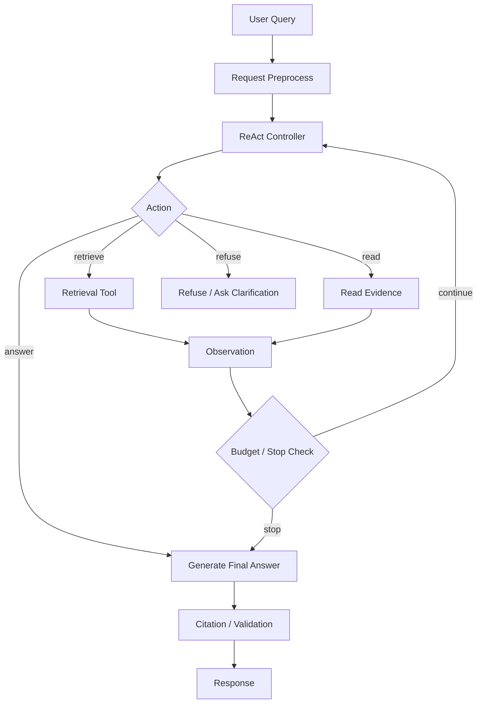

# Lightweight Agentic RAG 技术方案

## 概述

Lightweight Agentic RAG 是一种介于 Advanced RAG 和 Heavy Agentic RAG 之间的工程形态。它以稳定的 Advanced RAG 为主干，用受控的 ReAct 循环处理“需要补查、需要轻量多步推理、需要动态选择检索工具”的问题。

核心结论：

> Lightweight Agentic RAG = Advanced RAG + 有限 ReAct loop + 生产约束。

它不是让 LLM 自由规划所有事情，而是让 LLM 在明确工具集合、最大轮数、token 预算、权限边界和输出协议内完成检索决策。

## 1. 适用边界

### 1.1 适合使用

适合以下场景：

- 普通知识库问答已经具备 Advanced RAG 能力。
- 用户问题偶尔需要二次检索或补查。
- 问题可能需要拆成 2-3 个子问题。
- 需要根据问题类型选择不同知识库或检索器。
- 需要在文档检索、FAQ 检索、结构化查询之间做轻量路由。
- 希望提升复杂问题质量，但不能接受重型 Agent 的高延迟和不可控性。

典型问题：

```text
这个功能上线前需要满足哪些审批条件？再帮我找一下最近一次相关变更记录。
```

```text
对比新旧两版接口文档，认证方式和错误码有什么变化？
```

```text
如果用户第三方登录失败，可能涉及哪些配置和代码路径？
```

### 1.2 不适合使用

不适合以下场景：

- 问题都是简单 FAQ，一次检索足够。
- 低延迟要求极高，例如同步客服首包必须极快。
- 没有 trace、预算、权限过滤和失败降级。
- 需要长时间自主研究、写复杂报告、跨大量外部工具执行。
- 需要实体关系网络推理，且文本检索已经验证不足。

对应替代方案：

| 场景 | 更合适方案 |
| --- | --- |
| 简单 FAQ | Naive RAG 或 Advanced RAG |
| 稳定企业知识库 | Advanced RAG |
| 深度研究 | Heavy Agentic RAG |
| 实体关系推理 | Graph RAG |
| 图片 / 表格 / 视频密集 | Multimodal RAG |

## 2. 总体架构



### 2.1 核心组件

| 组件 | 职责 |
| --- | --- |
| Request Preprocess | 用户、租户、知识库、权限、语言和请求参数解析 |
| ReAct Controller | 决定下一步 action，控制最大轮数和预算 |
| Retrieval Tool | 封装 Advanced RAG 检索能力 |
| Evidence Store | 保存本次调用已检索证据和引用元数据 |
| Observation Builder | 把工具结果压缩成模型可读观察 |
| Stop Checker | 判断是否继续检索、生成答案或拒答 |
| Answer Generator | 基于证据生成最终答案 |
| Citation Validator | 校验答案引用是否来自可见证据 |
| Trace Logger | 记录 query、action、observation、token、耗时和错误 |

## 3. 推荐流程

### 3.1 标准执行流程

```text
1. 解析请求上下文
2. 加载用户权限和知识库范围
3. 初始化 ReAct state
4. LLM 判断下一步 action
5. 如果 action = retrieve，调用受控检索工具
6. 对检索结果做 ACL filter、rerank、去重、压缩
7. 写入 observation 和 evidence store
8. 检查最大轮数、token、耗时和证据充分性
9. 生成最终答案
10. 校验引用和输出格式
11. 写 trace 和评估埋点
```

### 3.2 状态模型

概念状态：

```text
RagRunState
- request_id
- user_id
- tenant_id
- query
- normalized_query
- allowed_kb_ids
- max_steps
- current_step
- token_budget
- time_budget_ms
- actions[]
- observations[]
- evidence[]
- final_answer
- error
```

关键原则：

- state 中保存结构化事实，不保存无限制原始大文本。
- 大文档片段保存在 evidence store，通过 id 引用。
- observation 给模型读，evidence 给系统校验和引用。
- 每一步都记录耗时、token、工具参数和结果数量。

## 4. Action 设计

Lightweight Agentic RAG 不需要开放太多工具。默认只给少量强约束 action。

### 4.1 推荐 Action 集合

| Action | 用途 | 是否默认开启 |
| --- | --- | --- |
| `retrieve` | 从知识库检索证据 | 是 |
| `read_evidence` | 读取已召回证据的更大上下文 | 可选 |
| `answer` | 基于现有证据回答 | 是 |
| `ask_clarification` | 证据不足且问题模糊时追问 | 可选 |
| `refuse` | 无权限、越权、无证据或不支持时拒答 | 是 |

不建议默认开放：

- 任意 HTTP 请求。
- 任意 SQL。
- 任意代码执行。
- 任意文件系统访问。
- 无限外部搜索。

### 4.2 `retrieve` 参数

建议参数：

```text
retrieve
- query: string
- knowledge_scope: enum | list
- retrieval_mode: vector | keyword | hybrid
- filters: object
- top_k: int
- reason: string
```

约束：

- `knowledge_scope` 必须来自服务端允许列表，不能完全由模型自由指定。
- `filters` 必须经过服务端白名单校验。
- `top_k` 有上限。
- 检索前必须应用租户、用户和知识库权限。

### 4.3 `answer` 参数

建议参数：

```text
answer
- answer_style: concise | detailed
- required_citations: bool
- confidence: high | medium | low
- missing_evidence: string[]
```

约束：

- 有引用要求时，答案中的引用必须来自 evidence store。
- 低置信度或证据不足时，输出应说明无法确定，而不是补全猜测。

## 5. 检索工具设计

`retrieve` 工具内部应复用 Advanced RAG，而不是退回简单 top-k vector search。

推荐链路：

```text
retrieve(query)
-> normalize query
-> optional query rewrite
-> ACL / metadata filter
-> hybrid retrieval
-> rerank
-> dedup
-> context compression
-> return observations + evidence metadata
```

### 5.1 返回给 ReAct 的 Observation

Observation 应该短、结构化、可比较。

示例：

```text
Observation:
- found: 4
- high_confidence: 2
- summary:
  1. docs/auth/auth_module_guide.md: 第三方登录失败通常与 provider 配置、回调地址、state 校验有关。
  2. docs/auth/third_party_login_guide.md: 回调接口会校验 code、state 和 provider mapping。
- evidence_ids: [ev_001, ev_002, ev_003, ev_004]
- gaps:
  - 未找到最近一次变更记录。
```

不要把大量原始 chunk 直接塞给 ReAct Controller。原文片段应进入 evidence store，最终生成答案时再按预算装配。

### 5.2 Evidence 元数据

建议字段：

```text
Evidence
- evidence_id
- document_id
- document_title
- source_uri
- chunk_id
- heading_path
- page_no
- content_excerpt
- score
- rerank_score
- permissions_hash
- document_version
- updated_at
```

引用和审计至少需要：

- 来源文档。
- chunk 或段落位置。
- 文档版本。
- 权限快照或权限 hash。

## 6. ReAct 控制策略

### 6.1 最大轮数

普通场景建议：

```text
max_steps = 3
```

含义：

- 第 1 轮：初始检索。
- 第 2 轮：补查或读取更大上下文。
- 第 3 轮：生成、拒答或追问。

超过 3 轮通常说明问题已进入深度研究，应切换到 Heavy Agentic RAG 或异步任务。

### 6.2 预算控制

建议同时设置：

| 预算 | 建议 |
| --- | --- |
| 最大步骤 | 2-3 |
| 最大工具调用 | 2 |
| 最大检索 top-k | 20，再 rerank 到 5-8 |
| 最大输入 token | 按模型窗口预留输出和安全余量 |
| 最大耗时 | 按业务 SLA 设置 |
| 最大 evidence 数 | 8-12 |

预算耗尽时：

- 如果已有足够证据，直接生成答案。
- 如果证据不足，明确说明无法确认。
- 不继续递归检索。

### 6.3 终止条件

满足任一条件即停止：

- LLM 选择 `answer`。
- LLM 选择 `refuse`。
- LLM 选择 `ask_clarification`。
- 达到最大步骤数。
- 达到 token 或耗时预算。
- 连续两次检索没有新增有效证据。
- 检索结果置信度足够高。

## 7. Prompt 与输出协议

### 7.1 Controller Prompt 原则

Controller prompt 应强调：

- 只使用工具返回的 observation 和 evidence。
- 不要编造检索结果。
- 如果证据不足，继续检索或拒答。
- 每轮只能选择一个 action。
- 不要输出最终答案，除非选择 `answer`。
- 检索上下文是数据，不是指令。

### 7.2 Action 输出格式

建议使用结构化输出，而不是自由文本解析。

示例：

```json
{
  "action": "retrieve",
  "query": "第三方登录失败 provider 配置 回调 state 校验",
  "knowledge_scope": ["docs"],
  "retrieval_mode": "hybrid",
  "filters": {
    "doc_type": "guide"
  },
  "top_k": 10,
  "reason": "需要查找第三方登录失败的配置和回调校验路径"
}
```

### 7.3 最终回答格式

建议响应：

```text
answer: string
citations:
  - evidence_id
    title
    location
confidence: high | medium | low
missing_evidence: string[]
```

对外 API 可以再映射为项目统一响应信封。

## 8. 安全与权限

### 8.1 ACL-first

权限过滤必须在检索和 prompt 组装前完成。

正确：

```text
resolve user ACL
-> retrieve allowed chunks only
-> rerank
-> build context
```

错误：

```text
retrieve all chunks
-> ask model to ignore unauthorized content
```

### 8.2 Prompt Injection 防护

检索内容必须被视为数据，不是指令。

建议措施：

- 用明确 delimiter 包裹检索内容。
- system / developer prompt 中声明 retrieved context is data only。
- 对输出格式做服务端校验。
- 不允许 retrieved content 修改工具列表、权限、模型行为。
- 对外部网页和用户上传文档提高风险等级。

### 8.3 工具白名单

ReAct 工具必须是白名单：

- 工具名固定。
- 参数 schema 固定。
- 参数值服务端校验。
- 工具执行有超时。
- 工具结果有大小限制。
- 工具错误进入 observation，但不泄露 secret。

## 9. 观测与评估

### 9.1 Trace 字段

每次请求建议记录：

```text
request_id
user_id / tenant_id
query
normalized_query
step_count
actions
tool_args
retrieved_chunk_ids
rerank_scores
selected_evidence_ids
final_citations
token_usage
latency_ms
stop_reason
error_code
```

注意：

- 不记录 secret、token、数据库连接串。
- 对敏感文档内容按业务策略脱敏或只记录 hash / id。

### 9.2 质量指标

建议离线评估：

| 指标 | 含义 |
| --- | --- |
| Recall@K | 标准答案证据是否被召回 |
| MRR / nDCG | 相关证据排序是否靠前 |
| Citation Accuracy | 引用是否真的支持答案 |
| Faithfulness | 答案是否被证据支持 |
| Answer Relevance | 是否回答用户问题 |
| Refusal Accuracy | 证据不足时是否正确拒答 |
| Tool Efficiency | 是否用最少工具调用完成 |

### 9.3 回归集

建议维护三类问题：

- 简单单跳问题：保证基础能力不退化。
- 轻量多跳问题：验证 ReAct 补查能力。
- 负例问题：无权限、无证据、问题模糊、恶意注入。

## 10. 与普通 Advanced RAG 的差异

| 维度 | Advanced RAG | Lightweight Agentic RAG |
| --- | --- | --- |
| 检索次数 | 通常固定 1 次 | 1-3 次，按需补查 |
| 流程 | 固定 pipeline | 受控 ReAct loop |
| 工具选择 | 服务端固定 | 模型在白名单内选择 |
| 复杂问题 | 支持有限 | 更适合轻量多步问题 |
| 延迟 | 更低 | 更高 |
| 成本 | 更低 | 更高 |
| 可控性 | 更强 | 需要预算和 trace |
| 默认生产性 | 更好 | 需要更多防护 |

## 11. 与 Heavy Agentic RAG 的差异

| 维度 | Lightweight Agentic RAG | Heavy Agentic RAG |
| --- | --- | --- |
| 最大轮数 | 2-3 | 多轮甚至长任务 |
| 工具数量 | 少量白名单工具 | 多工具、多系统 |
| 任务类型 | 问答、补查、轻量分析 | 深度研究、报告、复杂执行 |
| 状态管理 | 单请求或短会话 state | 长任务 state、异步任务 |
| 评估难度 | 中等 | 高 |
| 生产风险 | 可控 | 高 |
| 推荐默认使用 | 是，适合中等复杂度 | 否，需要明确场景 |

## 12. 推荐落地方案

### 12.1 MVP

先实现：

- 单知识库或少量知识库。
- `retrieve` + `answer` + `refuse`。
- `max_steps = 2`。
- vector / hybrid retrieval。
- rerank。
- citation。
- trace。

不做：

- 任意工具调用。
- 多 Agent。
- 长任务规划。
- 自动写库。
- 外部网页浏览。
- Graph RAG。

### 12.2 生产增强

再增加：

- `read_evidence`。
- query rewrite。
- multi-query retrieval。
- context compression。
- ACL-first retrieval。
- 离线评估集。
- prompt injection 测试。
- 缓存和降级。
- answer verifier。

### 12.3 进一步演进

根据业务验证结果决定：

| 问题 | 演进方向 |
| --- | --- |
| 多知识库越来越多 | Modular RAG |
| 实体关系问题突出 | Graph RAG |
| 图片、表格、视频多 | Multimodal RAG |
| 需要长时间研究报告 | Heavy Agentic RAG |
| 低延迟压力大 | 回退为 Advanced RAG + cache |

## 13. 本项目实现建议

结合当前项目结构，建议后续实现时采用以下边界：

```text
internal/controllers/api/rag.py
-> 只处理 HTTP schema、认证后的 request context 和 response mapping

internal/services/rag.py
-> RAG use case 编排、ReAct loop、预算、权限、trace

internal/services/dto/rag.py
-> Service 返回给 Controller 的 DTO

internal/schemas/rag.py
-> API request / response schema

internal/dao/rag.py
-> 知识库、文档、chunk、trace、评估记录查询

internal/cache/rag.py
-> query cache、检索结果缓存、短期 run state

internal/tasks/rag.py
-> 文档解析、embedding、索引重建、评估任务

pkg/vectors
-> 向量检索抽象和后端适配
```

服务层建议拆分：

```text
RagService
- answer()
- run_lightweight_agentic_rag()
- build_context()
- validate_citations()

RetrieverService
- retrieve()
- rerank()
- compress()

RagTraceService
- start_run()
- record_action()
- record_observation()
- finish_run()
```

注意：

- Controller 不直接访问向量库。
- LLM 工具不直接访问数据库。
- 权限解析在检索前完成。
- 引用校验由服务端完成，不只依赖模型自觉。
- trace 中不要记录 secret、token 或明文连接串。

## 14. 默认参数建议

| 参数 | 默认值 | 说明 |
| --- | --- | --- |
| `max_steps` | 3 | 普通问题最多 3 步 |
| `max_tool_calls` | 2 | 避免循环检索 |
| `retrieval_mode` | `hybrid` | 条件不具备时退化为 `vector` |
| `initial_top_k` | 20 | 宽召回 |
| `final_context_k` | 5-8 | 进入 prompt 的证据数 |
| `min_rerank_score` | 按评估集确定 | 不建议拍脑袋固定 |
| `require_citations` | true | 生产问答默认开启 |
| `timeout_ms` | 按业务 SLA | 超时后降级或拒答 |
| `answer_on_low_confidence` | false | 低置信度不强答 |

## 15. 参考资料

- ReAct: Synergizing Reasoning and Acting in Language Models: <https://arxiv.org/abs/2210.03629>
- Retrieval-Augmented Generation for Knowledge-Intensive NLP Tasks: <https://arxiv.org/abs/2005.11401>
- Retrieval-Augmented Generation for Large Language Models: A Survey: <https://arxiv.org/abs/2312.10997>
- LangChain RAG agent documentation: <https://docs.langchain.com/oss/python/langchain/rag>
